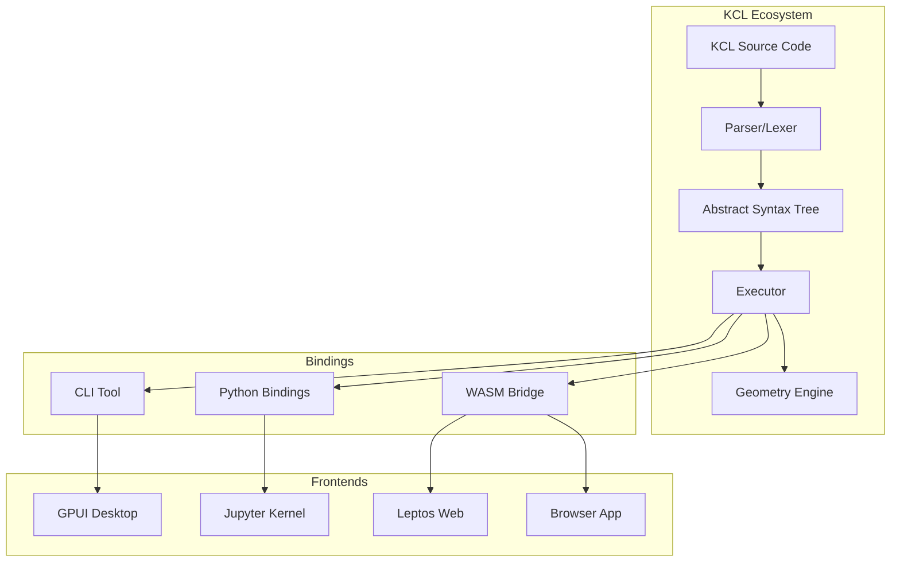

# Learning KCL: From Rust Novice to CAD Contributor

A 15-part series on learning Rust and KCL through the modeling-app codebase.

## What This Series Is

You want to understand Zoo.dev's KCL language well enough to use it for personal CAD projects and eventually contribute to the codebase. You're new to Rust but experienced with Python. This series teaches both simultaneously through the lens of real, production code.

The approach is top-down and hands-on. You'll build things from part one. Where possible, we start from the end goal and work backwards. The codebase isn't gospel. It has bugs, unpolished corners, and areas begging for optimization. Those imperfections are part of building in the open, and understanding them matters as much as understanding the elegant parts.

## The Parts

| Part | Title | What You'll Learn |
|------|-------|-------------------|
| 01 | [Rust Through KCL's Parser](./01_rust_fundamentals_through_parser.md) | Ownership, borrowing, lifetimes taught through real parser code |
| 02 | [KCL's Type System](./02_kcl_type_system.md) | How Rust's ownership model shapes language design decisions |
| 03 | [Your First KCL Programs](./03_first_kcl_programs.md) | Practical CAD from day one: desk organisers, phone stands, clips |
| 04 | [Geometry Engine Internals](./04_geometry_engine_internals.md) | How KCL talks to the geometry engine |
| 05 | [The Compiler Pipeline](./05_compiler_pipeline.md) | Lexing, parsing, semantic analysis, codegen |
| 06 | [Error Handling Patterns](./06_error_handling.md) | Result, Option, custom error types, and when each makes sense |
| 07 | [Testing Strategies](./07_testing_strategies.md) | Unit tests, integration tests, snapshot tests |
| 08 | [The WASM Bridge](./08_wasm_bridge.md) | Rust to TypeScript FFI, memory management across the boundary |
| 09 | [Liberating KCL](./09_liberating_kcl.md) | Running KCL as CLI, library, or embedded in other tools |
| 10 | [Contributing Workflow](./10_contributing_workflow.md) | From issue to merged PR |
| 11 | [Building a Jupyter Kernel](./11_jupyter_kernel.md) | Your first contribution target |
| 12 | [GPUI Exploration](./12_gpui_exploration.md) | A native Rust desktop CAD interface |
| 13 | [Leptos Exploration](./13_leptos_exploration.md) | A Rust-native web frontend for KCL |
| 14 | [tldraw Integration](./14_tldraw_integration.md) | Infinite canvas meets parametric CAD |
| 15 | [Capstone: Mechanical Flip-Tile Display](./15_capstone_flip_display.md) | KCL geometry to ESP32 to mobile app with Claude |

## Prerequisites

- Python proficiency (we'll map Rust concepts to Python equivalents)
- Basic programming concepts (functions, loops, data structures)
- A working development environment (Arch, Hyprland, Zed/Helix, Nvidia GPU)
- Access to a Bambu Labs A1 (for later parts)
- Curiosity and willingness to read production code

## How to Use This Series

Each part builds on previous ones, but they're also designed to work as standalone references. When you need to understand how KCL handles errors, part 6 should answer that whether you've read parts 1-5 or not.

Code examples come directly from the modeling-app codebase with file paths and line numbers. When the codebase has warts, we'll point them out. When it does something clever, we'll explain why.

## The Codebase at a Glance

```
modeling-app/
├── rust/
│   ├── kcl-lib/           # The heart: parser, executor, stdlib
│   ├── kcl-wasm-lib/      # WASM bindings for browser
│   ├── kcl-python-bindings/ # Python extension module
│   ├── kcl-error/         # Shared error types
│   ├── kcl-api/           # Shared API types
│   ├── kcl-language-server/ # LSP implementation
│   └── ...
├── src/                   # TypeScript frontend
├── public/kcl-samples/    # Example KCL programs
└── learning_kcl/          # This series (you are here)
```



## A Note on Style

This series favors directness over ceremony. We use simple words. We avoid marketing language. When something is confusing, we'll say so. When something is elegant, we'll explain what makes it work.

The goal is understanding, not awe.

Let's start.
