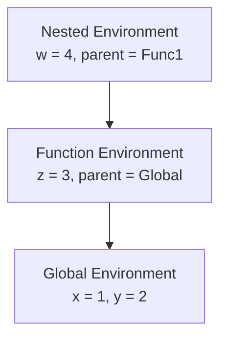

# Part 2: KCL's Type System and How Rust's Ownership Model Shapes Language Design

KCL's type system exists at runtime, not compile time. This is a deliberate choice driven by practical constraints: the language needed to ship, users needed feedback, and a full static type system takes years to build. Understanding this design teaches you how implementation language (Rust) influences the languages built with it.

## The RuntimeType Enum

Open `rust/kcl-lib/src/execution/types.rs`. Here's the core type representation:

```rust
#[derive(Debug, Clone, PartialEq)]
pub enum RuntimeType {
    Primitive(PrimitiveType),
    Array(Box<RuntimeType>, ArrayLen),
    Union(Vec<RuntimeType>),
    Tuple(Vec<RuntimeType>),
    Object(Vec<(String, RuntimeType)>, bool),  // bool = is open object?
}

#[derive(Debug, Clone, PartialEq)]
pub enum PrimitiveType {
    Any,
    Sketch,
    Solid,
    Face,
    Edge,
    Plane,
    Helix,
    Appearance,
    Number(NumericType),
    String,
    Boolean,
    TagDecl,
    TaggedFace,
    TaggedEdge,
    Function,
    ImportedGeometry,
}
```

### Why Box<RuntimeType>?

Look at the `Array` variant:

```rust
Array(Box<RuntimeType>, ArrayLen)
```

Why `Box<RuntimeType>` instead of just `RuntimeType`?

Recursive types in Rust need indirection. An `Array` contains a `RuntimeType`, which could be another `Array`, which contains another `RuntimeType`, and so on. Without `Box`, the type would have infinite size.

```rust
// This won't compile - infinite size
enum Broken {
    Array(Broken, usize),
}

// This works - Box adds a layer of indirection (pointer)
enum Works {
    Array(Box<Works>, usize),
}
```

`Box<T>` is Rust's simplest heap-allocated smart pointer. It owns its data and frees it when dropped. The size of `Box<T>` is always one pointer, regardless of what T is.

Python doesn't have this problem because everything is already a reference. Your `list` type doesn't specify element types at the language level (though type hints exist), and even when you write `List[List[int]]`, Python doesn't care about memory layout.

## Numeric Types: Where Units Live

```rust
#[derive(Debug, Clone, PartialEq)]
pub enum NumericType {
    Known(UnitType),
    Unknown,
}

#[derive(Debug, Clone, PartialEq)]
pub enum UnitType {
    Count,
    Length(UnitLen),
    Angle(UnitAngle),
    // ... more unit categories
}
```

KCL tracks dimensional analysis at runtime. A value like `5mm` isn't just the number 5; it carries unit information:

```kcl
length = 5mm        // NumericType::Known(UnitType::Length(UnitLen::Millimeters))
angle = 45deg       // NumericType::Known(UnitType::Angle(UnitAngle::Degrees))
count = 10          // NumericType::Known(UnitType::Count)
mystery = someFunc() // NumericType::Unknown until we know what someFunc returns
```

This design prevents dimensional errors:

```kcl
length = 5mm
angle = 45deg
result = length + angle  // Runtime error: can't add length to angle
```

### The UnitLen and UnitAngle Enums

```rust
pub enum UnitLen {
    Millimeters,
    Centimeters,
    Meters,
    Inches,
    Feet,
    Yards,
    // ...
}

pub enum UnitAngle {
    Degrees,
    Radians,
    Turns,
}
```

The exhaustive enumeration means conversions are explicit. When you need to convert millimeters to inches, there's a function for that, and the type system (at runtime) ensures you get it right.

Compare to Python, where units would be a convention at best:

```python
# Python - units are just documentation
length_mm = 5  # hope you remember this is millimeters
length_in = 0.5  # and this is inches
result = length_mm + length_in  # silently wrong
```

Libraries like Pint exist, but they're optional. KCL bakes units into the language.

## KclValue: The Universal Value Type

Open `rust/kcl-lib/src/execution/kcl_value.rs`. This enum represents every possible value in a KCL program:

```rust
pub enum KclValue {
    Uuid { value: Uuid, meta: Vec<Metadata> },
    Bool { value: bool, meta: Vec<Metadata> },
    Number { value: f64, ty: NumericType, meta: Vec<Metadata> },
    String { value: String, meta: Vec<Metadata> },
    Tuple { value: Vec<KclValue>, meta: Vec<Metadata> },
    HomArray { value: Vec<KclValue>, ty: RuntimeType },
    Object { value: HashMap<String, KclValue>, ... },
    Sketch { value: Box<Sketch> },
    Solid { value: Box<Solid> },
    Face { value: Box<Face> },
    Function { value: Box<FunctionSource>, meta: Vec<Metadata> },
    // ... more variants
}
```

### Struct-like Enum Variants

Notice the syntax:

```rust
Number { value: f64, ty: NumericType, meta: Vec<Metadata> },
```

This is a struct-like enum variant. Each `Number` carries three named fields. In Python, you'd probably use a dataclass:

```python
@dataclass
class Number:
    value: float
    ty: NumericType
    meta: list[Metadata]
```

But then you'd need a separate Union type to combine all value types. Rust's enum does both: it's a discriminated union where each variant can have its own structure.

### Why Box<Sketch> but Vec<KclValue>?

```rust
Sketch { value: Box<Sketch> },
Tuple { value: Vec<KclValue>, ... },
```

`Sketch` is boxed because it's a large struct that would bloat the enum. Rust enums are sized to their largest variant. If `Sketch` is 200 bytes and `Bool` is 1 byte, every `KclValue` would be at least 200 bytes.

Boxing moves the large data to the heap, making the `Sketch` variant just a pointer (8 bytes on 64-bit).

`Vec<KclValue>` is already heap-allocated. The `Vec` struct itself is small (pointer + length + capacity), so it doesn't need additional boxing.

This is a performance consideration that Python programmers don't face. Python already puts everything on the heap; you're paying for indirection everywhere, so you don't think about it.

## The Memory System: Environments and Epochs

Open `rust/kcl-lib/src/execution/memory.rs`. This file has extensive documentation comments explaining the design. Here's the key insight:

```rust
pub struct ProgramMemory {
    environments: Vec<Environment>,
    current_env: EnvironmentRef,
}

pub struct Environment {
    bindings: HashMap<String, KclValue>,
    parent: Option<EnvironmentRef>,
    module_id: ModuleId,
    epoch: Epoch,
}
```

### Why Epochs?

KCL needed closures without mutable variable capture. The solution is epochs, a global counter that marks "moments in time" during execution.

```rust
pub type Epoch = usize;

fn create_function(memory: &ProgramMemory) -> Function {
    Function {
        body: parse_body(),
        captured_epoch: memory.current_epoch(),  // Snapshot the moment
    }
}
```

When a function is called, it sees variables as they existed at its captured epoch, not as they are now. This gives closure semantics without mutation.

```kcl
fn makeCounter() {
    count = 0
    fn increment() {
        count + 1  // Sees count from when increment was created
    }
    return increment
}
```

This is a clever workaround. True mutable closures require either garbage collection or complex borrow-checking across async boundaries. Epochs sidestep the problem by making captures immutable snapshots.

### Environments as a Tree

```rust
parent: Option<EnvironmentRef>,
```

Each environment can have a parent. Variable lookup walks up the tree:



Looking up `x` from `Func2` walks: Func2 -> Func1 -> Global -> found.

This is standard lexical scoping. Python does the same thing with its LEGB rule (Local, Enclosing, Global, Built-in).

## Type Checking: Runtime, Not Compile Time

Look at how type checking happens in `rust/kcl-lib/src/std/args.rs`:

```rust
pub fn get_kw_arg<T: FromKclValue>(
    &self,
    name: &str,
    ty: &RuntimeType,
    exec_state: &mut ExecState,
) -> Result<T, KclError> {
    let value = self.keyword_args.get(name)
        .ok_or_else(|| KclError::missing_argument(name, &self.source_range))?;

    T::from_kcl_value(value, ty, exec_state)
}
```

The type is checked when you extract the value, not when the program is parsed. This is dynamic typing with extra steps.

### The FromKclValue Trait

```rust
pub trait FromKclValue: Sized {
    fn from_kcl_value(
        value: &KclValue,
        ty: &RuntimeType,
        exec_state: &mut ExecState,
    ) -> Result<Self, KclError>;
}
```

Each Rust type that can be extracted from a KclValue implements this trait:

```rust
impl FromKclValue for f64 {
    fn from_kcl_value(value: &KclValue, ty: &RuntimeType, _: &mut ExecState) -> Result<Self, KclError> {
        match value {
            KclValue::Number { value, .. } => Ok(*value),
            _ => Err(KclError::type_mismatch("number", value.type_name())),
        }
    }
}
```

This is Rust's way of achieving ad-hoc polymorphism. In Python, you'd use duck typing:

```python
def get_number(value):
    if isinstance(value, Number):
        return value.value
    raise TypeError(f"Expected number, got {type(value)}")
```

The trait-based approach is more structured but achieves the same goal: converting from a general value type to a specific one.

## Geometry Types: Domain Modeling in Rust

Open `rust/kcl-lib/src/execution/geometry.rs`. Here's how geometric primitives are represented:

```rust
#[derive(Debug, Clone)]
pub struct Sketch {
    pub uid: Uuid,
    pub start: SketchSurface,
    pub entities: Vec<Path>,
    pub constraints: Vec<Constraint>,
    pub meta: GeoMeta,
}

#[derive(Debug, Clone)]
pub struct Solid {
    pub uid: Uuid,
    pub value: f64,  // Volume or similar metric
    pub start_cap_id: Option<Uuid>,
    pub end_cap_id: Option<Uuid>,
    pub meta: GeoMeta,
}

#[derive(Debug, Clone)]
pub struct Point3d {
    pub x: f64,
    pub y: f64,
    pub z: f64,
    pub units: Option<UnitLength>,
}
```

### Uuid for Identity

Every geometric entity has a UUID. This connects KCL's representation to the geometry engine's internal state:

```
KCL: Sketch { uid: "abc-123", ... }
        |
        v
Engine: Internal mesh/brep with id "abc-123"
```

The UUID is the bridge between the language runtime and the geometry kernel.

### Option<T> for Optional Data

```rust
pub start_cap_id: Option<Uuid>,
```

Not every solid has a start cap (think of a swept surface vs an extruded solid). `Option` makes this explicit. In Python:

```python
start_cap_id: Optional[uuid.UUID] = None
```

The semantics are similar, but Rust's version is enforced. You can't accidentally use `start_cap_id` without checking if it exists.

## The Tag System: Mutation Through Naming

KCL handles an interesting problem: how do you refer to parts of geometry you created earlier, in a language where values are immutable?

The answer is tags:

```kcl
sketch = startSketchOn(XY)
  |> line(to = [10, 0], tag = $bottom)  // Name this edge "bottom"
  |> line(to = [0, 10])
  |> line(to = [-10, 0])
  |> close()

solid = extrude(sketch, length = 5mm)

// Later, refer to that edge by tag
filleted = fillet(solid, edge = bottom, radius = 1mm)
```

In the type system:

```rust
pub struct TagIdentifier {
    pub value: String,
    pub info: Option<TagInfo>,
}

pub struct TagDeclarator {
    pub name: String,
}
```

`$bottom` creates a `TagDeclarator`. When the geometry engine processes it, the declarator becomes a `TagIdentifier` with actual edge/face references.

This pattern appears in other CAD languages. It's a way to name things for later reference without mutable state.

## Traits in the Type System: Metadata

Look at how metadata flows through values:

```rust
pub trait HasMeta {
    fn get_meta(&self) -> Vec<Metadata>;
}

impl HasMeta for KclValue {
    fn get_meta(&self) -> Vec<Metadata> {
        match self {
            KclValue::Number { meta, .. } => meta.clone(),
            KclValue::String { meta, .. } => meta.clone(),
            KclValue::Sketch { value, .. } => value.meta.source_range.into(),
            // ... other variants
        }
    }
}
```

Traits let you add behavior to types without modifying them. `HasMeta` says "any type implementing this can return its metadata." The `impl` block provides the implementation.

Python equivalent using Protocol:

```python
from typing import Protocol

class HasMeta(Protocol):
    def get_meta(self) -> list[Metadata]: ...
```

But Python's protocol is structural (duck typing with type hints), while Rust's trait is nominal (you must explicitly implement it).

## Why Runtime Types Instead of Static?

KCL's type system is an interesting middle ground:
- Types exist and are checked (unlike pure duck typing)
- But checking happens at runtime (unlike Rust, TypeScript, or Java)

This was probably a pragmatic choice:

1. **Faster to implement**: Static type systems are hard. Getting them right takes years. Runtime typing lets you ship sooner.

2. **Better error messages**: You can introspect actual values when something goes wrong, not just types.

3. **Flexibility for CAD**: CAD operations often depend on geometric properties that can't be known statically (does this face exist? is this edge valid for filleting?).

The downside is you discover type errors when running code, not when writing it. For a CAD language where you're staring at a visual preview, this might be acceptable.

## Exercises

1. **Trace a Type Check**: Pick a stdlib function in `rust/kcl-lib/src/std/sketch.rs`. Find where it extracts its arguments. What happens if you pass the wrong type?

2. **Add a Unit**: Imagine adding a new length unit (nautical miles). What files would you modify? Trace the `UnitLen` enum through the codebase.

3. **Box Experiment**: Find a large struct in the codebase that's boxed. Calculate its size vs the size of Box<T>. Was the boxing necessary?

4. **Tag Tracing**: Write KCL code that uses tags. Find where in the Rust code the tag declarator becomes a tag identifier. What's stored in the geometry engine?

## What's Next

Part 3 puts this theory into practice. You'll write KCL programs that become physical objects: desk organizers, phone stands, cable clips. The type system fades into the background as you focus on shapes, but understanding how types work helps when things go wrong.

The journey from abstract syntax tree to physical object continues. Next stop: making things.
