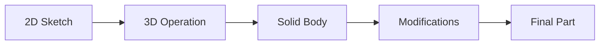
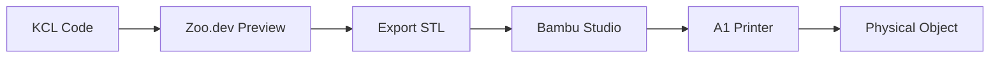

# Part 3: Building Your First KCL Programs

Enough theory. Let's make things.

You have a Bambu Labs A1. You want objects: a desk organizer for your workspace, a phone stand for your desk, cable clips to tame the wire chaos. This part builds all three while teaching KCL's syntax, workflow, and mental model.

## The KCL Mental Model

CAD programming follows a pattern:



1. **Sketch**: Draw 2D shapes on a plane
2. **Operate**: Extrude, revolve, sweep, or loft the sketch into 3D
3. **Modify**: Add fillets, chamfers, holes, patterns
4. **Export**: Generate STL/STEP for printing

KCL follows this pattern with a functional twist: operations are functions, and the pipe operator threads data through them.

## Project 1: Desktop Pen Cup

A simple cylinder with a bottom. Useful, printable, teaches the fundamentals.

```kcl
// pen_cup.kcl
@settings(defaultLengthUnit = mm)

// Parameters - change these to customize
diameter = 60
height = 100
wallThickness = 2

// Derived values
innerDiameter = diameter - (2 * wallThickness)
innerHeight = height - wallThickness

// Outer cylinder
outerSketch = startSketchOn(XY)
outerProfile = circle(outerSketch, center = [0, 0], radius = diameter / 2)
outerBody = extrude(outerProfile, length = height)

// Inner cavity (subtract this from outer)
innerSketch = startSketchOn(XY)
  |> startProfile(at = [0, 0])
innerProfile = circle(innerSketch, center = [0, 0], radius = innerDiameter / 2)
innerBody = extrude(innerProfile, length = innerHeight)
  |> translate(z = wallThickness)

// Final part: outer minus inner
penCup = subtract(outerBody, innerBody)
```

### What's Happening Here

**@settings**: Annotations configure the execution environment. `defaultLengthUnit = mm` means bare numbers are millimeters.

**Variables**: KCL variables are immutable bindings. `diameter = 60` creates a binding, not a mutable variable. You can't do `diameter = 70` later.

**startSketchOn(XY)**: Creates a sketch on the XY plane. Other options: `XZ`, `YZ`, `-XY`, `-XZ`, `-YZ`, or any face of an existing solid.

**circle()**: A stdlib function that creates a circular profile. The result can be extruded.

**extrude()**: Takes a 2D profile and pulls it into 3D. The `length` parameter says how far.

**subtract()**: Boolean operation. Removes the second solid from the first.

### Running It

In the Zoo.dev app:
1. Create a new file
2. Paste the code
3. The preview updates automatically

Or if you're running locally (we'll set this up in Part 9):
```bash
kcl run pen_cup.kcl --output pen_cup.stl
```

## Project 2: Phone Stand

A phone stand needs an angled surface and a lip to hold the phone. This introduces sketching with lines and the pipe operator.

```kcl
// phone_stand.kcl
@settings(defaultLengthUnit = mm)

// Parameters
baseWidth = 80
baseDepth = 60
baseHeight = 8
supportAngle = 65deg  // Angle from horizontal
supportHeight = 100
supportThickness = 5
lipHeight = 15
lipDepth = 8

// Base plate
base = startSketchOn(XY)
  |> startProfile(at = [-baseWidth/2, 0])
  |> xLine(length = baseWidth)
  |> yLine(length = baseDepth)
  |> xLine(length = -baseWidth)
  |> close()
  |> extrude(length = baseHeight)

// Calculate support geometry
// The support rises at an angle from the back of the base
supportBottomY = baseDepth - supportThickness
supportTopY = supportBottomY + supportHeight * cos(supportAngle)
supportTopZ = baseHeight + supportHeight * sin(supportAngle)

// Support profile (side view, on XZ plane at Y = baseDepth center)
supportSketch = startSketchOn(XZ)
  |> startProfile(at = [0, baseHeight])
  |> line(to = [0, supportTopZ - baseHeight], relative = true)
  |> line(to = [supportThickness / tan(supportAngle), 0], relative = true)
  |> line(to = [0, -(supportTopZ - baseHeight - lipHeight)], relative = true)
  |> xLine(length = lipDepth)
  |> yLine(length = -lipHeight)
  |> line(to = [-(lipDepth + supportThickness / tan(supportAngle)), 0], relative = true)
  |> close()

// Extrude support across the width
support = extrude(supportSketch, length = baseWidth)
  |> translate(x = -baseWidth/2, y = supportBottomY)

// Combine base and support
phoneStand = union(base, support)

// Add fillets to make it prettier and easier to print
phoneStand = fillet(phoneStand, radius = 2, edges = getAllEdges(phoneStand))
```

### New Concepts

**The Pipe Operator**: `|>` passes the result of one expression as the first argument to the next function:

```kcl
// These are equivalent:
result = close(yLine(xLine(startProfile(startSketchOn(XY), at = [0, 0]), length = 10), length = 10))

result = startSketchOn(XY)
  |> startProfile(at = [0, 0])
  |> xLine(length = 10)
  |> yLine(length = 10)
  |> close()
```

The pipe version is readable. The nested version is not.

**Angle Units**: `65deg` explicitly specifies degrees. You can also use `rad` for radians or bare numbers if you've set `defaultAngleUnit`.

**Trigonometry**: `sin()`, `cos()`, `tan()` work as expected. They take angles with units and return dimensionless numbers.

**relative = true**: Line coordinates are relative to the current position, not absolute.

**Transformations**: `translate(x, y, z)` moves geometry. Also available: `rotate()`, `scale()`.

**Boolean Union**: `union()` combines solids. The opposite of `subtract()`.

### A Note on the Pipe Operator in Rust

The pipe operator isn't magic. Look at how it's parsed in `rust/kcl-lib/src/parsing/parser.rs`:

```rust
// Simplified from the actual code
fn parse_pipe_expression(&mut self, left: Node<Expr>) -> Result<Node<Expr>, ParseError> {
    self.expect(TokenType::Pipe)?;  // Consume |>
    let right = self.parse_call_expression()?;

    // Insert 'left' as the first argument to 'right'
    Ok(Node::new(Expr::PipeExpression(Box::new(PipeExpression {
        left,
        right,
    }))))
}
```

At execution time, the pipe substitutes the left side as the first argument:

```rust
// In rust/kcl-lib/src/execution/exec_ast.rs
Expr::PipeExpression(pipe) => {
    let left_value = self.execute_expr(&pipe.left).await?;
    // The right side sees left_value as its implicit first argument
    self.execute_call_with_pipe_value(&pipe.right, left_value).await
}
```

This is similar to Python's method chaining, but works with regular functions:

```python
# Python method chaining
result = (df
    .filter(lambda x: x > 0)
    .map(lambda x: x * 2)
    .reduce(lambda a, b: a + b))

# If Python had a pipe operator
result = df |> filter(lambda x: x > 0) |> map(lambda x: x * 2) |> reduce(...)
```

## Project 3: Cable Management Clip

A clip that attaches to a desk edge and holds cables. Introduces sketch profiles with curves and practical tolerances.

```kcl
// cable_clip.kcl
@settings(defaultLengthUnit = mm)

// Parameters
deskThickness = 20      // How thick is your desk edge?
cableSlots = 3          // How many cables?
slotDiameter = 8        // Diameter of cable slot
slotSpacing = 12        // Center-to-center distance
clipDepth = 15          // How far the clip extends under desk
wallThickness = 2.5     // Structural thickness
tolerance = 0.3         // Printer tolerance for the desk grip

// Derived
totalWidth = (cableSlots - 1) * slotSpacing + slotDiameter + 2 * wallThickness
clipHeight = deskThickness + 2 * wallThickness + tolerance
topThickness = wallThickness + slotDiameter / 2 + wallThickness

// Main body profile (cross-section, looking from the side)
// Start at bottom-left of the desk grip
bodyProfile = startSketchOn(XZ)
  |> startProfile(at = [0, 0])
  // Up the front face
  |> yLine(length = clipHeight)
  // Across the top
  |> xLine(length = clipDepth + topThickness)
  // Down past cable slots
  |> yLine(length = -wallThickness)
  // Back across (above desk surface)
  |> xLine(length = -(clipDepth - wallThickness))
  // Down into desk grip opening
  |> yLine(length = -(deskThickness + tolerance))
  // Across desk grip
  |> xLine(length = clipDepth - wallThickness)
  // Down bottom
  |> yLine(length = -wallThickness)
  // Close to start
  |> close()

// Extrude to full width
body = extrude(bodyProfile, length = totalWidth)
  |> translate(y = -totalWidth / 2)

// Create cable slots
fn cableSlot(index) {
    yOffset = -totalWidth / 2 + wallThickness + slotDiameter / 2 + index * slotSpacing
    xOffset = clipDepth + wallThickness + slotDiameter / 2
    zOffset = clipHeight - wallThickness - slotDiameter / 2

    slotProfile = startSketchOn(XY)
      |> circle(center = [xOffset, yOffset], radius = slotDiameter / 2)

    return extrude(slotProfile, length = slotDiameter + wallThickness * 2)
      |> translate(z = zOffset - slotDiameter / 2)
}

// Generate all slots
slot0 = cableSlot(0)
slot1 = cableSlot(1)
slot2 = cableSlot(2)

// Subtract slots from body
clip = body
  |> subtract(slot0)
  |> subtract(slot1)
  |> subtract(slot2)

// Round the edges for comfort and printability
clip = fillet(clip, radius = 1, edges = getEdgesWithinAngle(clip, 85deg, 95deg))
```

### New Concepts

**Functions**: KCL supports user-defined functions:

```kcl
fn cableSlot(index) {
    // body
    return extrude(...)
}
```

Functions create new scopes. Variables defined inside aren't visible outside. Functions can call other functions, including stdlib functions.

**Loops (Sort Of)**: Notice we manually created `slot0`, `slot1`, `slot2`. KCL doesn't have traditional for loops that generate geometry. For patterns, use `patternLinear` or `patternCircular`:

```kcl
// Alternative approach using patterns
slotPrototype = cableSlot(0)
allSlots = patternLinear(slotPrototype,
    count = cableSlots,
    direction = [0, slotSpacing, 0])
```

**Tolerance**: The `tolerance = 0.3` parameter is crucial for 3D printing. Your printer isn't perfectly accurate, and neither is the desk measurement. Build in slack.

### Why No Traditional Loops?

KCL's approach to repetition is geometric, not imperative. Instead of:

```python
# Python approach
slots = []
for i in range(3):
    slots.append(make_slot(i))
```

KCL uses:

```kcl
// KCL approach
prototype = makeSlot()
slots = patternLinear(prototype, count = 3, direction = [0, spacing, 0])
```

This is a deliberate design choice. Geometric patterns map directly to CAD engine operations, which can optimize them. A loop with arbitrary code inside is harder to optimize.

The tradeoff: less flexibility, more performance, and often clearer intent.

## Project 4: Modular Desk Organizer

Let's combine multiple components into a system: a base tray with slots for removable dividers.

```kcl
// desk_organizer.kcl
@settings(defaultLengthUnit = mm)

// Overall dimensions
trayWidth = 200
trayDepth = 150
trayHeight = 40
wallThickness = 3
baseThickness = 3

// Divider system
dividerSlotWidth = 2.5
dividerSlotDepth = 10
dividerSpacing = 40
numDividers = 4

// Derived
innerWidth = trayWidth - 2 * wallThickness
innerDepth = trayDepth - 2 * wallThickness
innerHeight = trayHeight - baseThickness

// =====================
// TRAY (main container)
// =====================

// Outer shell
outerProfile = startSketchOn(XY)
  |> startProfile(at = [0, 0])
  |> xLine(length = trayWidth)
  |> yLine(length = trayDepth)
  |> xLine(length = -trayWidth)
  |> close()

outerBody = extrude(outerProfile, length = trayHeight)

// Inner cavity
innerProfile = startSketchOn(XY)
  |> startProfile(at = [wallThickness, wallThickness])
  |> xLine(length = innerWidth)
  |> yLine(length = innerDepth)
  |> xLine(length = -innerWidth)
  |> close()

innerBody = extrude(innerProfile, length = innerHeight)
  |> translate(z = baseThickness)

trayShell = subtract(outerBody, innerBody)

// Divider slots on both long walls
fn dividerSlot(xPos, yWall) {
    slotSketch = startSketchOn(XY)
      |> startProfile(at = [xPos - dividerSlotWidth/2, yWall])
      |> xLine(length = dividerSlotWidth)
      |> yLine(length = dividerSlotDepth)
      |> xLine(length = -dividerSlotWidth)
      |> close()

    return extrude(slotSketch, length = innerHeight)
      |> translate(z = baseThickness)
}

// Create slots along front wall (y = wallThickness)
// and back wall (y = trayDepth - wallThickness - dividerSlotDepth)
fn allSlotsForWall(yWall) {
    startX = wallThickness + dividerSpacing
    slots = []
    // Note: This is pseudocode - actual KCL pattern below
    return slots
}

// In practice, use patternLinear for repetition
slotPrototypeFront = dividerSlot(wallThickness + dividerSpacing, wallThickness)
slotsFront = patternLinear(slotPrototypeFront,
    count = numDividers,
    direction = [dividerSpacing, 0, 0])

slotPrototypeBack = dividerSlot(wallThickness + dividerSpacing,
    trayDepth - wallThickness - dividerSlotDepth)
slotsBack = patternLinear(slotPrototypeBack,
    count = numDividers,
    direction = [dividerSpacing, 0, 0])

// Combine all slots and subtract from tray
allSlots = union(slotsFront, slotsBack)
tray = subtract(trayShell, allSlots)

// Add fillets for aesthetics and printability
tray = fillet(tray, radius = 2, edges = getExteriorEdges(tray))


// =====================
// DIVIDER (print separately)
// =====================

// Dividers fit into the slots
dividerWidth = dividerSlotWidth - 0.2  // Tolerance for fit
dividerHeight = innerHeight - 1        // Slightly shorter than tray inner height
dividerDepth = innerDepth - 2 * dividerSlotDepth + 2  // Spans between slots with tabs

dividerProfile = startSketchOn(XZ)
  |> startProfile(at = [0, 0])
  |> yLine(length = dividerHeight)
  |> xLine(length = dividerDepth)
  |> yLine(length = -dividerHeight)
  |> close()

divider = extrude(dividerProfile, length = dividerWidth)
  |> translate(y = -dividerWidth / 2)

// Add tabs that fit into slots
tabWidth = dividerWidth
tabHeight = dividerSlotDepth - 0.3
tabThickness = 3

frontTab = startSketchOn(XZ)
  |> startProfile(at = [-tabHeight, 0])
  |> yLine(length = tabThickness)
  |> xLine(length = tabHeight)
  |> yLine(length = -tabThickness)
  |> close()
  |> extrude(length = tabWidth)
  |> translate(y = -tabWidth / 2)

backTab = translate(frontTab, x = dividerDepth)

dividerWithTabs = union(divider, frontTab, backTab)
```

### Multi-Part Assemblies

Notice this file defines two separate parts: `tray` and `dividerWithTabs`. In the Zoo.dev UI, you'd see both. For printing:

1. Export `tray` as its own STL
2. Export `divider` as its own STL
3. Print the divider multiple times in your slicer

This is a common pattern: design the assembly in one file for visualization, then export individual parts.

### Tolerances for Assembly

The divider is `0.2mm` narrower than the slot. This accounts for:
- Printer dimensional accuracy (typically ±0.1mm for a Bambu)
- Small amounts of elephant foot on first layers
- Easy insertion/removal

These tolerances are learned through iteration. Start with 0.2mm, print, test, adjust.

## From KCL to Printer

The workflow from code to physical object:



### Export Settings

When exporting from Zoo.dev:

- **Format**: STL for printing, STEP for CAD interop
- **Units**: Match your slicer settings (usually mm)
- **Resolution**: Higher for curved surfaces, lower for faster processing

### Slicer Considerations

Bambu Studio (or OrcaSlicer) needs to know:

- **Layer height**: 0.2mm is a good default
- **Infill**: 15-20% for desk items
- **Supports**: Overhangs > 45° need them
- **Orientation**: Print the pen cup upright, the phone stand on its back

### Design for Printing

Some KCL design patterns that help printability:

```kcl
// Chamfer bottom edges instead of fillet
// Fillets on bottom create overhangs; chamfers don't
bottomEdge = getEdgeAt(solid, z = 0)
solid = chamfer(solid, edge = bottomEdge, length = 0.5)

// Add draft angles for tall thin features
// Prevents warping and improves layer adhesion
supportAngle = 88deg  // Not quite vertical

// Round numbers for cleaner slicing
wallThickness = 2.4  // Multiple of 0.4mm nozzle for perfect walls
```

## Exercises

1. **Pen Cup Variations**: Modify the pen cup to have a hexagonal cross-section. Then add a drainage hole in the bottom (for using it as a small planter).

2. **Phone Stand Angle**: Make the phone stand angle parametric. Print versions at 60°, 65°, and 70°. Which works best for your phone and viewing angle?

3. **Cable Clip Stress Test**: The cable clip has thin walls. Design a version with reinforcing ribs. Predict where stress concentrations occur.

4. **Divider Interlock**: The desk organizer dividers just sit in slots. Design an interlocking version where dividers connect to each other, forming a grid.

5. **First Print**: Pick the simplest design (pen cup), export it, slice it, print it. Time from code to object. What surprised you?

## Common Mistakes and How to Fix Them

**Geometry doesn't appear**: Check that you're actually creating a solid, not just a sketch. Sketches are 2D; you need `extrude()` or similar.

**Boolean fails**: The bodies might not overlap, or might be identical. Boolean operations need proper intersection.

**Units confusion**: Mixing mm and inches causes chaos. Use `@settings` to set defaults and be explicit when mixing.

**Sketch not closed**: Extrusion needs a closed profile. If your lines don't meet, `close()` won't work properly.

**Negative dimensions**: KCL might not catch this at parse time. A negative length gives weird geometry or engine errors.

## What's Next

Part 4 goes inside the geometry engine. How does KCL's `extrude()` become actual triangles and faces? What happens when you call a modeling function? Understanding the engine helps you debug problems and write more efficient code.

You've made things. Now let's understand how they're made.
