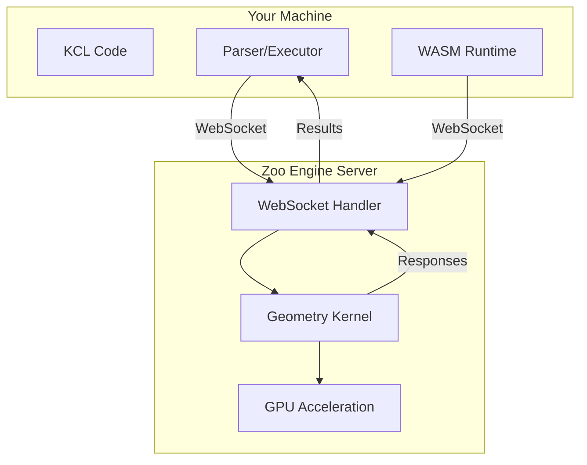
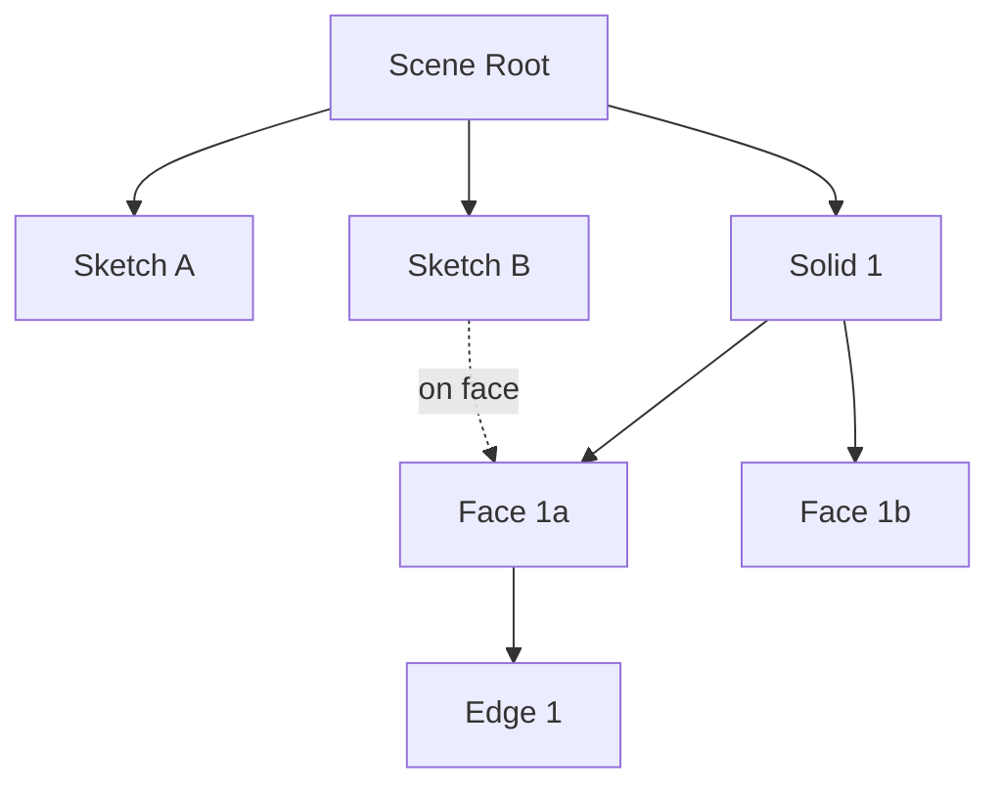

# Part 4: The Geometry Engine Internals

KCL doesn't create geometry. It describes it. The actual geometric computations happen in a separate engine that KCL talks to over a network protocol. Understanding this architecture explains why KCL works the way it does and where performance bottlenecks live.

## The Split Architecture



The geometry engine is a server. KCL sends commands ("create a sketch", "extrude this profile") and receives results ("here's the solid's UUID", "here's the face list"). This client-server model has consequences:

1. **Latency**: Every operation involves network round-trips
2. **Batching**: Multiple commands are grouped to reduce round-trips
3. **State**: The engine maintains geometric state; KCL tracks references to it
4. **Parallelism**: The engine can handle multiple clients

## Engine Connection Types

Look at `rust/kcl-lib/src/engine/mod.rs`:

```rust
pub trait EngineManager: Send + Sync {
    fn batch(&self) -> Result<Arc<RwLock<Vec<WebSocketRequest>>>, EngineError>;
    fn take_batch(&self) -> Result<Vec<WebSocketRequest>, EngineError>;
    fn responses(&self) -> Result<Arc<RwLock<IndexMap<Uuid, WebSocketResponse>>>, EngineError>;
    // ... more methods
}
```

This trait defines what any engine connection must support. There are three implementations:

### Native Connection (`conn.rs`)

Used when running the desktop app. Connects directly to Zoo's engine server via WebSocket.

```rust
pub struct EngineConnection {
    socket: WebSocket,
    batch: Arc<RwLock<Vec<WebSocketRequest>>>,
    responses: Arc<RwLock<IndexMap<Uuid, WebSocketResponse>>>,
}
```

### WASM Connection (`conn_wasm.rs`)

Used in the browser. The WebSocket is managed by JavaScript, and the Rust/WASM code talks to it through the JS bridge.

```rust
pub struct EngineConnectionWasm {
    // JavaScript handles the actual WebSocket
    // This is a thin wrapper
    js_bridge: JsValue,
}
```

### Mock Connection (`conn_mock.rs`)

Used for testing. Returns fake responses without hitting a real engine.

```rust
pub struct MockEngineConnection {
    responses: Arc<RwLock<IndexMap<Uuid, WebSocketResponse>>>,
}

impl MockEngineConnection {
    pub fn with_responses(responses: Vec<(Uuid, WebSocketResponse)>) -> Self {
        // Pre-populate fake responses
    }
}
```

This pattern (trait + multiple implementations) is how Rust achieves polymorphism without inheritance.

## The Command Protocol

Commands go out, responses come back. Look at what a command looks like in `kittycad-modeling-cmds`:

```rust
pub enum ModelingCmd {
    StartSketch(StartSketch),
    SketchAddLine(SketchAddLine),
    Extrude(Extrude),
    Fillet(Fillet),
    Boolean(Boolean),
    // ... many more
}

pub struct Extrude {
    pub target: Uuid,           // Which sketch to extrude
    pub distance: f64,          // How far
    pub direction: Direction,   // Which direction
    pub cap: bool,              // Create end caps?
}
```

Each command is a struct with the data needed to perform that operation. The engine deserializes these, executes them, and returns results.

### Request/Response Lifecycle

```rust
// Simplified from rust/kcl-lib/src/execution/modeling.rs

pub async fn extrude(
    sketch: &Sketch,
    length: f64,
    exec_state: &mut ExecState,
) -> Result<Solid, KclError> {
    let cmd_id = Uuid::new_v4();

    // Build the command
    let cmd = WebSocketRequest {
        cmd_id,
        cmd: ModelingCmd::Extrude(Extrude {
            target: sketch.uid,
            distance: length,
            direction: Direction::Positive,
            cap: true,
        }),
    };

    // Add to batch
    exec_state.engine_manager.batch()?.write().push(cmd);

    // Later, when batch is sent and response arrives:
    let response = exec_state.engine_manager
        .responses()?
        .read()
        .get(&cmd_id)
        .cloned();

    match response {
        Some(WebSocketResponse::Extrude { solid_id, faces, ... }) => {
            Ok(Solid {
                uid: solid_id,
                // ...
            })
        }
        _ => Err(KclError::engine_error("Extrude failed")),
    }
}
```

### Why Batching?

If every `line()` in a sketch sent its own request and waited for a response, sketching would be painfully slow. Network latency dominates.

Instead, commands accumulate in a batch:

```rust
sketch = startSketchOn(XY)          // Adds StartSketch to batch
  |> line(to = [10, 0])             // Adds SketchAddLine to batch
  |> line(to = [10, 10])            // Adds SketchAddLine to batch
  |> line(to = [0, 10])             // Adds SketchAddLine to batch
  |> close()                        // Adds ClosePath to batch
// Batch is sent here, all at once
```

The batch is sent when:
1. The expression evaluating the pipeline completes
2. A result is needed from a previous command (synchronization point)
3. Execution pauses (error, user interaction)

## Async Execution

The engine connection is asynchronous. Look at how this shows up in function signatures:

```rust
pub async fn start_sketch_on(
    exec_state: &mut ExecState,
    args: Args,
) -> Result<KclValue, KclError> {
    // ...
}
```

That `async` keyword means this function returns a `Future` that must be awaited. In practice:

```rust
// Inside the executor
match expr {
    Expr::CallExpression(call) => {
        let result = self.call_function(&call).await?;
        // ^ .await suspends until the future completes
    }
}
```

Rust's async model is different from Python's:

| Python | Rust |
|--------|------|
| `async def foo():` | `async fn foo() -> T` |
| `await foo()` | `foo().await` |
| asyncio event loop | tokio runtime (or similar) |
| Cooperative multitasking | Cooperative multitasking |

The key difference: Rust's futures are lazy. `foo()` doesn't start executing until you `.await` it. Python's coroutines start immediately when called.

### The Tokio Runtime

KCL uses Tokio as its async runtime. You'll see this in tests and the CLI:

```rust
#[tokio::test]
async fn test_extrude() {
    // Tokio provides the event loop
}

#[tokio::main]
async fn main() {
    // Entry point for async CLI
}
```

Tokio handles:
- Scheduling async tasks
- Non-blocking I/O (network, file system)
- Timers and timeouts
- Thread pools for CPU-bound work

## Geometry Representation

The engine uses boundary representation (B-rep) internally. This is different from what you might expect from mesh-based tools like Blender.

### B-rep vs Mesh

| B-rep | Mesh |
|-------|------|
| Stores mathematical surfaces | Stores triangles |
| Exact geometry | Approximation |
| Editable (can fillet an edge) | Hard to modify (which triangles are that edge?) |
| Larger data for complex curves | Fixed-size triangles |

When you export an STL, the B-rep is tessellated (converted to triangles). The resolution parameter controls how closely the triangles approximate curves.

### What KCL Stores

KCL doesn't store the actual geometry. It stores references:

```rust
pub struct Sketch {
    pub uid: Uuid,              // Engine knows the actual sketch data
    pub start: SketchSurface,   // Which plane/face it's on
    pub entities: Vec<Path>,    // Simplified path info for the language
    pub meta: GeoMeta,          // Source location, metadata
}
```

The `uid` is the connection. When you pass a `Sketch` to `extrude()`, the command includes that UUID. The engine looks up the actual geometry by that ID.

This is like passing object IDs between processes. Python equivalent:

```python
class Sketch:
    def __init__(self, uid: uuid.UUID):
        self.uid = uid  # Engine has the real data

def extrude(sketch: Sketch, length: float) -> Solid:
    response = engine.send_command({
        "type": "extrude",
        "target": str(sketch.uid),
        "length": length,
    })
    return Solid(uid=response["solid_id"])
```

## Command Categories

Modeling commands fall into categories:

### Sketch Commands

Create and modify 2D geometry on a plane:

```rust
StartSketch { plane: Plane }
SketchAddLine { start: Point2d, end: Point2d }
SketchAddArc { center: Point2d, radius: f64, start_angle: f64, end_angle: f64 }
SketchAddSpline { control_points: Vec<Point2d> }
ClosePath { }
```

### Solid Commands

Create 3D geometry from 2D sketches:

```rust
Extrude { target: Uuid, distance: f64, cap: bool }
Revolve { target: Uuid, axis: Axis, angle: f64 }
Sweep { profile: Uuid, path: Uuid }
Loft { profiles: Vec<Uuid> }
```

### Modification Commands

Modify existing 3D geometry:

```rust
Fillet { target: Uuid, edges: Vec<Uuid>, radius: f64 }
Chamfer { target: Uuid, edges: Vec<Uuid>, distance: f64 }
Shell { target: Uuid, faces: Vec<Uuid>, thickness: f64 }
```

### Boolean Commands

Combine or subtract solids:

```rust
Boolean { operation: BooleanOp, operands: Vec<Uuid> }

pub enum BooleanOp {
    Union,
    Subtract,
    Intersect,
}
```

### Query Commands

Get information about geometry:

```rust
GetFaces { target: Uuid }
GetEdges { target: Uuid }
GetVertices { target: Uuid }
MeasureDistance { from: Uuid, to: Uuid }
```

## Error Propagation from Engine

Engine errors bubble up differently than language errors. Look at the error types:

```rust
pub enum KclError {
    // Language errors
    Lexical { ... },
    Syntax { ... },
    Type { ... },

    // Engine errors
    Engine { details: KclErrorDetails },
}

pub struct KclErrorDetails {
    pub message: String,
    pub source_ranges: Vec<SourceRange>,
}
```

When the engine fails (invalid geometry, impossible operation), it returns an error that KCL wraps and presents to the user. The source range connects the error back to the KCL code that caused it.

```kcl
// This will fail at the engine level
sketch = startSketchOn(XY)
  |> circle(center = [0, 0], radius = -5)  // Negative radius!
  |> extrude(length = 10)

// Error: Engine error: Invalid circle radius
//        at line 3, column 29
```

## Performance Considerations

### Minimize Round-Trips

Each batch send/receive has latency. Group related operations:

```kcl
// Slower: Forces multiple batches
s1 = startSketchOn(XY) |> ... |> extrude(10)
s2 = startSketchOn(face1) |> ... |> extrude(5)  // Must wait for face1 from s1

// Faster if possible: Independent operations batch together
s1 = startSketchOn(XY) |> ... |> extrude(10)
s2 = startSketchOn(XZ) |> ... |> extrude(5)  // Doesn't depend on s1
```

### Avoid Complex Booleans

Boolean operations (union, subtract, intersect) are expensive:

```kcl
// Expensive: Many boolean operations
result = solid1
  |> union(solid2)
  |> union(solid3)
  |> subtract(hole1)
  |> subtract(hole2)

// Potentially cheaper: Batch booleans
holes = union(hole1, hole2)  // One union
solids = union(solid1, solid2, solid3)  // One union
result = subtract(solids, holes)  // One subtract
```

### Pattern Functions Are Optimized

When you use `patternLinear` or `patternCircular`, the engine can optimize:

```kcl
// Engine can use instancing/references
holes = patternCircular(hole, count = 8, axis = Z, center = [0, 0, 0])

// Each is computed separately
h1 = translate(hole, x = 10)
h2 = translate(hole, x = 20)
// ... etc
```

Pattern functions tell the engine about the pattern's regularity, allowing optimizations like instanced rendering or shared geometry.

## The Scene Graph

The engine maintains a scene graph connecting geometric entities:



When you create a sketch on a face of a solid, there's a reference. If the solid changes (rebuild), the sketch might need to update too. This is the parametric in "parametric CAD."

### Tags and the Scene Graph

Tags in KCL create named references into this graph:

```kcl
box = startSketchOn(XY)
  |> rect(width = 10, height = 10)
  |> extrude(length = 5, tag = $topFace)

// Later, reference by tag
newSketch = startSketchOn(topFace)  // Finds the face tagged $topFace
```

The engine tracks: "The face created by this extrusion is tagged 'topFace'." When you reference `topFace`, it resolves to the actual face UUID.

## Exploring the Connection Code

The engine connection is the most network-heavy part of the codebase. In `rust/kcl-lib/src/engine/conn.rs`:

```rust
// Simplified connection handling
impl EngineConnection {
    pub async fn send_batch(&self) -> Result<(), EngineError> {
        let batch = self.batch.write().drain(..).collect::<Vec<_>>();

        for request in batch {
            let serialized = serde_json::to_string(&request)?;
            self.socket.send(Message::Text(serialized)).await?;
        }

        Ok(())
    }

    pub async fn receive_responses(&self) -> Result<(), EngineError> {
        loop {
            match self.socket.recv().await? {
                Message::Text(text) => {
                    let response: WebSocketResponse = serde_json::from_str(&text)?;
                    self.responses.write().insert(response.cmd_id, response);
                }
                Message::Close(_) => break,
                _ => continue,
            }
        }
        Ok(())
    }
}
```

This is standard async I/O: serialize commands to JSON, send over WebSocket, receive responses, deserialize, store for later lookup.

## Exercises

1. **Trace a Command**: Pick a simple KCL program (`circle |> extrude`). Add logging or use a debugger to trace the exact commands sent to the engine. What's in the JSON?

2. **Measure Latency**: Write a KCL program with many small operations. Compare execution time with few batches vs many. How much does latency matter?

3. **Engine Errors**: Write KCL code that causes engine errors (impossible geometry, like a zero-radius circle or self-intersecting extrusion). What errors come back? How are they reported?

4. **Mock Engine Testing**: Look at the tests in `rust/kcl-lib/e2e/`. How do they use the mock engine? What do the fake responses look like?

5. **Scene Graph Exploration**: Create a complex model with faces and edges. Use engine query commands to explore the scene graph. What relationships exist?

## What's Next

Part 5 covers the complete compiler pipeline: from raw text to executed geometry. You've seen pieces (parser, executor, engine). Now we'll see how they connect and where the boundaries are.

The engine is a black box that does what we ask. The compiler is the translator that converts human intent into engine commands.
