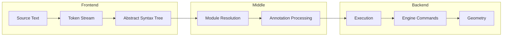

# Part 5: The Compiler Pipeline

A compiler is a series of transformations. Text becomes tokens. Tokens become trees. Trees become actions. Actions become geometry. This part traces the complete path from KCL source code to rendered 3D model.

## The Big Picture



Unlike traditional compilers that produce machine code, KCL produces geometry. The "codegen" phase sends commands to a geometry engine instead of emitting assembly.

## Phase 1: Lexical Analysis (Tokenization)

The lexer turns characters into tokens. Open `rust/kcl-lib/src/parsing/token/tokeniser.rs`:

```rust
pub fn lex(input: &str) -> Result<Vec<Token>, Vec<CompilationError>> {
    let mut tokens = Vec::new();
    let mut chars = input.char_indices().peekable();

    while let Some((pos, ch)) = chars.next() {
        let token = match ch {
            '|' if chars.peek() == Some(&(pos + 1, '>')) => {
                chars.next();  // consume '>'
                Token::new(TokenType::Pipe, pos, pos + 2)
            }
            '=' if chars.peek() != Some(&(pos + 1, '=')) => {
                Token::new(TokenType::Equals, pos, pos + 1)
            }
            '0'..='9' => lex_number(&mut chars, pos),
            'a'..='z' | 'A'..='Z' | '_' => lex_identifier(&mut chars, pos),
            '"' => lex_string(&mut chars, pos),
            // ... more cases
            _ => return Err(unexpected_character(ch, pos)),
        };
        tokens.push(token);
    }

    Ok(tokens)
}
```

### Token Types

KCL has about 50 token types. The important ones:

```rust
pub enum TokenType {
    // Literals
    Number,      // 42, 3.14, 5mm, 90deg
    String,      // "hello"
    True, False, // boolean literals

    // Identifiers and Keywords
    Identifier,  // myVariable, someFunction
    Fn, Let, If, Else, For, While, Return,

    // Operators
    Plus, Minus, Star, Slash,
    Pipe,        // |>
    Dollar,      // $ for tags
    Percent,     // % for pipe substitution

    // Delimiters
    LParen, RParen,
    LBrace, RBrace,
    LBracket, RBracket,
    Comma, Colon,

    // Special
    At,          // @ for annotations
    Newline,
    EOF,
}
```

### Number Lexing with Units

KCL numbers can have units attached. The lexer handles this:

```rust
fn lex_number(chars: &mut Peekable<...>, start: usize) -> Token {
    let mut end = start;

    // Consume digits and decimal point
    while let Some(&(pos, ch)) = chars.peek() {
        if ch.is_ascii_digit() || ch == '.' {
            end = pos;
            chars.next();
        } else {
            break;
        }
    }

    // Check for unit suffix
    if let Some(&(_, ch)) = chars.peek() {
        if ch.is_alphabetic() {
            // Might be a unit: mm, cm, deg, rad, etc.
            let unit_start = end + 1;
            while let Some(&(pos, ch)) = chars.peek() {
                if ch.is_alphabetic() {
                    end = pos;
                    chars.next();
                } else {
                    break;
                }
            }
        }
    }

    Token::new(TokenType::Number, start, end + 1)
}
```

The token carries the raw text. Unit parsing happens later during execution when the numeric type is needed.

### Winnow Parser Combinator

The actual lexer uses Winnow, a parser combinator library. Parser combinators build complex parsers from simple pieces:

```rust
use winnow::combinator::{alt, repeat};
use winnow::token::one_of;

fn identifier(input: &mut &str) -> PResult<&str> {
    (
        one_of(|c: char| c.is_alphabetic() || c == '_'),
        repeat(0.., one_of(|c: char| c.is_alphanumeric() || c == '_')),
    )
        .take()
        .parse_next(input)
}
```

This is declarative: describe what you want to parse, not how to parse it character by character. Python's PLY or lark work similarly.

## Phase 2: Parsing

The parser transforms tokens into an AST. Open `rust/kcl-lib/src/parsing/parser.rs`:

```rust
pub fn parse(tokens: &[Token]) -> Result<Node<Program>, Vec<CompilationError>> {
    let mut parser = Parser::new(tokens);
    parser.parse_program()
}

impl<'a> Parser<'a> {
    fn parse_program(&mut self) -> Result<Node<Program>, ParseError> {
        let mut body = Vec::new();

        while !self.is_at_end() {
            let item = self.parse_body_item()?;
            body.push(item);
        }

        Ok(Node::new(Program { body }, 0, self.current_position()))
    }
}
```

### Recursive Descent

KCL uses recursive descent parsing. Each grammar rule becomes a function:

```rust
fn parse_expression(&mut self) -> Result<Node<Expr>, ParseError> {
    self.parse_pipe_expression()
}

fn parse_pipe_expression(&mut self) -> Result<Node<Expr>, ParseError> {
    let mut left = self.parse_binary_expression()?;

    while self.matches(TokenType::Pipe) {
        let right = self.parse_call_expression()?;
        left = Node::new(
            Expr::PipeExpression(Box::new(PipeExpression { left, right })),
            left.start,
            right.end,
        );
    }

    Ok(left)
}

fn parse_binary_expression(&mut self) -> Result<Node<Expr>, ParseError> {
    self.parse_comparison()
}

fn parse_comparison(&mut self) -> Result<Node<Expr>, ParseError> {
    let mut left = self.parse_term()?;

    while self.matches_one_of(&[TokenType::Lt, TokenType::Gt, ...]) {
        let operator = self.previous().token_type;
        let right = self.parse_term()?;
        left = Node::new(
            Expr::BinaryExpression(Box::new(BinaryExpression {
                left,
                operator: operator.into(),
                right,
            })),
            left.start,
            right.end,
        );
    }

    Ok(left)
}
```

Each function calls the next level down. `parse_expression` calls `parse_pipe_expression`, which calls `parse_binary_expression`, and so on. This naturally handles operator precedence: lower-precedence operators are parsed higher in the call stack.

### Precedence Climbing

The actual parser uses precedence climbing for binary operators, which is more efficient:

```rust
fn parse_binary_expr_with_precedence(
    &mut self,
    min_precedence: u8,
) -> Result<Node<Expr>, ParseError> {
    let mut left = self.parse_unary()?;

    while let Some(op) = self.peek_operator() {
        let precedence = op.precedence();
        if precedence < min_precedence {
            break;
        }

        self.advance();  // consume operator
        let right = self.parse_binary_expr_with_precedence(precedence + 1)?;
        left = make_binary_expr(left, op, right);
    }

    Ok(left)
}
```

This handles left-associativity (`a + b + c` = `(a + b) + c`) and correctly groups mixed operators (`a + b * c` = `a + (b * c)`).

### AST Structure

The AST nodes capture the structure of the program:

```rust
pub struct Program {
    pub body: Vec<BodyItem>,
}

pub enum BodyItem {
    ExpressionStatement(Node<ExpressionStatement>),
    VariableDeclaration(Node<VariableDeclaration>),
    FunctionDeclaration(Node<FunctionDeclaration>),
    ReturnStatement(Node<ReturnStatement>),
    // ...
}

pub struct VariableDeclaration {
    pub name: Identifier,
    pub value: Node<Expr>,
}

pub struct FunctionDeclaration {
    pub name: Identifier,
    pub params: Vec<Parameter>,
    pub body: Vec<BodyItem>,
    pub return_type: Option<TypeAnnotation>,
}
```

Every node is wrapped in `Node<T>`, which adds source location:

```rust
pub struct Node<T> {
    pub inner: T,
    pub start: usize,
    pub end: usize,
    pub module_id: ModuleId,
}
```

This is crucial for error reporting. When something goes wrong, you need to point at the source code.

## Phase 3: Module Resolution

Before execution, imports must be resolved. This happens in `rust/kcl-lib/src/modules.rs`:

```rust
pub struct ModuleLoader {
    loaded: HashMap<ModulePath, ModuleRepr>,
}

impl ModuleLoader {
    pub fn load(&mut self, path: &ModulePath) -> Result<&ModuleRepr, KclError> {
        if self.loaded.contains_key(path) {
            return Ok(self.loaded.get(path).unwrap());
        }

        // Check for cycles
        if self.is_loading(path) {
            return Err(KclError::import_cycle(path));
        }

        let source = self.read_source(path)?;
        let ast = parsing::parse_str(&source)?;
        self.loaded.insert(path.clone(), ModuleRepr::Kcl(ast, None));

        Ok(self.loaded.get(path).unwrap())
    }
}
```

### Import Resolution

KCL imports can be:

1. **Local files**: `import "utils.kcl"`
2. **Standard library**: `import std::math`
3. **Foreign geometry**: `import "model.step"`

```rust
pub enum ModulePath {
    Main,                           // The entry point
    Local { value: PathBuf },       // Relative file
    Std { value: String },          // std::something
}
```

Standard library modules are embedded in the binary:

```rust
pub const PRELUDE: &str = include_str!("../std/prelude.kcl");
pub const MATH: &str = include_str!("../std/math.kcl");
pub const SKETCH: &str = include_str!("../std/sketch.kcl");
```

### Cycle Detection

Circular imports cause infinite loops. The loader tracks what's being loaded:

```rust
fn is_loading(&self, path: &ModulePath) -> bool {
    self.loading_stack.contains(path)
}

fn load(&mut self, path: &ModulePath) -> Result<...> {
    if self.is_loading(path) {
        return Err(KclError::import_cycle(...));
    }

    self.loading_stack.push(path.clone());
    let result = self.do_load(path);
    self.loading_stack.pop();

    result
}
```

## Phase 4: Annotation Processing

Annotations configure execution before the body runs:

```kcl
@settings(defaultLengthUnit = mm, defaultAngleUnit = deg)
@warnings(unknownUnits = "warn")

x = 5  // Now 5mm by default
```

Processing happens in `rust/kcl-lib/src/execution/annotations.rs`:

```rust
pub fn process_annotations(
    annotations: &[Annotation],
    settings: &mut MetaSettings,
) -> Result<(), KclError> {
    for annotation in annotations {
        match annotation.name.as_str() {
            "settings" => process_settings(annotation, settings)?,
            "warnings" => process_warnings(annotation, settings)?,
            "no_std" => settings.no_std = true,
            _ => return Err(unknown_annotation(&annotation.name)),
        }
    }
    Ok(())
}
```

### Settings Annotation

`@settings` controls execution defaults:

```rust
fn process_settings(
    annotation: &Annotation,
    settings: &mut MetaSettings,
) -> Result<(), KclError> {
    for (key, value) in &annotation.args {
        match key.as_str() {
            "defaultLengthUnit" => {
                settings.default_length_unit = parse_length_unit(value)?;
            }
            "defaultAngleUnit" => {
                settings.default_angle_unit = parse_angle_unit(value)?;
            }
            _ => return Err(unknown_setting(key)),
        }
    }
    Ok(())
}
```

## Phase 5: Execution

Execution walks the AST and produces side effects (geometry commands, variable bindings). This is in `rust/kcl-lib/src/execution/exec_ast.rs`:

```rust
pub async fn execute(
    program: &Node<Program>,
    exec_state: &mut ExecState,
) -> Result<ExecOutcome, ExecError> {
    for item in &program.body {
        execute_body_item(item, exec_state).await?;
    }

    Ok(ExecOutcome {
        variables: exec_state.memory.all_bindings(),
        errors: exec_state.errors.clone(),
    })
}

async fn execute_body_item(
    item: &BodyItem,
    exec_state: &mut ExecState,
) -> Result<(), ExecError> {
    match item {
        BodyItem::VariableDeclaration(decl) => {
            let value = execute_expr(&decl.value, exec_state).await?;
            exec_state.memory.bind(&decl.name, value)?;
        }
        BodyItem::ExpressionStatement(stmt) => {
            execute_expr(&stmt.expression, exec_state).await?;
        }
        BodyItem::FunctionDeclaration(func) => {
            let closure = create_closure(func, exec_state)?;
            exec_state.memory.bind(&func.name, closure)?;
        }
        // ...
    }
    Ok(())
}
```

### Expression Evaluation

Expressions are evaluated recursively:

```rust
async fn execute_expr(
    expr: &Node<Expr>,
    exec_state: &mut ExecState,
) -> Result<KclValue, ExecError> {
    match &expr.inner {
        Expr::Literal(lit) => Ok(literal_to_value(lit)),

        Expr::Identifier(id) => {
            exec_state.memory.lookup(&id.name)
                .ok_or_else(|| undefined_variable(&id.name, expr))
        }

        Expr::BinaryExpression(bin) => {
            let left = execute_expr(&bin.left, exec_state).await?;
            let right = execute_expr(&bin.right, exec_state).await?;
            apply_binary_op(bin.operator, left, right)
        }

        Expr::CallExpression(call) => {
            execute_call(call, exec_state).await
        }

        Expr::PipeExpression(pipe) => {
            let left = execute_expr(&pipe.left, exec_state).await?;
            exec_state.pipe_value = Some(left);
            let result = execute_call(&pipe.right, exec_state).await?;
            exec_state.pipe_value = None;
            Ok(result)
        }

        // ... more expression types
    }
}
```

### Function Calls

Function calls are where the interesting work happens:

```rust
async fn execute_call(
    call: &CallExpression,
    exec_state: &mut ExecState,
) -> Result<KclValue, ExecError> {
    let callee = execute_expr(&call.callee, exec_state).await?;

    // Evaluate arguments
    let args = evaluate_args(&call.arguments, exec_state).await?;

    match callee {
        KclValue::Function { value: func, .. } => {
            // User-defined function
            execute_user_function(func, args, exec_state).await
        }
        _ => {
            // Check if it's a stdlib function
            if let Some(stdlib_fn) = STDLIB.get(&call.callee_name()) {
                stdlib_fn.call(args, exec_state).await
            } else {
                Err(not_callable(&callee))
            }
        }
    }
}
```

### The Standard Library

Stdlib functions are registered in `rust/kcl-lib/src/std/mod.rs`:

```rust
lazy_static! {
    pub static ref STDLIB: HashMap<&'static str, StdLibFn> = {
        let mut m = HashMap::new();
        m.insert("startSketchOn", StdLibFn::new(sketch::start_sketch_on));
        m.insert("line", StdLibFn::new(sketch::line));
        m.insert("circle", StdLibFn::new(shapes::circle));
        m.insert("extrude", StdLibFn::new(extrude::extrude));
        m.insert("fillet", StdLibFn::new(fillet::fillet));
        // ... hundreds more
        m
    };
}
```

Each stdlib function follows the same pattern:

```rust
pub async fn extrude(
    exec_state: &mut ExecState,
    args: Args,
) -> Result<KclValue, KclError> {
    // 1. Extract and validate arguments
    let sketch: Sketch = args.get_unlabeled_kw_arg("sketch", ...)?;
    let length: f64 = args.get_kw_arg("length", ...)?;

    // 2. Build engine command
    let cmd = ModelingCmd::Extrude { ... };

    // 3. Add to batch
    exec_state.engine.batch()?.write().push(cmd);

    // 4. Return KCL value referencing the result
    Ok(KclValue::Solid { uid: cmd_id, ... })
}
```

## Phase 6: Engine Command Generation

As execution proceeds, commands accumulate. At certain points, the batch is sent:

```rust
impl EngineManager for EngineConnection {
    async fn flush(&self) -> Result<Vec<WebSocketResponse>, EngineError> {
        let batch = self.batch.write().drain(..).collect();

        // Send all commands
        for cmd in &batch {
            self.socket.send(serialize(cmd)?).await?;
        }

        // Collect responses
        let mut responses = Vec::new();
        for _ in &batch {
            let response = self.socket.recv().await?;
            responses.push(deserialize(response)?);
        }

        Ok(responses)
    }
}
```

### Command Serialization

Commands are serialized to JSON for the wire:

```json
{
  "cmd_id": "550e8400-e29b-41d4-a716-446655440000",
  "cmd": {
    "type": "extrude",
    "target": "660e8400-e29b-41d4-a716-446655440001",
    "distance": 10.0,
    "cap": true
  }
}
```

The `kittycad-modeling-cmds` crate defines the command types with serde derive macros:

```rust
#[derive(Serialize, Deserialize)]
#[serde(tag = "type")]
pub enum ModelingCmd {
    #[serde(rename = "extrude")]
    Extrude(ExtrudeCmd),
    // ...
}
```

## Phase 7: Response Processing

Responses come back with results or errors:

```rust
pub enum WebSocketResponse {
    Success {
        cmd_id: Uuid,
        result: ModelingCmdResult,
    },
    Error {
        cmd_id: Uuid,
        error: EngineError,
    },
}

pub enum ModelingCmdResult {
    Extrude { solid_id: Uuid, faces: Vec<Uuid>, edges: Vec<Uuid> },
    Fillet { modified_edges: Vec<Uuid> },
    // ...
}
```

Responses are stored by command ID for later lookup:

```rust
// When a command needs its response
let response = exec_state.engine
    .responses()?
    .read()
    .get(&cmd_id)
    .cloned()
    .ok_or(missing_response(cmd_id))?;
```

## The Complete Flow

Let's trace a simple program:

```kcl
@settings(defaultLengthUnit = mm)

box = startSketchOn(XY)
  |> rect(width = 10, height = 10)
  |> extrude(length = 5)
```

1. **Lex**: Text becomes tokens
   ```
   [@, settings, (, defaultLengthUnit, =, mm, ), NEWLINE,
    box, =, startSketchOn, (, XY, ), NEWLINE,
    |>, rect, (, width, =, 10, ..., ), NEWLINE,
    |>, extrude, (, length, =, 5, ), EOF]
   ```

2. **Parse**: Tokens become AST
   ```
   Program {
     body: [
       AnnotatedItem { annotation: @settings(...), ... },
       VariableDeclaration {
         name: "box",
         value: PipeExpression {
           left: PipeExpression {
             left: CallExpr { callee: "startSketchOn", args: [XY] },
             right: CallExpr { callee: "rect", args: [...] },
           },
           right: CallExpr { callee: "extrude", args: [length: 5] },
         }
       }
     ]
   }
   ```

3. **Process Annotations**: Set `defaultLengthUnit = mm`

4. **Execute Variable Declaration**:
   - Execute `startSketchOn(XY)` → Returns `Sketch { uid: A }`
   - Pipe into `rect(...)` → Adds lines to sketch, returns `Sketch { uid: A }`
   - Pipe into `extrude(length = 5)` → Adds command to batch
   - Flush batch → Engine receives `[StartSketch, Line, Line, Line, Line, Extrude]`
   - Engine returns `Solid { uid: B, faces: [...], edges: [...] }`
   - Bind `box` → `Solid { uid: B, ... }`

5. **Result**: `ExecOutcome { variables: { "box": Solid {...} }, errors: [] }`

## Comparison to Traditional Compilers

| Traditional Compiler | KCL |
|---------------------|-----|
| Lexer → Parser → AST | Same |
| Type Checker | Runtime type checking |
| IR Generation | Engine commands |
| Optimization Passes | Limited (engine optimizes) |
| Code Generation (asm) | Command serialization |
| Linker | Module loader |
| Executable | Geometry |

KCL is more like an interpreter with a JIT backend (the geometry engine). The "object code" is the scene graph maintained by the engine.

## Exercises

1. **Add a Token**: Pick a symbol that KCL doesn't use (maybe `@#`). Add it as a new token type. What changes are needed?

2. **Trace Parsing**: Use `dbg!` macros or a debugger to trace how `a + b * c` is parsed. Verify that operator precedence is correct.

3. **Custom Annotation**: Design and implement a custom annotation (`@myAnnotation(key = value)`). What should it do? Where does the processing code go?

4. **Batch Boundary**: Write KCL code that creates multiple independent batches. Where do the boundaries fall? Why?

5. **Error Locations**: Cause a type error deep in a piped expression. Does the error point to the right place? Trace how source location flows through the pipeline.

## What's Next

Part 6 covers error handling in depth. You've seen `Result` and `Option` throughout this pipeline. Now we'll examine the patterns, when to use each, and how to write error-handling code that helps users instead of confusing them.

The compiler pipeline is the backbone. Everything else hangs off it.
