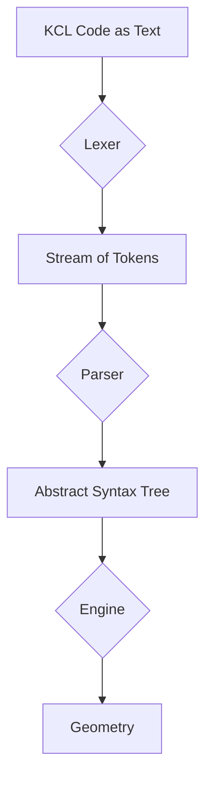

# Part 6: The Belly of the Beast: The KCL Parser (Expanded)

You've made it deep into the jungle. So far, we've treated the KCL compiler as a black box: code goes in, geometry comes out. Now, we're going to pry open that box. This is where your code begins its transformation from human-readable text to something the machine can execute. This process is called parsing, but it's really two distinct steps: **lexical analysis** (lexing) and **syntactic analysis** (parsing).

Here's our trusty, slightly more detailed diagram:



## Step 1: Lexical Analysis (The Lexer)

The first step is to break the raw text of your code into a sequence of "tokens." A token is the smallest unit of meaning in a language. Think of it as a word. The lexer scans the input string and groups characters into tokens.

In the KCL codebase, the lexer is defined in `rust/kcl-lib/src/parsing/token/tokeniser.rs`. It produces a stream of `Token` structs, each of which has a `TokenType`. You can see all the possible token types in `rust/kcl-lib/src/parsing/token/mod.rs`. They include things you'd expect:

-   `TokenType::Number` (e.g., `10`, `3.14`)
-   `TokenType::Word` (e.g., `myVariable`, `startSketchOn`)
-   `TokenType::Keyword` (e.g., `const`, `let`, `fn`)
-   `TokenType::Operator` (e.g., `+`, `-`, `=`)
-   `TokenType::Brace` (e.g., `{`, `}`, `(`, `)`)
-   And so on, for comments, strings, whitespace, etc.

Let's take a more complex KCL example:

```kcl
const wheelRadius = 10
const wheel = circle(0, 0, wheelRadius)
```

The lexer would turn this into a stream of tokens like this (simplified):

| Value           | Type      |
| --------------- | --------- |
| `const`         | Keyword   |
| `wheelRadius`   | Word      |
| `=`             | Operator  |
| `10`            | Number    |
| `const`         | Keyword   |
| `wheel`         | Word      |
| `=`             | Operator  |
| `circle`        | Word      |
| `(`             | Brace     |
| `0`             | Number    |
| `,`             | Comma     |
| `0`             | Number    |
| `,`             | Comma     |
| `wheelRadius`   | Word      |
| `)`             | Brace     |

The lexer doesn't know what this code *means*. It doesn't know that `circle` is a function or that `wheelRadius` is a variable. It just knows that `const` is a keyword and `wheelRadius` is a word. Its job is to put the raw text into neat, categorized boxes.

## Step 2: Syntactic Analysis (The Parser)

Now that we have a stream of tokens, the parser takes over. The parser's job is to determine the grammatical structure of the code. It consumes the tokens from the lexer and builds a tree-like data structure called an **Abstract Syntax Tree (AST)**. The AST represents the code's structure and meaning.

The KCL parser lives in `rust/kcl-lib/src/parsing/parser.rs`, and the definitions for the AST nodes are in the `rust/kcl-lib/src/parsing/ast/` directory.

The parser is essentially a set of rules that say things like:
- "If I see a `Keyword` with the value `const`, I expect to see a `Word` next, then an `Operator` with the value `=`, and then an expression."

If the tokens follow these rules, the parser builds an AST node (in this case, a `VariableDeclaration` node). If they don't, it produces a syntax error.

For our KCL example, the parser would consume the token stream and produce an AST that looks something like this (again, simplified for clarity):

```
Program
└── Body
    ├── [0]: VariableDeclaration
    │   ├── Name: "wheelRadius"
    │   └── Value: Literal(10)
    │
    └── [1]: VariableDeclaration
        ├── Name: "wheel"
        └── Value: CallExpression
            ├── Callee: "circle"
            └── Arguments
                ├── [0]: Literal(0)
                ├── [1]: Literal(0)
                └── [2]: Identifier("wheelRadius")
```

This tree is a much more useful representation of our code. It captures the relationships between the different parts: `wheel` is being declared, its value comes from a function call, that function is `circle`, and it's being called with three arguments, one of which is the variable `wheelRadius`.

This AST is the data structure that gets passed to the next stage of the compiler: the engine.

## Why You Should Care

Understanding the parser is crucial for diagnosing syntax errors. When you get a message like "unexpected token," it's the parser telling you that the stream of tokens it received from the lexer didn't match any of its grammatical rules. By understanding this process, you can better pinpoint where your code violates the language's grammar.

It's also the first step to making deeper contributions to KCL. If you ever want to add new syntax to the language—a new kind of loop, a new type of declaration—you'll have to start by modifying the parser.

Next, we'll follow the AST to its destination: the KCL engine, which will execute this tree to produce actual geometry.
