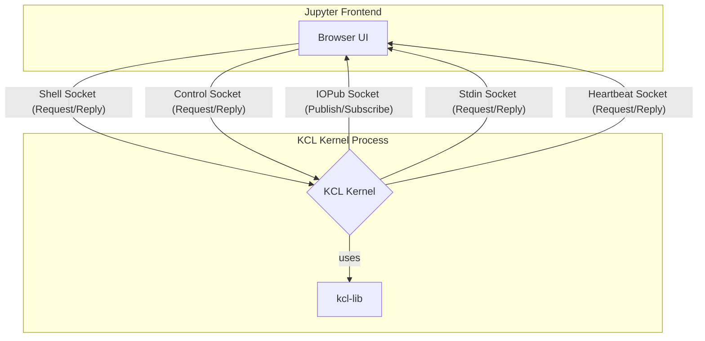

# Part 8: The Jupyter Kernel: A Fool's Errand (Expanded)

Welcome to the grand project. We're going to build a Jupyter kernel for KCL. This will tie together everything we've learned about Rust and the internals of the KCL compiler. It's ambitious. It's probably foolish. But by the end, you'll have a real, working contribution and a deep understanding of the entire KCL ecosystem.

## The Jupyter Architecture: A Symphony of Sockets

Jupyter's architecture is surprisingly elegant. It's a client-server model, but it's a bit more complex than a simple request-response cycle. When you start a kernel, it listens on several network ports for different kinds of messages. The frontend (your web browser) connects to these ports and communicates with the kernel using a messaging protocol over ZeroMQ (ZMQ).

Here's a more accurate diagram of the moving parts:



The kernel and frontend communicate over five ZMQ sockets:

1.  **Shell**: This is the main channel for executing code. The frontend sends `execute_request` messages, and the kernel sends `execute_reply` messages.
2.  **IOPub**: This is a one-way street. The kernel broadcasts messages to the frontend about its status (`status`), what it's writing to stdout/stderr (`stream`), and the results of execution (`execute_result`). This is a publish-subscribe channel.
3.  **Control**: Similar to the Shell socket, but intended for control messages like shutdown and restart.
4.  **Stdin**: For when the kernel needs to request input from the user.
5.  **Heartbeat**: A simple request-reply socket to check if the kernel is still alive.

All messages are sent as a series of frames, containing headers, metadata, and the actual content in JSON format. It's a well-defined, language-agnostic protocol.

## Our Plan: A Rust-based Kernel

Our goal is to build a Rust program that implements this protocol. It will listen on the ZMQ sockets, parse the incoming messages, and when it receives an `execute_request`, it will pipe the KCL code to our `kcl-lib` executor, take the result, and send it back to the frontend in the correct message format.

Thankfully, we don't have to do all of this from scratch. The Rust community has a crate for that.

### Step 1: Project Setup

First, let's create a new binary project. We'll do this outside of the `learning_kcl` directory, in a new `kcl_kernel` directory at the root of the repository.

```bash
cargo new kcl_kernel
cd kcl_kernel
```

### Step 2: Dependencies

Now, let's add our dependencies to `Cargo.toml`.

```toml
[dependencies]
jupyter_kernel = "0.1.1" # A helper library for writing Jupyter kernels
serde_json = "1.0"      # For working with JSON
tokio = { version = "1", features = ["full"] } # An async runtime
anyhow = "1.0"         # For simpler error handling
uuid = { version = "1", features = ["v4"] } # For generating message IDs

# And, of course, our KCL executor
kcl-lib = { path = "../rust/kcl-lib" }
```

The star of the show here is `jupyter_kernel`. This crate handles all the low-level ZMQ communication and message serialization/deserialization. It provides a simple `Kernel` trait that we can implement, which abstracts away most of the messy details.

### Step 3: The Kernel Skeleton

Let's create the basic structure of our kernel in `src/main.rs`.

```rust
use anyhow::Result;
use jupyter_kernel::{Kernel, KernelInfo, LanguageInfo, DisplayData};
use kcl_lib::executor::Executor;
use serde_json::json;
use std::sync::Arc;
use tokio::sync::Mutex;

#[tokio::main]
async fn main() -> Result<()> {
    KclKernel::start().await?;
    Ok(())
}

struct KclKernel {
    executor: Arc<Mutex<Executor>>,
}

impl KclKernel {
    async fn start() -> Result<()> {
        let kernel = KclKernel {
            executor: Arc::new(Mutex::new(Executor::new().await?)),
        };
        jupyter_kernel::run(&kernel);
        Ok(())
    }
}

impl Kernel for KclKernel {
    fn get_info(&self) -> KernelInfo {
        KernelInfo {
            protocol_version: "5.3".to_string(),
            implementation: "kcl-kernel".to_string(),
            implementation_version: "0.1.0".to_string(),
            language_info: LanguageInfo {
                name: "KCL".to_string(),
                version: "0.1.0".to_string(),
                mimetype: "text/x-kcl".to_string(),
                file_extension: ".kcl".to_string(),
                ..Default::default()
            },
            banner: "KCL Kernel".to_string(),
            ..Default::default()
        }
    }

    async fn execute(&self, code: &str, execution_count: u32) -> Result<Vec<DisplayData>> {
        // This is where the magic will happen.
        // We'll implement this in the next part.
        Ok(Vec::new())
    }

    async fn complete(&self, code: &str, cursor_pos: u32) -> Result<(Vec<String>, u32, u32)> {
        // We can implement code completion later.
        Ok((Vec::new(), cursor_pos, cursor_pos))
    }
}
```
This is a solid starting point. We have a `KclKernel` struct that holds our `kcl-lib` `Executor`. We've implemented the `Kernel` trait with some basic metadata, and we've left placeholders for the `execute` and `complete` methods. The `tokio::main` attribute sets up the asynchronous runtime we'll need.

In the next part, we'll breathe life into this skeleton by implementing the `execute` method. We'll take the user's code, pass it to the KCL executor, and figure out how to display the resulting geometry in the notebook.
