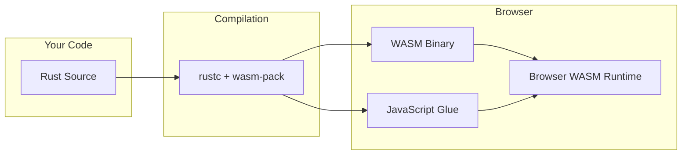

# Part 8: The WASM Bridge

KCL runs in browsers. Browsers don't run Rust directly. They run JavaScript and WebAssembly. The WASM bridge translates between Rust's world and JavaScript's world, handling memory, async operations, and type conversions across the boundary.

## What Is WASM?

WebAssembly (WASM) is a binary instruction format that runs in browsers (and other places). It's fast, portable, and sandboxed.



Rust compiles to WASM via the `wasm32-unknown-unknown` target. The `wasm-bindgen` tool generates JavaScript bindings.

## The KCL WASM Library

Look at `rust/kcl-wasm-lib/src/lib.rs`:

```rust
use wasm_bindgen::prelude::*;

#[wasm_bindgen]
pub async fn execute_kcl(code: String, context_json: String) -> JsValue {
    // Parse context from JSON
    let ctx: ExecutorContext = serde_json::from_str(&context_json)
        .map_err(|e| JsValue::from_str(&e.to_string()))?;

    // Parse and execute
    let ast = parsing::parse_str(&code)?;
    let outcome = execution::execute(&ast, &ctx).await?;

    // Convert to JsValue for return
    serde_wasm_bindgen::to_value(&outcome)
        .map_err(|e| JsValue::from_str(&e.to_string()))
}
```

The `#[wasm_bindgen]` attribute is the magic. It generates:
1. A WASM function that JavaScript can call
2. JavaScript glue code to handle type conversion
3. Memory management across the boundary

## Type Conversion at the Boundary

Rust and JavaScript have different type systems. Converting between them has rules.

### Primitive Types

| Rust | JavaScript | Notes |
|------|------------|-------|
| `i32`, `u32`, `f64` | `number` | Direct mapping |
| `bool` | `boolean` | Direct mapping |
| `String` | `string` | Copied across boundary |
| `&str` | `string` | Copied (can't share reference) |

### Complex Types

For structs and enums, use `serde`:

```rust
use serde::{Serialize, Deserialize};
use serde_wasm_bindgen;

#[derive(Serialize, Deserialize)]
pub struct Point {
    x: f64,
    y: f64,
}

#[wasm_bindgen]
pub fn create_point(x: f64, y: f64) -> JsValue {
    let point = Point { x, y };
    serde_wasm_bindgen::to_value(&point).unwrap()
}

#[wasm_bindgen]
pub fn read_point(js: JsValue) -> f64 {
    let point: Point = serde_wasm_bindgen::from_value(js).unwrap();
    point.x + point.y
}
```

JavaScript sees:
```javascript
const point = create_point(3.0, 4.0);
console.log(point);  // { x: 3, y: 4 }
console.log(read_point(point));  // 7
```

### JsValue: The Universal Type

`JsValue` is wasm-bindgen's type for any JavaScript value:

```rust
use wasm_bindgen::JsValue;

#[wasm_bindgen]
pub fn log_value(value: JsValue) {
    // value could be anything: number, string, object, null, undefined
    web_sys::console::log_1(&value);
}

#[wasm_bindgen]
pub fn return_object() -> JsValue {
    let obj = js_sys::Object::new();
    js_sys::Reflect::set(&obj, &"key".into(), &42.into()).unwrap();
    obj.into()
}
```

## Memory Management Across the Boundary

WASM has its own linear memory. JavaScript has garbage collection. They don't share.

### The Problem

```rust
#[wasm_bindgen]
pub fn create_data() -> Vec<u8> {
    vec![1, 2, 3, 4, 5]
}
```

Where does that `Vec` live? In WASM memory. JavaScript gets a view into that memory, but when Rust drops the Vec, the memory is freed. JavaScript's reference becomes dangling.

### The Solution: Copy or Transfer

**Copy** (safe, slower):
```rust
#[wasm_bindgen]
pub fn get_data() -> Vec<u8> {
    vec![1, 2, 3]
}
// wasm-bindgen copies the data to JS heap
```

**Transfer** (careful ownership):
```rust
#[wasm_bindgen]
pub fn get_buffer() -> js_sys::Uint8Array {
    let data = vec![1, 2, 3, 4, 5];
    js_sys::Uint8Array::from(data.as_slice())
    // JS now owns a copy
}
```

### Rust Objects in JavaScript

For complex Rust objects that need to persist:

```rust
#[wasm_bindgen]
pub struct Parser {
    tokens: Vec<Token>,
    position: usize,
}

#[wasm_bindgen]
impl Parser {
    #[wasm_bindgen(constructor)]
    pub fn new(code: String) -> Result<Parser, JsValue> {
        let tokens = tokenize(&code)
            .map_err(|e| JsValue::from_str(&e.to_string()))?;
        Ok(Parser { tokens, position: 0 })
    }

    pub fn parse_next(&mut self) -> JsValue {
        // Parse one item, return as JsValue
        ...
    }

    pub fn is_done(&self) -> bool {
        self.position >= self.tokens.len()
    }
}
```

JavaScript:
```javascript
const parser = new Parser("x = 5\ny = 10");
while (!parser.is_done()) {
    const item = parser.parse_next();
    console.log(item);
}
parser.free();  // Manual cleanup!
```

That `free()` call is crucial. Rust objects held by JavaScript don't get garbage collected. You must free them explicitly.

## Async Operations in WASM

JavaScript is async. Rust's `async`/`await` compiles to state machines. Making them work together requires care.

### wasm-bindgen-futures

```rust
use wasm_bindgen_futures::JsFuture;
use web_sys::Response;

#[wasm_bindgen]
pub async fn fetch_data(url: String) -> Result<JsValue, JsValue> {
    let window = web_sys::window().unwrap();

    // Convert JS Promise to Rust Future
    let resp_value = JsFuture::from(window.fetch_with_str(&url)).await?;
    let resp: Response = resp_value.dyn_into()?;

    // Get the JSON body
    let json = JsFuture::from(resp.json()?).await?;

    Ok(json)
}
```

`JsFuture` wraps a JavaScript Promise so Rust can `.await` it.

### Returning Promises to JavaScript

When a Rust async function is called from JavaScript, it returns a Promise:

```rust
#[wasm_bindgen]
pub async fn slow_operation() -> Result<String, JsValue> {
    // This takes a while
    let result = compute_something().await?;
    Ok(result)
}
```

```javascript
// JavaScript
const result = await slow_operation();
console.log(result);
```

## The SendSync Problem

Rust's async runtime expects types to be `Send` (can be sent to other threads) and `Sync` (can be shared between threads). But WASM is single-threaded. JavaScript values aren't thread-safe.

### The Wrapper Pattern

Look at `rust/kcl-lib/src/wasm/mod.rs`:

```rust
/// A wrapper that implements Send + Sync for single-threaded WASM
#[derive(Debug)]
pub struct SendWrapper<T>(T);

// SAFETY: WASM is single-threaded
unsafe impl<T> Send for SendWrapper<T> {}
unsafe impl<T> Sync for SendWrapper<T> {}

impl<T> SendWrapper<T> {
    pub fn new(value: T) -> Self {
        SendWrapper(value)
    }

    pub fn into_inner(self) -> T {
        self.0
    }
}
```

This is an escape hatch. It's safe only because:
1. WASM (without threads feature) is single-threaded
2. The value never actually moves between threads

Use this sparingly and document why it's safe.

### JsFuture and JsValue Wrappers

```rust
pub struct JsFuture(Option<wasm_bindgen_futures::JsFuture>);

unsafe impl Send for JsFuture {}
unsafe impl Sync for JsFuture {}

impl JsFuture {
    pub fn new(promise: js_sys::Promise) -> Self {
        JsFuture(Some(wasm_bindgen_futures::JsFuture::from(promise)))
    }
}
```

## Building the WASM Package

The build process uses `wasm-pack`:

```bash
cd rust/kcl-wasm-lib
wasm-pack build --target web --release
```

This produces:
```
pkg/
├── kcl_wasm_lib_bg.wasm     # The WASM binary
├── kcl_wasm_lib.js          # JavaScript glue
├── kcl_wasm_lib.d.ts        # TypeScript definitions
└── package.json             # NPM package manifest
```

### Target Options

- `--target web`: For browser ES modules
- `--target bundler`: For Webpack/Rollup
- `--target nodejs`: For Node.js
- `--target no-modules`: For plain script tags

### Size Optimization

WASM binaries can be large. To shrink them:

```toml
# Cargo.toml
[profile.release]
opt-level = 'z'      # Optimize for size
lto = true           # Link-time optimization
codegen-units = 1    # Better optimization, slower build
```

```bash
# After building, run wasm-opt
wasm-opt -Oz -o optimized.wasm pkg/kcl_wasm_lib_bg.wasm
```

## JavaScript Integration

The frontend uses the WASM module. Look at how it's loaded:

```typescript
// In src/wasm/index.ts
import init, { execute_kcl } from 'kcl-wasm-lib';

let wasmInitialized = false;

export async function initWasm(): Promise<void> {
    if (!wasmInitialized) {
        await init();
        wasmInitialized = true;
    }
}

export async function runKcl(code: string, context: ExecutorContext): Promise<ExecOutcome> {
    await initWasm();

    const contextJson = JSON.stringify(context);
    const result = await execute_kcl(code, contextJson);

    return result as ExecOutcome;
}
```

### Error Handling at the Boundary

Errors need special handling:

```rust
#[wasm_bindgen]
pub fn might_fail() -> Result<JsValue, JsValue> {
    do_something()
        .map(|v| serde_wasm_bindgen::to_value(&v).unwrap())
        .map_err(|e| JsValue::from_str(&e.to_string()))
}
```

```typescript
try {
    const result = await might_fail();
    console.log(result);
} catch (error) {
    // error is a string from Rust
    console.error("WASM error:", error);
}
```

For richer errors, serialize a structured error object:

```rust
#[derive(Serialize)]
struct WasmError {
    message: String,
    code: String,
    source_range: Option<SourceRange>,
}

#[wasm_bindgen]
pub fn might_fail() -> Result<JsValue, JsValue> {
    do_something()
        .map(|v| serde_wasm_bindgen::to_value(&v).unwrap())
        .map_err(|e| {
            let wasm_err = WasmError {
                message: e.to_string(),
                code: e.code(),
                source_range: e.source_range(),
            };
            serde_wasm_bindgen::to_value(&wasm_err).unwrap()
        })
}
```

## The WASM Engine Connection

The geometry engine connection in WASM differs from native:

```rust
// rust/kcl-lib/src/engine/conn_wasm.rs

pub struct EngineConnectionWasm {
    bridge: JsEngineBridge,
    batch: Arc<RwLock<Vec<WebSocketRequest>>>,
    responses: Arc<RwLock<IndexMap<Uuid, WebSocketResponse>>>,
}

impl EngineConnectionWasm {
    pub fn new(bridge: JsEngineBridge) -> Self {
        Self {
            bridge,
            batch: Arc::new(RwLock::new(Vec::new())),
            responses: Arc::new(RwLock::new(IndexMap::new())),
        }
    }

    async fn send_to_js(&self, cmd: WebSocketRequest) -> Result<WebSocketResponse, EngineError> {
        let cmd_json = serde_json::to_string(&cmd)?;

        // Call into JavaScript
        let response_js = self.bridge.send_command(cmd_json).await?;

        // Parse response back
        let response: WebSocketResponse = serde_wasm_bindgen::from_value(response_js)?;
        Ok(response)
    }
}
```

The JavaScript side handles the actual WebSocket:

```typescript
class EngineBridge {
    private ws: WebSocket;

    async sendCommand(cmdJson: string): Promise<any> {
        return new Promise((resolve, reject) => {
            const cmd = JSON.parse(cmdJson);

            this.ws.send(cmdJson);

            this.ws.onmessage = (event) => {
                const response = JSON.parse(event.data);
                if (response.cmd_id === cmd.cmd_id) {
                    resolve(response);
                }
            };

            this.ws.onerror = reject;
        });
    }
}
```

## Debugging WASM

WASM debugging is harder than native Rust. Some techniques:

### Console Logging

```rust
use web_sys::console;

#[wasm_bindgen]
pub fn debug_function(input: &str) -> Result<JsValue, JsValue> {
    console::log_1(&format!("Input: {}", input).into());

    let result = process(input);
    console::log_1(&format!("Result: {:?}", result).into());

    Ok(serde_wasm_bindgen::to_value(&result).unwrap())
}
```

### Browser DevTools

Chrome and Firefox can debug WASM:
1. Open DevTools
2. Enable "WebAssembly Debugging" in Settings
3. Source maps show Rust code (if built with debug info)
4. Set breakpoints in Rust source

### Panic Handling

Rust panics in WASM need special handling:

```rust
use console_error_panic_hook;

#[wasm_bindgen(start)]
pub fn init_panic_hook() {
    console_error_panic_hook::set_once();
}
```

Now panics print useful stack traces to the console instead of cryptic "unreachable" errors.

## Performance Considerations

WASM is fast, but the boundary has overhead.

### Minimize Boundary Crossings

```rust
// Bad: many small calls
#[wasm_bindgen]
pub fn add(a: i32, b: i32) -> i32 { a + b }
// Calling this in a loop is slow

// Good: batch operations
#[wasm_bindgen]
pub fn sum_array(arr: &[i32]) -> i32 {
    arr.iter().sum()
}
// One call, process many values
```

### Pre-allocate Memory

```rust
// Let Rust manage the buffer
#[wasm_bindgen]
pub struct Buffer {
    data: Vec<u8>,
}

#[wasm_bindgen]
impl Buffer {
    pub fn new(size: usize) -> Buffer {
        Buffer { data: vec![0; size] }
    }

    pub fn as_ptr(&self) -> *const u8 {
        self.data.as_ptr()
    }

    pub fn len(&self) -> usize {
        self.data.len()
    }
}
```

JavaScript can then write directly to WASM memory:
```javascript
const buffer = new Buffer(1024);
const view = new Uint8Array(memory.buffer, buffer.as_ptr(), buffer.len());
view.set(sourceData);  // Direct memory copy
```

## Exercises

1. **Simple WASM Function**: Write a WASM function that takes two numbers and returns their product. Build it and call it from JavaScript.

2. **Struct Serialization**: Create a Rust struct with several fields. Export a function that creates and returns it. Verify the JavaScript object matches.

3. **Async WASM**: Write an async WASM function that simulates a delay (using `wasm_bindgen_futures::spawn_local`). Call it from JavaScript with await.

4. **Error Handling**: Write a WASM function that can fail. Return structured errors and handle them gracefully in JavaScript.

5. **Memory Experiment**: Create a large Vec in Rust, expose it to JavaScript, drop it, and see what happens. Why is this dangerous?

## Common Pitfalls

**Forgetting to free**: Rust objects held by JavaScript must be freed manually. Set up linting or wrapper classes to enforce this.

**Blocking the main thread**: WASM runs on the main thread by default. Long operations freeze the UI. Use Web Workers or break work into chunks.

**JSON overhead**: Serializing everything to JSON is convenient but slow. For hot paths, use binary formats or direct memory access.

**Memory leaks**: Easy to create circular references between Rust and JavaScript. Use weak references or clear references explicitly.

## What's Next

Part 9 explores liberating KCL from modeling-app. You've seen how it runs in browsers via WASM. Now we'll look at running it standalone: as a CLI tool, as a library in other Rust projects, or embedded in entirely different applications.

The WASM bridge is one escape route. There are others.
