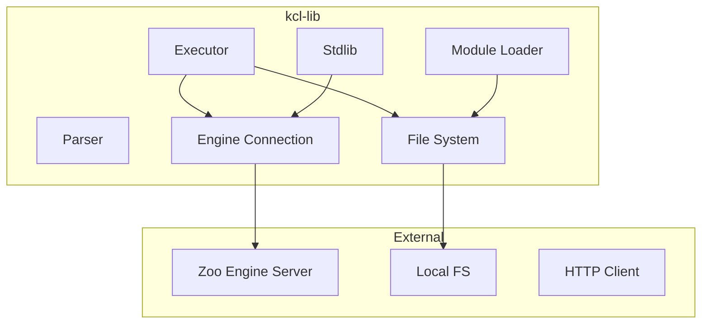
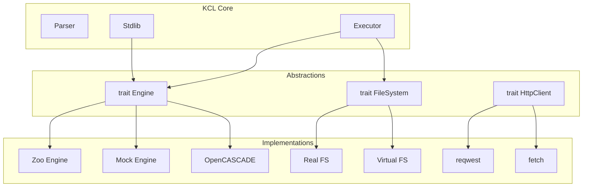

# Part 9: Liberating KCL

KCL is tightly coupled to modeling-app. The language runtime, the geometry engine connection, the UI, the file system access, the module loading. All intertwined. This part explores what it takes to pull KCL out and use it elsewhere: as a standalone CLI, as a library in other Rust projects, embedded in different applications.

## The Current Coupling

KCL's dependencies form a web:



The tight spots:
1. **Engine Connection**: Assumes Zoo's engine server is available
2. **File System**: Uses `std::fs` directly in places
3. **HTTP Client**: For imports and engine communication
4. **Configuration**: Assumes modeling-app's config structure

## Strategy 1: CLI Tool

The simplest liberation is a standalone CLI. Look at `rust/kcl-lib/src/main.rs`:

```rust
use clap::Parser;
use kcl_lib::{parsing, execution, ExecutorContext};

#[derive(Parser)]
#[command(name = "kcl")]
#[command(about = "KCL compiler and runner")]
struct Cli {
    /// Input KCL file
    input: PathBuf,

    /// Output format (stl, step, json)
    #[arg(short, long, default_value = "stl")]
    format: String,

    /// Output file
    #[arg(short, long)]
    output: Option<PathBuf>,

    /// Engine URL
    #[arg(long, default_value = "wss://api.zoo.dev/ws")]
    engine: String,

    /// API token
    #[arg(long, env = "ZOO_API_TOKEN")]
    token: Option<String>,
}

#[tokio::main]
async fn main() -> anyhow::Result<()> {
    let cli = Cli::parse();

    // Read source
    let source = std::fs::read_to_string(&cli.input)?;

    // Parse
    let ast = parsing::parse_str(&source)
        .map_err(|errors| anyhow::anyhow!("Parse errors: {:?}", errors))?;

    // Set up context
    let ctx = ExecutorContext::new()
        .with_engine_url(&cli.engine)
        .with_token(cli.token.as_deref())
        .with_project_directory(cli.input.parent());

    // Execute
    let outcome = execution::execute(&ast, &ctx).await?;

    // Handle errors
    if !outcome.errors.is_empty() {
        for error in &outcome.errors {
            eprintln!("Error: {}", error);
        }
        if outcome.has_fatal_error() {
            std::process::exit(1);
        }
    }

    // Export
    if let Some(output) = cli.output {
        let geometry = outcome.get_geometry()?;
        let bytes = export(&geometry, &cli.format).await?;
        std::fs::write(&output, bytes)?;
        println!("Wrote {} bytes to {:?}", bytes.len(), output);
    }

    Ok(())
}
```

### Building the CLI

```bash
cd rust/kcl-lib
cargo build --release --bin kcl
# Binary at target/release/kcl
```

### Running It

```bash
# Basic execution
kcl run my_design.kcl

# With output
kcl run my_design.kcl -o output.stl

# Check syntax only
kcl check my_design.kcl

# Format code
kcl fmt my_design.kcl

# With custom engine
kcl run my_design.kcl --engine ws://localhost:8080
```

## Strategy 2: Library Usage

To use KCL as a library in another Rust project:

```toml
# Your project's Cargo.toml
[dependencies]
kcl-lib = { path = "../modeling-app/rust/kcl-lib" }
# Or from git:
kcl-lib = { git = "https://github.com/zoo-dev/modeling-app", branch = "main" }
```

### Basic Library Usage

```rust
use kcl_lib::{parsing, execution, ExecutorContext, KclValue};

async fn run_kcl(code: &str) -> Result<HashMap<String, KclValue>, Box<dyn Error>> {
    // Parse
    let ast = parsing::parse_str(code)?;

    // Create mock context (no engine needed for simple programs)
    let ctx = ExecutorContext::mock();

    // Execute
    let outcome = execution::execute(&ast, &ctx).await?;

    Ok(outcome.variables)
}

#[tokio::main]
async fn main() {
    let code = r#"
        x = 5
        y = 10
        result = x + y
    "#;

    let vars = run_kcl(code).await.unwrap();
    println!("result = {:?}", vars.get("result"));
}
```

### With Engine Connection

For geometry operations, you need an engine:

```rust
use kcl_lib::{engine::EngineConnection, ExecutorContext};

async fn run_with_engine(code: &str) -> Result<ExecOutcome, Box<dyn Error>> {
    // Connect to engine
    let engine = EngineConnection::connect("wss://api.zoo.dev/ws", &api_token).await?;

    // Create context with engine
    let ctx = ExecutorContext::new()
        .with_engine(Arc::new(engine));

    // Parse and execute
    let ast = parsing::parse_str(code)?;
    let outcome = execution::execute(&ast, &ctx).await?;

    Ok(outcome)
}
```

## Strategy 3: Offline Mode

For truly standalone operation, you need a local geometry engine. This doesn't exist yet as open source, but the architecture supports it:

```rust
// Hypothetical local engine
pub trait LocalGeometryEngine {
    fn start_sketch(&mut self, plane: Plane) -> SketchId;
    fn add_line(&mut self, sketch: SketchId, from: Point2d, to: Point2d) -> LineId;
    fn extrude(&mut self, sketch: SketchId, distance: f64) -> SolidId;
    fn export_stl(&self, solid: SolidId) -> Vec<u8>;
}

// Using open source geometry kernel
use opencascade_sys as occ;

struct OccEngine {
    // OpenCASCADE state
}

impl LocalGeometryEngine for OccEngine {
    fn extrude(&mut self, sketch: SketchId, distance: f64) -> SolidId {
        // Use OpenCASCADE to create the extrusion
        let face = self.get_sketch_face(sketch);
        let solid = occ::BRepPrimAPI_MakePrism::new(face, distance);
        self.register_solid(solid)
    }
}
```

### OpenCASCADE Integration

OpenCASCADE is an open-source geometry kernel. Rust bindings exist:

```toml
[dependencies]
opencascade-sys = "0.2"  # Low-level bindings
opencascade = "0.2"      # Higher-level wrapper
```

```rust
use opencascade::primitives::{Shape, Wire, Face};
use opencascade::workplane::Workplane;

fn create_box() -> Shape {
    Workplane::xy()
        .rect(10.0, 10.0)
        .extrude(5.0)
        .into_shape()
}
```

This is a significant undertaking. The Zoo engine has years of development. Replacing it with OpenCASCADE requires implementing all the commands KCL uses.

## Strategy 4: Mock Mode for Development

For development without engine access:

```rust
pub struct MockGeometry {
    sketches: HashMap<Uuid, MockSketch>,
    solids: HashMap<Uuid, MockSolid>,
}

impl MockGeometry {
    pub fn new() -> Self {
        Self {
            sketches: HashMap::new(),
            solids: HashMap::new(),
        }
    }

    pub fn handle_command(&mut self, cmd: &ModelingCmd) -> WebSocketResponse {
        match cmd {
            ModelingCmd::StartSketch { plane } => {
                let id = Uuid::new_v4();
                self.sketches.insert(id, MockSketch::new(plane.clone()));
                WebSocketResponse::StartSketch { sketch_id: id }
            }
            ModelingCmd::Extrude { target, distance, .. } => {
                let id = Uuid::new_v4();
                self.solids.insert(id, MockSolid {
                    from_sketch: *target,
                    height: *distance,
                });
                WebSocketResponse::Extrude {
                    solid_id: id,
                    faces: vec![Uuid::new_v4(), Uuid::new_v4()],
                    edges: vec![],
                }
            }
            // ... other commands
        }
    }
}
```

This mock doesn't produce real geometry, but it lets you:
- Test KCL code structure
- Debug the executor
- Develop without network access

## Strategy 5: Python Bindings

The Python bindings in `rust/kcl-python-bindings` expose KCL to Python:

```rust
use pyo3::prelude::*;

#[pyfunction]
fn parse_kcl(code: &str) -> PyResult<String> {
    let ast = kcl_lib::parsing::parse_str(code)
        .map_err(|e| PyErr::new::<pyo3::exceptions::PyValueError, _>(format!("{:?}", e)))?;

    Ok(serde_json::to_string(&ast).unwrap())
}

#[pyfunction]
fn execute_kcl(py: Python, code: &str) -> PyResult<Py<PyAny>> {
    let runtime = pyo3_asyncio::tokio::get_runtime();

    runtime.block_on(async {
        let ast = kcl_lib::parsing::parse_str(code)?;
        let ctx = kcl_lib::ExecutorContext::mock();
        let outcome = kcl_lib::execution::execute(&ast, &ctx).await?;

        let dict = PyDict::new(py);
        for (name, value) in outcome.variables {
            dict.set_item(name, kcl_value_to_py(py, value)?)?;
        }
        Ok(dict.into())
    })
}

#[pymodule]
fn kcl(_py: Python, m: &PyModule) -> PyResult<()> {
    m.add_function(wrap_pyfunction!(parse_kcl, m)?)?;
    m.add_function(wrap_pyfunction!(execute_kcl, m)?)?;
    Ok(())
}
```

### Building Python Package

```bash
cd rust/kcl-python-bindings
maturin build --release
pip install target/wheels/kcl-*.whl
```

### Using in Python

```python
import kcl

# Parse only
ast_json = kcl.parse_kcl("""
    x = 5
    y = 10
""")

# Execute
result = kcl.execute_kcl("""
    x = 5
    y = x * 2
""")
print(result)  # {'x': 5, 'y': 10}
```

## Creating a Minimal KCL Runtime

For embedding in other applications, create a minimal runtime:

```rust
// minimal_kcl/src/lib.rs

pub struct KclRuntime {
    geometry: Box<dyn GeometryBackend>,
}

pub trait GeometryBackend: Send + Sync {
    fn create_sketch(&self, plane: Plane) -> Uuid;
    fn add_line(&self, sketch: Uuid, start: Point2d, end: Point2d);
    fn extrude(&self, sketch: Uuid, distance: f64) -> Uuid;
    fn export(&self, solid: Uuid, format: ExportFormat) -> Vec<u8>;
}

impl KclRuntime {
    pub fn new(backend: Box<dyn GeometryBackend>) -> Self {
        Self { geometry: backend }
    }

    pub async fn execute(&self, code: &str) -> Result<KclResult, KclError> {
        let ast = parsing::parse_str(code)?;

        let mut state = ExecState::new();
        state.set_geometry_backend(self.geometry.as_ref());

        execution::execute(&ast, &mut state).await
    }
}

// Implement for different backends
struct ZooBackend { /* ... */ }
impl GeometryBackend for ZooBackend { /* ... */ }

struct MockBackend { /* ... */ }
impl GeometryBackend for MockBackend { /* ... */ }

struct OccBackend { /* ... */ }
impl GeometryBackend for OccBackend { /* ... */ }
```

## Feature Flags for Conditional Compilation

Use Cargo features to enable/disable capabilities:

```toml
# Cargo.toml
[features]
default = ["engine", "filesystem"]
engine = ["tokio/net", "tungstenite"]
filesystem = ["tokio/fs"]
wasm = ["wasm-bindgen", "js-sys"]
python = ["pyo3"]

[dependencies]
tokio = { version = "1", features = ["rt"], optional = true }
tungstenite = { version = "0.20", optional = true }
wasm-bindgen = { version = "0.2", optional = true }
pyo3 = { version = "0.20", optional = true }
```

```rust
#[cfg(feature = "engine")]
pub mod engine;

#[cfg(feature = "filesystem")]
pub mod fs;

#[cfg(all(not(feature = "engine"), not(feature = "mock")))]
compile_error!("Either 'engine' or 'mock' feature must be enabled");
```

Then build with specific features:

```bash
# Minimal, no engine
cargo build --no-default-features

# With engine
cargo build --features engine

# For WASM
cargo build --target wasm32-unknown-unknown --features wasm
```

## The Abstraction Layer

The key to liberating KCL is abstracting the dependencies:



Each trait defines what the core needs. Implementations adapt different environments.

## Current Limitations

Several things make liberation harder:

1. **Engine Protocol**: The engine protocol is Zoo-specific. No open standard.

2. **Stdlib Assumes Engine**: Functions like `extrude()` directly call engine commands.

3. **No Geometry Primitives**: KCL stores UUIDs, not geometry. You can't inspect a Solid's faces without the engine.

4. **Async Runtime**: Hard-coded to Tokio. WASM uses a different runtime.

5. **File Paths**: Module resolution uses real file paths. Need virtual FS for sandboxing.

## Exercises

1. **Build CLI**: Build and run the KCL CLI. Try it on a sample KCL file. What works without an engine?

2. **Mock Backend**: Implement a MockGeometryBackend that tracks what commands were called. Use it to test KCL code without geometry.

3. **Python Extension**: Build the Python bindings. Write a Python script that parses and analyzes KCL AST.

4. **Feature Flags**: Fork kcl-lib and add a new feature flag. What would you make optional?

5. **Local Engine**: Research OpenCASCADE. What would it take to implement `extrude()` using OCCT?

## Paths Forward

Liberation has levels:

**Level 1: Parse Only**
No engine needed. Useful for syntax highlighting, linting, formatting.

**Level 2: Mock Execution**
Fake geometry. Tests structure, catches type errors, no real output.

**Level 3: Local Geometry**
Open-source kernel (OpenCASCADE, Fornjot). Full standalone operation. Major engineering effort.

**Level 4: Full Portability**
Any geometry backend. Any runtime. Any platform. The ideal.

The codebase is partway to Level 2. Level 3 and 4 require significant work but are architecturally possible.

## What's Next

Part 10 covers the contribution workflow. You've explored the codebase deeply. Now it's time to contribute back. The journey from understanding to contributing is shorter than you might think.

Liberation isn't just about running KCL elsewhere. It's about understanding it well enough to shape its future.
