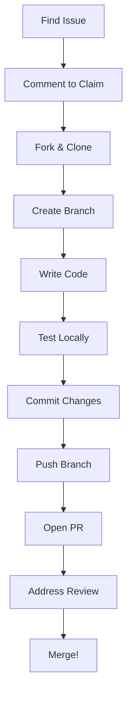

# Part 10: Contributing Workflow

You've read the code. You've built things. Now you want to contribute back. This part covers the workflow from finding an issue to getting a PR merged, the social dynamics of open source, and the technical details of the modeling-app development setup.

## Finding Your First Issue

Good first contributions share traits:
- Clear scope (you know when you're done)
- Limited blast radius (changes stay contained)
- Learning opportunity (you understand more after)

### Issue Labels

The modeling-app repo uses labels:
- `good first issue`: Explicitly beginner-friendly
- `help wanted`: Maintainers want community help
- `bug`: Something is broken
- `enhancement`: Something could be better
- `docs`: Documentation improvements

### Where to Look

```bash
# Clone the repo
git clone https://github.com/zoo-dev/modeling-app.git
cd modeling-app

# Check recent issues
gh issue list --label "good first issue"
gh issue list --label "help wanted"
```

### Evaluating an Issue

Before claiming an issue:

1. **Read the whole thread**: Others may have context or partial solutions
2. **Check if it's stale**: Old issues might be outdated
3. **Verify it's reproducible**: Can you see the bug?
4. **Estimate scope**: Does it match your available time?

## Setting Up the Development Environment

### Prerequisites

```bash
# Rust toolchain
curl --proto '=https' --tlsv1.2 -sSf https://sh.rustup.rs | sh
rustup default stable
rustup component add rustfmt clippy

# Node.js (for frontend)
# Using fnm (Fast Node Manager)
curl -fsSL https://fnm.vercel.app/install | bash
fnm install 20
fnm use 20

# pnpm (package manager)
npm install -g pnpm
```

### Building the Project

```bash
cd modeling-app

# Install dependencies
pnpm install

# Build Rust components
cd rust
cargo build

# Run tests
cargo test

# Back to root, start dev server
cd ..
pnpm dev
```

### Development Tools

The repo uses several tools:

```bash
# Format Rust code
cargo fmt

# Lint Rust code
cargo clippy

# Format TypeScript
pnpm format

# Run all checks
pnpm check
```

### Editor Setup

For Helix:

```toml
# ~/.config/helix/languages.toml

[[language]]
name = "rust"
auto-format = true

[language-server.rust-analyzer.config]
cargo.features = "all"
checkOnSave.command = "clippy"
```

For Zed, the defaults work well. Ensure rust-analyzer is installed.

## The Contribution Workflow



### Step 1: Claim the Issue

Leave a comment saying you're working on it:

> "I'd like to take this on. I'm planning to [brief description of approach]. Let me know if that sounds right."

This:
- Prevents duplicate work
- Gets early feedback on approach
- Shows maintainers you're engaged

### Step 2: Fork and Branch

```bash
# Fork on GitHub UI, then:
git clone https://github.com/YOUR_USERNAME/modeling-app.git
cd modeling-app
git remote add upstream https://github.com/zoo-dev/modeling-app.git

# Create feature branch
git checkout -b fix-parser-edge-case
```

Branch naming conventions:
- `fix-*`: Bug fixes
- `feat-*`: New features
- `docs-*`: Documentation
- `refactor-*`: Code restructuring

### Step 3: Make Changes

Write the code. Keep commits focused:

```bash
# Stage specific files
git add rust/kcl-lib/src/parsing/parser.rs

# Commit with descriptive message
git commit -m "Fix parser panic on empty input

The parser would panic when given an empty string because
the token stream was empty and peek() returned None.

Added a check for empty input that returns an empty program
instead of panicking.

Fixes #1234"
```

Commit message anatomy:
- First line: short summary (50 chars)
- Blank line
- Body: explain what and why
- Footer: reference issues

### Step 4: Test Locally

```bash
# Run all Rust tests
cargo test

# Run specific test
cargo test parse_empty_input

# Run with output visible
cargo test parse_empty_input -- --nocapture

# Run clippy
cargo clippy -- -D warnings

# Format check
cargo fmt --check
```

Add tests for your changes:

```rust
#[test]
fn parse_empty_input_returns_empty_program() {
    let result = parse_str("");
    assert!(result.is_ok());
    let program = result.unwrap();
    assert!(program.body.is_empty());
}
```

### Step 5: Push and Open PR

```bash
git push origin fix-parser-edge-case
```

On GitHub, open a Pull Request. The template asks for:

1. **What this PR does**: Brief description
2. **How to test**: Steps to verify
3. **Screenshots**: If visual changes
4. **Issue reference**: Closes #1234

Example PR description:

```markdown
## What

Fixes the parser panic when given empty input.

## Why

Empty input caused a panic in the tokenizer because it tried
to access the first character of an empty string.

## How

Added an early return in `parse_str()` that returns an empty
program when the input is empty.

## Testing

```bash
cargo test parse_empty_input
```

## Checklist

- [x] Tests added
- [x] Cargo fmt
- [x] Cargo clippy clean
- [ ] Documentation updated (N/A)

Closes #1234
```

### Step 6: Address Review

Reviewers will comment. Address each comment:

- **Questions**: Answer them
- **Suggestions**: Accept or explain why not
- **Required changes**: Make them

Push updates to the same branch:

```bash
git add .
git commit -m "Address review: rename variable for clarity"
git push origin fix-parser-edge-case
```

The PR updates automatically.

### Step 7: Merge

Once approved, a maintainer merges. Congratulations!

## Code Review: What Reviewers Look For

### Correctness

Does the code do what it claims? Are edge cases handled?

```rust
// Reviewer might ask: what if tokens is empty?
fn parse(&mut self) -> Result<Program, Error> {
    let first = self.tokens[0];  // Potential panic!
}

// Better:
fn parse(&mut self) -> Result<Program, Error> {
    let first = self.tokens.first()
        .ok_or(Error::EmptyInput)?;
}
```

### Style

Does it match the codebase conventions?

```rust
// Codebase uses this style
if condition {
    do_something();
}

// Not this
if condition { do_something(); }
```

### Tests

Are changes tested? Do tests actually test the behavior?

```rust
// Weak test: only checks happy path
#[test]
fn test_parse() {
    assert!(parse("x = 5").is_ok());
}

// Stronger test: checks specific behavior
#[test]
fn parse_variable_declaration_binds_value() {
    let ast = parse("x = 5").unwrap();
    let decl = ast.body[0].as_variable_declaration().unwrap();
    assert_eq!(decl.name, "x");
    assert_eq!(decl.value, Expr::Literal(5.0));
}
```

### Performance

Does this introduce inefficiency?

```rust
// Reviewer might flag: clone in a loop
for item in &items {
    process(item.clone());  // Clone every iteration
}

// Better: pass reference
for item in &items {
    process(item);
}
```

### Security

Does this introduce vulnerabilities?

```rust
// Reviewer should flag: path traversal risk
fn read_file(name: &str) -> String {
    std::fs::read_to_string(format!("/data/{}", name)).unwrap()
}
// name = "../../../etc/passwd" would be bad

// Better: validate path
fn read_file(name: &str) -> Result<String, Error> {
    let path = Path::new("/data").join(name);
    if !path.starts_with("/data") {
        return Err(Error::InvalidPath);
    }
    std::fs::read_to_string(path)
}
```

## Types of Contributions

Not all contributions are code:

### Documentation

- Fix typos
- Clarify confusing sections
- Add examples
- Update outdated information

```markdown
<!-- Before -->
Use the `parse()` function to parse code.

<!-- After -->
Use the `parse_str()` function to parse KCL source code:

\```rust
let ast = kcl_lib::parsing::parse_str("x = 5")?;
\```
```

### Bug Reports

A good bug report includes:

1. **What happened**: Actual behavior
2. **What should happen**: Expected behavior
3. **How to reproduce**: Step-by-step instructions
4. **Environment**: OS, Rust version, etc.
5. **Minimal example**: Smallest code that shows the bug

```markdown
## Bug: Parser panics on trailing comma

### Steps to reproduce

1. Save this KCL code:
```kcl
arr = [1, 2, 3,]
```
2. Run `kcl check file.kcl`
3. Observe panic

### Expected

Parse succeeds (trailing comma should be allowed)

### Actual

```
thread 'main' panicked at 'index out of bounds'
```

### Environment

- OS: Arch Linux
- Rust: 1.75.0
- kcl-lib: main branch, commit abc123
```

### Issue Triage

Help maintainers by:
- Confirming bugs (can you reproduce?)
- Adding information (does it happen on your setup?)
- Suggesting labels
- Linking related issues

## Common Pitfalls

### Scope Creep

Start small. Don't try to fix everything at once.

```
❌ "While I was fixing the parser bug, I also refactored
    the entire error handling system"

✓ "Fixed the parser bug. I noticed error handling could
    be improved; I'll open a separate issue for that."
```

### Stale PRs

If your PR sits without review, it's okay to politely ping:

> "Hi, just checking if this PR is ready for review. Let me know if you need anything from me."

### Merge Conflicts

Keep your branch updated:

```bash
git fetch upstream
git rebase upstream/main
# Resolve conflicts if any
git push --force-with-lease origin your-branch
```

### Ignoring CI

If CI fails, fix it. Don't ask maintainers to merge failing PRs.

## Building Relationships

Open source is a community. Good interactions matter:

### Be Patient

Maintainers are often volunteers. Responses take time.

### Be Gracious

Thank reviewers. Acknowledge when they're right.

### Be Consistent

Regular small contributions build trust more than occasional large ones.

### Be Honest

If you're stuck, say so. If you can't finish, let others know.

## Exercises

1. **Find an Issue**: Search the modeling-app issues for something that matches your skills. Read the whole thread.

2. **Set Up Locally**: Clone, build, and run the test suite. Note any issues you encounter.

3. **Documentation Fix**: Find a typo or unclear sentence in the docs. Open a PR to fix it.

4. **Add a Test**: Find a function that lacks test coverage. Add a meaningful test.

5. **Review a PR**: Read an open PR. Leave a thoughtful comment (even just "this looks good because...")

## Your First Contribution Checklist

- [ ] Found an appropriate issue
- [ ] Commented to claim it
- [ ] Forked and cloned the repo
- [ ] Set up the development environment
- [ ] Created a feature branch
- [ ] Made the changes
- [ ] Added/updated tests
- [ ] Ran cargo fmt and clippy
- [ ] Committed with good messages
- [ ] Pushed and opened a PR
- [ ] Addressed review feedback
- [ ] Celebrated when merged!

## What's Next

Part 11 explores building a Jupyter kernel for KCL, your target first major contribution. This combines everything you've learned: Rust, the execution model, Python bindings, and the contribution workflow.

Contributing is how you become a maintainer. Every expert contributor started with their first PR.
