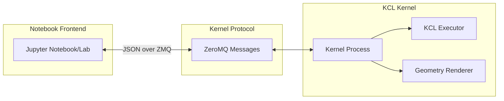

# Part 11: Building a Jupyter Kernel for KCL

This is your target first major contribution: a Jupyter kernel for KCL. Imagine writing KCL in a notebook, seeing geometry preview inline, iterating on designs interactively. This combines everything you've learned: Rust, Python bindings, the execution model, and the contribution workflow.

## What Is a Jupyter Kernel?

Jupyter notebooks are documents with code cells that execute in a kernel. The kernel is a separate process that:
1. Receives code from the notebook
2. Executes it
3. Returns results (text, images, rich output)
4. Maintains state between cells



## The Jupyter Kernel Protocol

Kernels communicate via ZeroMQ sockets using JSON messages. The protocol has several message types:

- `execute_request`: Run code, return results
- `complete_request`: Provide autocomplete suggestions
- `inspect_request`: Provide documentation/info
- `kernel_info_request`: Describe kernel capabilities

We'll focus on `execute_request` first.

## Architecture Options

### Option 1: Pure Python Kernel

Use the Python bindings from Part 9:

```python
from ipykernel.kernelbase import Kernel
import kcl

class KclKernel(Kernel):
    implementation = 'kcl'
    implementation_version = '0.1'
    language = 'kcl'
    language_info = {
        'name': 'kcl',
        'mimetype': 'text/x-kcl',
        'file_extension': '.kcl',
    }

    def __init__(self, **kwargs):
        super().__init__(**kwargs)
        self.context = kcl.ExecutorContext()

    def do_execute(self, code, silent, ...):
        try:
            result = kcl.execute(code, self.context)

            if not silent:
                # Return result as rich output
                content = {
                    'data': {
                        'text/plain': str(result),
                        'application/json': result.to_dict(),
                    },
                    'metadata': {},
                }
                self.send_response(self.iopub_socket, 'display_data', content)

            return {'status': 'ok', 'execution_count': self.execution_count}

        except kcl.KclError as e:
            return {
                'status': 'error',
                'ename': type(e).__name__,
                'evalue': str(e),
                'traceback': [],
            }
```

Pros:
- Simpler Python ecosystem integration
- Easier to package and distribute
- Works with existing Jupyter infrastructure

Cons:
- Async handling is awkward
- Python GIL limits parallelism
- Extra layer of indirection

### Option 2: Native Rust Kernel

Write the kernel directly in Rust:

```rust
use jupyter_client::Client;

struct KclKernel {
    client: Client,
    executor: ExecutorContext,
    session_state: ProgramMemory,
}

impl KclKernel {
    async fn handle_execute(&mut self, code: &str) -> ExecuteResult {
        let ast = parsing::parse_str(code)?;
        let outcome = execution::execute(&ast, &mut self.executor, &mut self.session_state).await?;

        // Render geometry to image
        let image = self.render_geometry(&outcome)?;

        ExecuteResult {
            status: "ok",
            data: vec![
                ("text/plain", format!("{:?}", outcome.variables)),
                ("image/png", base64::encode(&image)),
            ],
        }
    }
}
```

Pros:
- Native async
- Direct access to KCL internals
- Better performance

Cons:
- More work to implement
- Need to handle ZeroMQ in Rust
- Less Python ecosystem integration

### Recommended: Hybrid Approach

Use Python for the kernel framework, Rust (via PyO3) for KCL execution:

```python
from ipykernel.kernelbase import Kernel
from kcl_python import KclExecutor, render_geometry

class KclKernel(Kernel):
    def __init__(self, **kwargs):
        super().__init__(**kwargs)
        self.executor = KclExecutor()

    async def do_execute(self, code, ...):
        # Rust execution via Python bindings
        result = await self.executor.execute_async(code)
        image = render_geometry(result.geometry)
        # ...
```

This gets the best of both worlds: Python's Jupyter integration and Rust's performance.

## Project Structure

```
kcl-jupyter/
├── Cargo.toml           # Rust/Python extension
├── pyproject.toml       # Python package config
├── src/
│   └── lib.rs           # PyO3 bindings
├── kcl_jupyter/
│   ├── __init__.py
│   ├── kernel.py        # Kernel implementation
│   └── renderer.py      # Geometry to image
├── kernel.json          # Kernel spec
└── tests/
    └── test_kernel.py
```

## Step 1: Create the Python Package

```toml
# pyproject.toml
[build-system]
requires = ["maturin>=1.0,<2.0"]
build-backend = "maturin"

[project]
name = "kcl-jupyter"
version = "0.1.0"
description = "Jupyter kernel for KCL"
requires-python = ">=3.9"
dependencies = [
    "ipykernel>=6.0",
    "jupyter-client>=7.0",
]

[project.entry-points."jupyter.kernels"]
kcl = "kcl_jupyter:KclKernelSpec"
```

## Step 2: Create Rust Bindings

```rust
// src/lib.rs
use pyo3::prelude::*;
use pyo3_asyncio::tokio::future_into_py;

#[pyclass]
struct KclExecutor {
    context: Arc<ExecutorContext>,
    memory: Arc<RwLock<ProgramMemory>>,
}

#[pymethods]
impl KclExecutor {
    #[new]
    fn new(engine_url: Option<String>) -> PyResult<Self> {
        let context = ExecutorContext::new()
            .with_engine_url(engine_url.as_deref().unwrap_or("mock"));

        Ok(Self {
            context: Arc::new(context),
            memory: Arc::new(RwLock::new(ProgramMemory::new())),
        })
    }

    fn execute<'p>(&self, py: Python<'p>, code: String) -> PyResult<&'p PyAny> {
        let context = self.context.clone();
        let memory = self.memory.clone();

        future_into_py(py, async move {
            let ast = parsing::parse_str(&code)
                .map_err(|e| PyErr::new::<pyo3::exceptions::PyValueError, _>(format!("{:?}", e)))?;

            let mut state = ExecState::new(memory.write().await);

            let outcome = execution::execute(&ast, &context, &mut state).await
                .map_err(|e| PyErr::new::<pyo3::exceptions::PyRuntimeError, _>(e.to_string()))?;

            Ok(ExecuteResult::from(outcome))
        })
    }
}

#[pyclass]
struct ExecuteResult {
    #[pyo3(get)]
    variables: HashMap<String, PyObject>,
    #[pyo3(get)]
    errors: Vec<String>,
    #[pyo3(get)]
    geometry_ids: Vec<String>,
}

#[pymodule]
fn kcl_python(_py: Python, m: &PyModule) -> PyResult<()> {
    m.add_class::<KclExecutor>()?;
    m.add_class::<ExecuteResult>()?;
    Ok(())
}
```

## Step 3: Implement the Kernel

```python
# kcl_jupyter/kernel.py
from ipykernel.kernelbase import Kernel
from kcl_python import KclExecutor, ExecuteResult
import base64

class KclKernel(Kernel):
    implementation = 'kcl'
    implementation_version = '0.1.0'
    language = 'kcl'
    language_version = '0.1'
    language_info = {
        'name': 'kcl',
        'mimetype': 'text/x-kcl',
        'file_extension': '.kcl',
        'pygments_lexer': 'kcl',
    }
    banner = "KCL - Zoo's CAD programming language"

    def __init__(self, **kwargs):
        super().__init__(**kwargs)
        self.executor = KclExecutor()
        self.cell_count = 0

    async def do_execute(self, code, silent, store_history=True,
                         user_expressions=None, allow_stdin=False):
        self.cell_count += 1

        if not code.strip():
            return {'status': 'ok', 'execution_count': self.cell_count}

        try:
            result: ExecuteResult = await self.executor.execute(code)

            # Handle errors
            if result.errors:
                for error in result.errors:
                    self.send_response(self.iopub_socket, 'stream', {
                        'name': 'stderr',
                        'text': f"Error: {error}\n"
                    })

            if not silent:
                # Display variables
                var_text = '\n'.join(f"{k} = {v}" for k, v in result.variables.items())

                data = {'text/plain': var_text}

                # If there's geometry, render it
                if result.geometry_ids:
                    image = await self.render_geometry(result.geometry_ids)
                    if image:
                        data['image/png'] = base64.b64encode(image).decode()

                self.send_response(self.iopub_socket, 'display_data', {
                    'data': data,
                    'metadata': {},
                })

            return {
                'status': 'ok',
                'execution_count': self.cell_count,
                'payload': [],
                'user_expressions': {},
            }

        except Exception as e:
            return {
                'status': 'error',
                'execution_count': self.cell_count,
                'ename': type(e).__name__,
                'evalue': str(e),
                'traceback': [],
            }

    async def render_geometry(self, geometry_ids):
        """Render geometry to PNG image."""
        # This would call the engine to get a snapshot
        # For now, return None (no image)
        return None

    def do_complete(self, code, cursor_pos):
        """Handle autocomplete requests."""
        # Basic implementation: no completions
        return {
            'status': 'ok',
            'matches': [],
            'cursor_start': cursor_pos,
            'cursor_end': cursor_pos,
            'metadata': {},
        }

    def do_inspect(self, code, cursor_pos, detail_level=0):
        """Handle documentation requests."""
        return {
            'status': 'ok',
            'found': False,
            'data': {},
            'metadata': {},
        }
```

## Step 4: Kernel Specification

```json
// kernel.json
{
    "argv": [
        "python",
        "-m",
        "kcl_jupyter",
        "-f",
        "{connection_file}"
    ],
    "display_name": "KCL",
    "language": "kcl",
    "metadata": {
        "debugger": false
    }
}
```

## Step 5: Installation Entry Point

```python
# kcl_jupyter/__init__.py
from .kernel import KclKernel

def install_kernel():
    """Install the kernel spec."""
    import json
    import os
    import sys
    from jupyter_client.kernelspec import KernelSpecManager

    kernel_json = {
        "argv": [sys.executable, "-m", "kcl_jupyter", "-f", "{connection_file}"],
        "display_name": "KCL",
        "language": "kcl",
    }

    ksm = KernelSpecManager()
    # Create temp directory with kernel.json
    # Install using ksm.install_kernel_spec()

def main():
    from ipykernel.kernelapp import IPKernelApp
    IPKernelApp.launch_instance(kernel_class=KclKernel)

if __name__ == '__main__':
    main()
```

## Session State

Jupyter cells share state. Variable `x` defined in cell 1 should be visible in cell 2:

```python
# Cell 1
x = 5

# Cell 2
y = x + 3  # Should work!
```

The `ProgramMemory` handles this:

```rust
#[pyclass]
struct KclExecutor {
    memory: Arc<RwLock<ProgramMemory>>,  // Persists across cells
}

impl KclExecutor {
    async fn execute(&self, code: &str) -> ExecuteResult {
        let mut memory = self.memory.write().await;
        // Execute with existing memory state
        // New bindings are added to memory
        // Memory persists for next cell
    }
}
```

## Geometry Rendering

To show geometry inline, we need to render it to an image:

### Option 1: Engine Snapshot

Ask the engine for a PNG:

```rust
async fn capture_snapshot(&self, geometry_id: Uuid) -> Result<Vec<u8>, Error> {
    let cmd = ModelingCmd::TakeSnapshot {
        target: geometry_id,
        format: ImageFormat::Png,
        width: 800,
        height: 600,
    };

    let response = self.engine.send_command(cmd).await?;
    Ok(response.image_data)
}
```

### Option 2: Client-Side Rendering

For offline mode, use a software renderer:

```rust
use rend3::{Renderer, create_iad};

fn render_mesh(mesh: &Mesh) -> Vec<u8> {
    let iad = create_iad();
    let renderer = Renderer::new(&iad, ...).unwrap();

    // Add mesh to scene
    // Set up camera
    // Render to texture
    // Export as PNG
}
```

### Option 3: Interactive 3D Widget

Use ipywidgets for interactive 3D:

```python
from ipywidgets import DOMWidget
import traitlets

class KclViewer(DOMWidget):
    _view_name = traitlets.Unicode('KclViewerView').tag(sync=True)
    _view_module = traitlets.Unicode('kcl-jupyter').tag(sync=True)
    geometry_data = traitlets.Bytes(b'').tag(sync=True)

    def update_geometry(self, mesh_data):
        self.geometry_data = mesh_data
```

With a JavaScript frontend using Three.js.

## Adding Autocomplete

For a good editing experience, implement completions:

```python
def do_complete(self, code, cursor_pos):
    # Get word at cursor
    line = code[:cursor_pos]
    word_start = line.rfind(' ') + 1
    partial = line[word_start:]

    # Get completions from KCL
    matches = self.get_completions(partial)

    return {
        'status': 'ok',
        'matches': matches,
        'cursor_start': word_start,
        'cursor_end': cursor_pos,
    }

def get_completions(self, partial):
    # Stdlib functions
    stdlib_fns = [
        'startSketchOn', 'line', 'circle', 'extrude',
        'fillet', 'chamfer', 'union', 'subtract',
        # ... more
    ]

    # Variables in scope
    variables = list(self.executor.get_variables().keys())

    all_options = stdlib_fns + variables
    return [opt for opt in all_options if opt.startswith(partial)]
```

## Adding Documentation

Show docs on hover or inspect:

```python
def do_inspect(self, code, cursor_pos, detail_level=0):
    # Extract identifier at cursor
    identifier = self.extract_identifier(code, cursor_pos)
    if not identifier:
        return {'status': 'ok', 'found': False, 'data': {}}

    # Look up documentation
    doc = self.get_documentation(identifier)
    if not doc:
        return {'status': 'ok', 'found': False, 'data': {}}

    return {
        'status': 'ok',
        'found': True,
        'data': {
            'text/plain': doc.plain,
            'text/markdown': doc.markdown,
        },
    }

def get_documentation(self, name):
    # Embedded from kcl-lib's documentation
    docs = {
        'startSketchOn': """
## startSketchOn(plane)

Start a new sketch on the given plane.

### Parameters
- `plane`: The plane to sketch on (XY, XZ, YZ, or a face)

### Returns
A Sketch object that can be used for drawing.

### Example
```kcl
sketch = startSketchOn(XY)
```
""",
        # ... more
    }
    return docs.get(name)
```

## Testing the Kernel

```python
# tests/test_kernel.py
import pytest
from jupyter_client import BlockingKernelClient
from kcl_jupyter.kernel import KclKernel

@pytest.fixture
def kernel():
    k = KclKernel.instance()
    yield k
    k.clear_instance()

def test_simple_execution(kernel):
    result = kernel.do_execute("x = 5", silent=False)
    assert result['status'] == 'ok'

def test_variable_persistence(kernel):
    kernel.do_execute("x = 5", silent=False)
    result = kernel.do_execute("y = x + 3", silent=False)
    assert result['status'] == 'ok'
    # y should be 8

def test_syntax_error(kernel):
    result = kernel.do_execute("x = ", silent=False)
    assert result['status'] == 'error'
```

## Distribution

Package for pip:

```bash
# Build with maturin
maturin build --release

# Resulting wheel
pip install target/wheels/kcl_jupyter-0.1.0-*.whl

# Install kernel spec
python -m kcl_jupyter.install
```

## Exercises

1. **Basic Kernel**: Implement the minimal kernel (execute only, no completions). Test with `jupyter console --kernel=kcl`.

2. **State Persistence**: Verify that variables persist across cells. Define `x` in one cell, use it in another.

3. **Error Display**: Make error messages show with line numbers and context.

4. **Autocomplete**: Implement basic autocomplete for stdlib functions.

5. **Geometry Display**: Implement geometry snapshot rendering. Show an image when a solid is created.

## Contribution Path

To contribute this to modeling-app:

1. **RFC**: Open an issue describing the feature and approach
2. **Prototype**: Build a working prototype outside the main repo
3. **Iterate**: Get feedback from maintainers
4. **Integrate**: Merge into the monorepo at `rust/kcl-jupyter`
5. **Document**: Add to docs and examples
6. **Release**: Publish to PyPI

## What's Next

Part 12 explores GPUI for a native desktop interface. The Jupyter kernel connects KCL to data science workflows. A native desktop app connects it to professional CAD workflows. Different interfaces, same language.

A Jupyter kernel is a significant contribution. It opens KCL to the Python ecosystem, notebook-based workflows, and interactive exploration. Start here.
