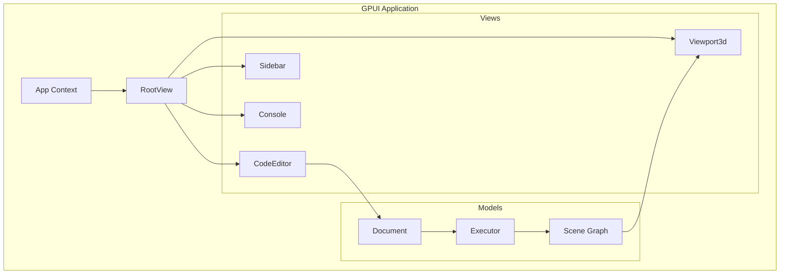

# Part 12: GPUI Exploration

What would a native Rust desktop CAD interface look like? Not Electron, not web tech, not GTK bindings. Pure Rust, GPU-accelerated, cross-platform. GPUI is the framework behind Zed, and it offers a compelling answer. This part explores building a KCL desktop application with GPUI.

## What Is GPUI?

GPUI is Zed's UI framework. It's:
- **GPU-accelerated**: Renders directly to GPU, not through browser compositing
- **Rust-native**: No FFI to C++ toolkits
- **Immediate-mode influenced**: Updates are efficient and explicit
- **Cross-platform**: macOS, Linux, Windows

Find it at: https://github.com/zed-industries/zed/tree/main/crates/gpui

## Why GPUI for CAD?

CAD applications need:
- High frame rates for 3D viewport manipulation
- Complex UI layouts (toolbars, panels, inspectors)
- Responsive to user input during computation
- Efficient rendering of large data

GPUI provides:
- GPU-accelerated rendering
- Async-native architecture
- Efficient text rendering (important for code editors)
- Mature, production-tested (powers Zed)

## Project Setup

```bash
# Create new project
cargo new kcl-studio
cd kcl-studio
```

```toml
# Cargo.toml
[package]
name = "kcl-studio"
version = "0.1.0"
edition = "2021"

[dependencies]
gpui = { git = "https://github.com/zed-industries/zed", branch = "main" }
kcl-lib = { path = "../modeling-app/rust/kcl-lib" }
tokio = { version = "1", features = ["full"] }
anyhow = "1"
```

Note: GPUI isn't published to crates.io separately. You need to reference it from the Zed repo.

## GPUI Basics

### The Application

```rust
use gpui::*;

fn main() {
    App::new().run(|cx: &mut AppContext| {
        cx.open_window(WindowOptions::default(), |cx| {
            cx.new_view(|cx| RootView::new(cx))
        });
    });
}
```

### Views

Views are the building blocks. Each view:
- Has state
- Renders to elements
- Handles events

```rust
struct RootView {
    code_editor: View<CodeEditor>,
    viewport_3d: View<Viewport3d>,
    sidebar: View<Sidebar>,
}

impl Render for RootView {
    fn render(&mut self, cx: &mut ViewContext<Self>) -> impl IntoElement {
        div()
            .flex()
            .size_full()
            .child(self.sidebar.clone())
            .child(
                div()
                    .flex()
                    .flex_col()
                    .flex_1()
                    .child(self.viewport_3d.clone())
                    .child(self.code_editor.clone())
            )
    }
}
```

### The Element DSL

GPUI uses a Tailwind-inspired element DSL:

```rust
div()
    .flex()                    // display: flex
    .flex_col()                // flex-direction: column
    .gap_4()                   // gap: 1rem
    .p_4()                     // padding: 1rem
    .bg(rgb(0x1e1e1e))         // background-color
    .text_color(white())       // color
    .child(                    // nested element
        div().text("Hello")
    )
```

## Application Architecture



## The Code Editor

GPUI includes text editing primitives. For a KCL editor:

```rust
struct CodeEditor {
    buffer: Model<Buffer>,
    editor: View<Editor>,
    diagnostics: Vec<Diagnostic>,
}

impl CodeEditor {
    fn new(cx: &mut ViewContext<Self>) -> Self {
        let buffer = cx.new_model(|_| Buffer::new(""));
        let editor = cx.new_view(|cx| {
            Editor::for_buffer(buffer.clone(), None, cx)
        });

        Self {
            buffer,
            editor,
            diagnostics: Vec::new(),
        }
    }

    fn get_code(&self, cx: &AppContext) -> String {
        self.buffer.read(cx).text()
    }

    fn set_diagnostics(&mut self, diagnostics: Vec<Diagnostic>, cx: &mut ViewContext<Self>) {
        self.diagnostics = diagnostics;
        cx.notify();  // Trigger re-render
    }
}

impl Render for CodeEditor {
    fn render(&mut self, cx: &mut ViewContext<Self>) -> impl IntoElement {
        div()
            .flex()
            .flex_col()
            .size_full()
            .child(
                div()
                    .flex_1()
                    .overflow_hidden()
                    .child(self.editor.clone())
            )
            .child(
                // Diagnostics panel
                div()
                    .h_32()
                    .bg(rgb(0x252525))
                    .children(self.diagnostics.iter().map(|d| {
                        div()
                            .px_2()
                            .text_color(match d.severity {
                                Severity::Error => red(),
                                Severity::Warning => yellow(),
                            })
                            .child(format!("Line {}: {}", d.line, d.message))
                    }))
            )
    }
}
```

## The 3D Viewport

Rendering 3D geometry requires integration with a graphics API:

```rust
struct Viewport3d {
    scene: Model<Scene>,
    camera: Camera,
    renderer: Option<WgpuRenderer>,
}

impl Viewport3d {
    fn new(cx: &mut ViewContext<Self>) -> Self {
        let scene = cx.new_model(|_| Scene::new());

        Self {
            scene,
            camera: Camera::default(),
            renderer: None,
        }
    }

    fn update_geometry(&mut self, solids: Vec<Solid>, cx: &mut ViewContext<Self>) {
        self.scene.update(cx, |scene, _| {
            scene.clear();
            for solid in solids {
                scene.add_mesh(solid.to_mesh());
            }
        });
        cx.notify();
    }
}

impl Render for Viewport3d {
    fn render(&mut self, cx: &mut ViewContext<Self>) -> impl IntoElement {
        // GPUI canvas element for custom rendering
        canvas(
            |bounds, cx| {
                // Setup phase - initialize renderer if needed
            },
            |bounds, cx| {
                // Paint phase - render the scene
                if let Some(renderer) = &self.renderer {
                    renderer.render(&self.scene, &self.camera, bounds);
                }
            },
        )
        .size_full()
        .on_mouse_down(MouseButton::Left, |event, cx| {
            // Start camera rotation
        })
        .on_mouse_move(|event, cx| {
            // Update camera if rotating
        })
        .on_scroll(|event, cx| {
            // Zoom camera
        })
    }
}
```

### Camera Controls

Implement standard CAD navigation:

```rust
struct Camera {
    position: Vec3,
    target: Vec3,
    up: Vec3,
    fov: f32,
}

impl Camera {
    fn orbit(&mut self, delta_x: f32, delta_y: f32) {
        // Rotate around target
        let right = (self.position - self.target).cross(self.up).normalize();
        let rotation = Quat::from_axis_angle(self.up, delta_x)
            * Quat::from_axis_angle(right, delta_y);
        self.position = rotation * (self.position - self.target) + self.target;
    }

    fn pan(&mut self, delta_x: f32, delta_y: f32) {
        let right = (self.position - self.target).cross(self.up).normalize();
        let offset = right * delta_x + self.up * delta_y;
        self.position += offset;
        self.target += offset;
    }

    fn zoom(&mut self, delta: f32) {
        let direction = (self.target - self.position).normalize();
        self.position += direction * delta;
    }

    fn view_matrix(&self) -> Mat4 {
        Mat4::look_at_rh(self.position, self.target, self.up)
    }
}
```

## Connecting KCL Execution

Wire the editor to the executor:

```rust
struct Document {
    code: String,
    executor: KclExecutor,
    outcome: Option<ExecOutcome>,
    dirty: bool,
}

impl Document {
    async fn execute(&mut self) -> Result<ExecOutcome, KclError> {
        let ast = parsing::parse_str(&self.code)?;
        let outcome = self.executor.execute(&ast).await?;
        self.outcome = Some(outcome.clone());
        self.dirty = false;
        Ok(outcome)
    }
}

// In the root view
fn on_code_change(&mut self, code: String, cx: &mut ViewContext<Self>) {
    self.document.update(cx, |doc, _| {
        doc.code = code;
        doc.dirty = true;
    });

    // Debounced execution
    cx.spawn(|this, mut cx| async move {
        Timer::after(Duration::from_millis(500)).await;

        let result = this.update(&mut cx, |this, cx| {
            this.document.update(cx, |doc, _| doc.execute())
        })??.await;

        this.update(&mut cx, |this, cx| {
            match result {
                Ok(outcome) => {
                    this.viewport.update(cx, |vp, cx| {
                        vp.update_geometry(outcome.geometry, cx);
                    });
                    this.editor.update(cx, |ed, cx| {
                        ed.set_diagnostics(vec![], cx);
                    });
                }
                Err(errors) => {
                    this.editor.update(cx, |ed, cx| {
                        ed.set_diagnostics(errors.into(), cx);
                    });
                }
            }
        })
    }).detach();
}
```

## The Sidebar

A sidebar for project navigation and properties:

```rust
struct Sidebar {
    file_tree: View<FileTree>,
    properties: View<Properties>,
    selected_tab: SidebarTab,
}

enum SidebarTab {
    Files,
    Properties,
    Settings,
}

impl Render for Sidebar {
    fn render(&mut self, cx: &mut ViewContext<Self>) -> impl IntoElement {
        div()
            .w_64()
            .h_full()
            .bg(rgb(0x1e1e1e))
            .flex()
            .flex_col()
            // Tab buttons
            .child(
                div()
                    .flex()
                    .border_b_1()
                    .border_color(rgb(0x333333))
                    .child(self.tab_button("Files", SidebarTab::Files, cx))
                    .child(self.tab_button("Props", SidebarTab::Properties, cx))
                    .child(self.tab_button("Settings", SidebarTab::Settings, cx))
            )
            // Content
            .child(
                div()
                    .flex_1()
                    .overflow_y_scroll()
                    .child(match self.selected_tab {
                        SidebarTab::Files => self.file_tree.clone().into_any_element(),
                        SidebarTab::Properties => self.properties.clone().into_any_element(),
                        SidebarTab::Settings => div().child("Settings").into_any_element(),
                    })
            )
    }

    fn tab_button(&self, label: &str, tab: SidebarTab, cx: &ViewContext<Self>) -> impl IntoElement {
        let is_active = self.selected_tab == tab;

        div()
            .px_3()
            .py_2()
            .cursor_pointer()
            .bg(if is_active { rgb(0x333333) } else { transparent() })
            .text_color(if is_active { white() } else { rgb(0x888888) })
            .child(label)
            .on_click(move |_, cx| {
                cx.emit(TabClicked(tab));
            })
    }
}
```

## Keyboard Shortcuts

GPUI handles keyboard input elegantly:

```rust
actions!(kcl_studio, [
    Save,
    Run,
    Format,
    Undo,
    Redo,
    ZoomIn,
    ZoomOut,
    ResetView,
]);

fn register_actions(cx: &mut AppContext) {
    cx.on_action(|action: &Save, cx| {
        // Save document
    });

    cx.on_action(|action: &Run, cx| {
        // Execute KCL
    });

    cx.on_action(|action: &Format, cx| {
        // Format code
    });
}

fn keybindings() -> Vec<KeyBinding> {
    vec![
        KeyBinding::new("cmd-s", Save, None),
        KeyBinding::new("cmd-enter", Run, None),
        KeyBinding::new("shift-alt-f", Format, None),
        KeyBinding::new("cmd-z", Undo, None),
        KeyBinding::new("cmd-shift-z", Redo, None),
        KeyBinding::new("cmd-=", ZoomIn, Some("Viewport3d")),
        KeyBinding::new("cmd--", ZoomOut, Some("Viewport3d")),
        KeyBinding::new("cmd-0", ResetView, Some("Viewport3d")),
    ]
}
```

## Async and Concurrency

GPUI is async-native. Long operations don't block:

```rust
fn export_stl(&mut self, path: PathBuf, cx: &mut ViewContext<Self>) {
    let geometry = self.scene.read(cx).geometry.clone();

    cx.spawn(|this, mut cx| async move {
        // Show progress indicator
        this.update(&mut cx, |this, cx| {
            this.show_progress("Exporting...", cx);
        })?;

        // Do the export (slow)
        let result = export_to_stl(&geometry, &path).await;

        // Hide progress, show result
        this.update(&mut cx, |this, cx| {
            this.hide_progress(cx);
            match result {
                Ok(_) => this.show_toast("Export complete", cx),
                Err(e) => this.show_error(&e.to_string(), cx),
            }
        })
    }).detach();
}
```

## Theming

GPUI supports theming through the theme system:

```rust
struct KclTheme {
    background: Hsla,
    foreground: Hsla,
    accent: Hsla,
    error: Hsla,
    warning: Hsla,
}

impl KclTheme {
    fn dark() -> Self {
        Self {
            background: hsla(0.0, 0.0, 0.12, 1.0),
            foreground: hsla(0.0, 0.0, 0.9, 1.0),
            accent: hsla(210.0, 0.8, 0.6, 1.0),
            error: hsla(0.0, 0.8, 0.6, 1.0),
            warning: hsla(45.0, 0.9, 0.6, 1.0),
        }
    }
}

fn themed_button(label: &str, theme: &KclTheme) -> impl IntoElement {
    div()
        .px_4()
        .py_2()
        .rounded_md()
        .bg(theme.accent)
        .text_color(theme.foreground)
        .child(label)
        .hover(|style| style.bg(theme.accent.lighten(0.1)))
}
```

## Challenges

Building this is non-trivial:

1. **GPUI Learning Curve**: The framework is powerful but underdocumented. Read Zed's source.

2. **3D Rendering**: GPUI doesn't include 3D rendering. You need wgpu or similar.

3. **No crates.io Release**: GPUI is part of Zed's monorepo. Dependencies are complex.

4. **Platform Differences**: macOS is best supported. Linux and Windows work but may have issues.

## Alternative: Iced + wgpu

If GPUI is too tightly coupled to Zed, consider Iced:

```rust
use iced::{Application, Command, Element};
use iced_wgpu::Renderer;

struct KclStudio {
    code: String,
    scene: Scene,
}

impl Application for KclStudio {
    type Message = Message;
    type Executor = iced::executor::Default;
    type Flags = ();

    fn view(&self) -> Element<Message> {
        // Iced UI layout
    }
}
```

Iced is less performant for text editing but simpler to get started with.

## Exercises

1. **Hello GPUI**: Create a minimal GPUI app that shows a window with "Hello, KCL".

2. **Basic Layout**: Implement a three-panel layout (sidebar, viewport, editor) with placeholder content.

3. **Camera Controls**: Add mouse-based orbit, pan, zoom to a viewport placeholder.

4. **Code Editing**: Integrate GPUI's text editing with KCL syntax highlighting.

5. **End-to-End**: Connect the editor to KCL execution and display results (even if just text).

## What's Next

Part 13 explores Leptos for a Rust-native web frontend. GPUI is for desktop; Leptos is for web. Different targets, same language. The goal is options: KCL should work wherever you want it.

A native desktop app offers performance and integration that web can't match. But it's significant work. Start small, iterate, and decide if the tradeoffs are worth it.
