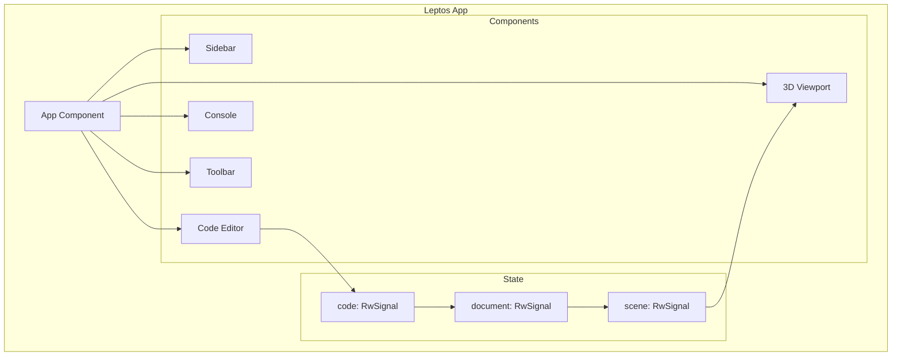

# Part 13: Leptos Exploration

What if you could build Zoo's web frontend in Rust? No TypeScript, no React, no JavaScript build tooling. Just Rust, compiled to WASM, running in the browser. Leptos makes this possible. This part explores building a Rust-native web frontend for KCL.

## What Is Leptos?

Leptos is a full-stack Rust web framework. It offers:
- **Fine-grained reactivity**: Like Solid.js, not like React's virtual DOM
- **WASM-first**: Compiles to efficient WebAssembly
- **SSR support**: Server-side rendering when needed
- **Rust ergonomics**: Familiar ownership and type safety

## Why Rust for the Frontend?

The current modeling-app frontend is TypeScript + React. It works, but:
- **Two languages**: Rust backend/core, TypeScript frontend
- **Serialization overhead**: Data crosses the WASM boundary as JSON
- **Type drift**: Rust types and TypeScript types can diverge
- **Tooling complexity**: Node, npm/pnpm, Vite, esbuild, etc.

With Leptos:
- **One language**: Rust everywhere
- **Direct WASM calls**: No serialization for core operations
- **Single type system**: Rust types work on both sides
- **Cargo only**: Standard Rust tooling

## Project Setup

```bash
# Install trunk (WASM bundler)
cargo install trunk

# Create project
cargo new kcl-web
cd kcl-web
```

```toml
# Cargo.toml
[package]
name = "kcl-web"
version = "0.1.0"
edition = "2021"

[dependencies]
leptos = { version = "0.6", features = ["csr"] }
kcl-lib = { path = "../modeling-app/rust/kcl-lib", default-features = false, features = ["wasm"] }
wasm-bindgen = "0.2"
web-sys = { version = "0.3", features = ["console"] }

[profile.release]
opt-level = 'z'
lto = true
```

```html
<!-- index.html -->
<!DOCTYPE html>
<html>
<head>
    <meta charset="utf-8">
    <title>KCL Studio</title>
    <link data-trunk rel="css" href="styles.css">
</head>
<body></body>
</html>
```

## Leptos Basics

### Components

Leptos components are functions that return views:

```rust
use leptos::*;

#[component]
fn App() -> impl IntoView {
    view! {
        <div class="app">
            <Sidebar/>
            <main>
                <Viewport/>
                <Editor/>
            </main>
        </div>
    }
}

fn main() {
    leptos::mount_to_body(App);
}
```

### Signals (Reactive State)

Signals are reactive values that trigger updates:

```rust
#[component]
fn Counter() -> impl IntoView {
    let (count, set_count) = create_signal(0);

    view! {
        <button on:click=move |_| set_count.update(|n| *n += 1)>
            "Count: " {count}
        </button>
    }
}
```

When `count` changes, only the text updates. No virtual DOM diffing.

### Effects

Effects run when their dependencies change:

```rust
#[component]
fn CodeEditor() -> impl IntoView {
    let (code, set_code) = create_signal(String::new());
    let (result, set_result) = create_signal(None::<ExecOutcome>);

    // Effect: re-run when code changes
    create_effect(move |_| {
        let current_code = code.get();
        spawn_local(async move {
            let outcome = execute_kcl(&current_code).await;
            set_result.set(Some(outcome));
        });
    });

    view! {
        <div class="editor">
            <textarea
                on:input=move |ev| set_code.set(event_target_value(&ev))
                prop:value=code
            />
            <div class="result">
                {move || result.get().map(|r| format!("{:?}", r))}
            </div>
        </div>
    }
}
```

## The Application Structure



## The Code Editor Component

For a proper editor, use a CodeMirror binding or build custom:

```rust
#[component]
fn CodeEditor(
    code: RwSignal<String>,
    diagnostics: Signal<Vec<Diagnostic>>,
) -> impl IntoView {
    let textarea_ref = create_node_ref::<html::Textarea>();

    // Highlight errors
    let error_markers = move || {
        diagnostics.get().iter().map(|d| {
            view! {
                <div
                    class="error-marker"
                    style:top=format!("{}em", d.line)
                    title=&d.message
                />
            }
        }).collect_view()
    };

    view! {
        <div class="code-editor">
            <div class="line-numbers">
                {move || {
                    (1..=code.get().lines().count().max(1))
                        .map(|n| view! { <div>{n}</div> })
                        .collect_view()
                }}
            </div>
            <div class="editor-content">
                <textarea
                    node_ref=textarea_ref
                    on:input=move |ev| code.set(event_target_value(&ev))
                    prop:value=code
                    spellcheck="false"
                />
                <div class="error-overlay">
                    {error_markers}
                </div>
            </div>
        </div>
    }
}
```

### Syntax Highlighting

For proper syntax highlighting, integrate with tree-sitter-highlight or a WASM port:

```rust
#[component]
fn HighlightedCode(code: Signal<String>) -> impl IntoView {
    let highlighted = create_memo(move |_| {
        let source = code.get();
        highlight_kcl(&source)  // Returns HTML with spans
    });

    view! {
        <pre class="highlighted">
            <code inner_html=highlighted/>
        </pre>
    }
}

fn highlight_kcl(code: &str) -> String {
    // Tokenize and wrap in spans
    let mut result = String::new();
    for token in tokenize(code) {
        let class = match token.kind {
            TokenKind::Keyword => "keyword",
            TokenKind::String => "string",
            TokenKind::Number => "number",
            TokenKind::Comment => "comment",
            TokenKind::Function => "function",
            _ => "plain",
        };
        result.push_str(&format!(
            r#"<span class="{}">{}</span>"#,
            class,
            html_escape(&token.text)
        ));
    }
    result
}
```

## The 3D Viewport

For 3D rendering, use web-sys with WebGL or WebGPU:

```rust
use web_sys::{WebGl2RenderingContext, HtmlCanvasElement};

#[component]
fn Viewport(scene: Signal<SceneGraph>) -> impl IntoView {
    let canvas_ref = create_node_ref::<html::Canvas>();
    let (renderer, set_renderer) = create_signal(None::<WebGlRenderer>);

    // Initialize WebGL on mount
    create_effect(move |_| {
        if let Some(canvas) = canvas_ref.get() {
            let gl = canvas
                .get_context("webgl2")
                .unwrap()
                .unwrap()
                .dyn_into::<WebGl2RenderingContext>()
                .unwrap();

            set_renderer.set(Some(WebGlRenderer::new(gl)));
        }
    });

    // Re-render when scene changes
    create_effect(move |_| {
        if let Some(r) = renderer.get() {
            r.render(&scene.get());
        }
    });

    // Animation loop
    create_effect(move |_| {
        if renderer.get().is_some() {
            request_animation_frame(move || {
                // Update and re-render
            });
        }
    });

    view! {
        <canvas
            node_ref=canvas_ref
            class="viewport"
            width="800"
            height="600"
        />
    }
}
```

### Three.js Integration

Alternatively, use Three.js from Rust via wasm-bindgen:

```rust
#[wasm_bindgen(module = "three")]
extern "C" {
    type Scene;
    type PerspectiveCamera;
    type WebGLRenderer;
    type Mesh;

    #[wasm_bindgen(constructor)]
    fn new() -> Scene;

    #[wasm_bindgen(method)]
    fn add(this: &Scene, object: &Mesh);
}

fn create_three_scene() -> Scene {
    let scene = Scene::new();
    // Add geometry...
    scene
}
```

This is verbose but gives full Three.js access.

## Connecting to KCL

Call KCL directly without JSON serialization:

```rust
use kcl_lib::{parsing, execution, ExecutorContext};

async fn execute_kcl(code: &str) -> Result<ExecOutcome, KclError> {
    let ast = parsing::parse_str(code)?;

    let ctx = ExecutorContext::wasm();  // WASM-specific context
    let outcome = execution::execute(&ast, &ctx).await?;

    Ok(outcome)
}

#[component]
fn App() -> impl IntoView {
    let code = create_rw_signal(String::new());
    let outcome = create_rw_signal(None::<ExecOutcome>);
    let errors = create_rw_signal(Vec::<Diagnostic>::new());

    // Execute on code change (debounced)
    let execute = create_action(move |code: &String| {
        let code = code.clone();
        async move {
            match execute_kcl(&code).await {
                Ok(result) => {
                    errors.set(result.warnings.clone());
                    outcome.set(Some(result));
                }
                Err(e) => {
                    errors.set(vec![e.into()]);
                    outcome.set(None);
                }
            }
        }
    });

    // Debounce code changes
    create_effect(move |prev: Option<String>| {
        let current = code.get();
        if prev.as_ref() != Some(&current) {
            set_timeout(
                move || execute.dispatch(current.clone()),
                Duration::from_millis(500),
            );
        }
        current
    });

    view! {
        <div class="app">
            <CodeEditor code=code diagnostics=errors.into()/>
            <Viewport scene=derive_scene(outcome)/>
        </div>
    }
}
```

## State Management

For complex apps, use a central store:

```rust
#[derive(Clone)]
struct AppState {
    code: RwSignal<String>,
    document: RwSignal<Option<Document>>,
    scene: RwSignal<SceneGraph>,
    selection: RwSignal<Selection>,
    camera: RwSignal<Camera>,
}

impl AppState {
    fn new() -> Self {
        Self {
            code: create_rw_signal(String::new()),
            document: create_rw_signal(None),
            scene: create_rw_signal(SceneGraph::empty()),
            selection: create_rw_signal(Selection::None),
            camera: create_rw_signal(Camera::default()),
        }
    }
}

// Provide state to all components
#[component]
fn App() -> impl IntoView {
    let state = AppState::new();
    provide_context(state);

    view! {
        <div class="app">
            <Sidebar/>
            <Workspace/>
        </div>
    }
}

// Access state in any component
#[component]
fn Toolbar() -> impl IntoView {
    let state = expect_context::<AppState>();

    view! {
        <div class="toolbar">
            <button on:click=move |_| {
                state.scene.update(|s| s.zoom_to_fit());
            }>
                "Fit View"
            </button>
        </div>
    }
}
```

## Routing

For multi-page apps:

```rust
use leptos_router::*;

#[component]
fn App() -> impl IntoView {
    view! {
        <Router>
            <Routes>
                <Route path="/" view=Home/>
                <Route path="/project/:id" view=ProjectView/>
                <Route path="/settings" view=Settings/>
            </Routes>
        </Router>
    }
}

#[component]
fn ProjectView() -> impl IntoView {
    let params = use_params_map();
    let id = move || params.with(|p| p.get("id").cloned());

    view! {
        <div>
            "Project: " {id}
        </div>
    }
}
```

## Styling

CSS works normally. Use Tailwind or custom CSS:

```css
/* styles.css */
.app {
    display: grid;
    grid-template-columns: 250px 1fr;
    height: 100vh;
}

.code-editor {
    display: grid;
    grid-template-columns: 3em 1fr;
    font-family: 'JetBrains Mono', monospace;
    font-size: 14px;
}

.viewport {
    background: #1a1a1a;
}

/* KCL syntax highlighting */
.keyword { color: #c678dd; }
.string { color: #98c379; }
.number { color: #d19a66; }
.comment { color: #5c6370; }
.function { color: #61afef; }
```

## Building and Deploying

```bash
# Development
trunk serve

# Production build
trunk build --release

# Output in dist/
ls dist/
# index.html
# kcl_web-xxxx.js
# kcl_web-xxxx_bg.wasm
# styles.css
```

The WASM file is typically 2-5MB for a full KCL integration. gzip compression helps.

## Performance Considerations

### Bundle Size

KCL-lib is large. Reduce with:

```toml
[profile.release]
opt-level = 'z'     # Optimize for size
lto = true          # Link-time optimization
codegen-units = 1   # Better optimization
strip = true        # Strip debug info
```

### Lazy Loading

Don't load everything at once:

```rust
use wasm_bindgen_futures::spawn_local;

// Load heavy component on demand
let load_viewport = move |_| {
    spawn_local(async {
        // Dynamic import equivalent
        let module = wasm_bindgen_futures::JsFuture::from(
            js_sys::eval("import('./viewport.js')")
                .unwrap()
                .dyn_into::<js_sys::Promise>()
                .unwrap()
        ).await;
        // Initialize viewport
    });
};
```

### Web Workers

Heavy computation should run in workers:

```rust
use wasm_bindgen::prelude::*;
use web_sys::Worker;

fn create_kcl_worker() -> Worker {
    let worker = Worker::new("./kcl_worker.js").unwrap();

    // Send code to worker
    worker.post_message(&JsValue::from_str("let x = 5")).unwrap();

    worker
}
```

## Challenges

1. **Ecosystem Maturity**: Leptos is newer than React. Fewer components, examples.

2. **WASM Size**: Full KCL plus UI can be large. Optimize aggressively.

3. **Browser APIs**: web-sys is verbose. Helper crates help.

4. **Debugging**: WASM debugging is harder than JavaScript.

5. **Rendering**: No built-in 3D. Need WebGL/Three.js integration.

## Comparison to TypeScript/React

| Aspect | Leptos | React/TS |
|--------|--------|----------|
| Language | Rust only | TypeScript + Rust |
| Reactivity | Fine-grained | Virtual DOM |
| Type Safety | Compile-time | Runtime (with TS) |
| Bundle Size | Larger initial | Smaller JS, +WASM |
| Tooling | Cargo + Trunk | npm/pnpm + Vite |
| 3D Integration | Manual WebGL | react-three-fiber |
| Learning Curve | Steeper | More resources |

## Exercises

1. **Hello Leptos**: Create a minimal Leptos app with a counter. Build and run in browser.

2. **KCL Parser**: Use Leptos to parse KCL in the browser and display the AST.

3. **Two-Panel Layout**: Build an editor/preview layout with reactive updates.

4. **Canvas Rendering**: Draw something on a canvas from Leptos.

5. **Integration Test**: Connect to KCL execution and display errors.

## What's Next

Part 14 explores integrating KCL with tldraw. While GPUI and Leptos are new frontends, tldraw integration adds KCL to an existing, popular canvas tool. Different approach, same goal: making KCL accessible.

Leptos is ambitious. A full Rust frontend eliminates the language boundary but requires rebuilding UI patterns. Evaluate whether the benefits outweigh the costs for your use case.
