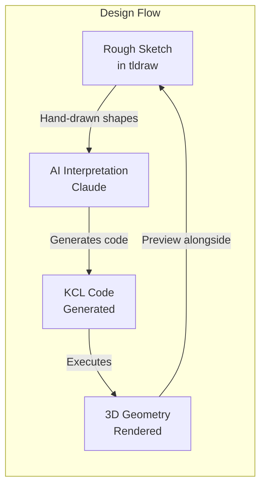

# Part 14: Integrating KCL with tldraw

What if you could sketch on an infinite canvas, then turn those sketches into parametric KCL geometry? Rough shapes on the left, precise code on the right. The makereal pattern, applied to CAD. This part explores building that hybrid workbench with tldraw.

## The Vision



You sketch an idea. AI interprets it. KCL generates precise geometry. The 3D preview appears next to your sketch. Iterate until it's right.

## What Is tldraw?

tldraw is an open-source infinite canvas library. It provides:
- Drawing primitives (rectangles, ellipses, lines, arrows, freehand)
- Selection, grouping, alignment
- Zoom, pan, infinite space
- Collaboration (optional)
- Extensibility

See: https://github.com/tldraw/tldraw

## What Is makereal?

makereal is a pattern from tldraw that turns sketches into working UIs using AI. See: https://github.com/tldraw/make-real

The flow:
1. Draw UI elements on canvas
2. Select and click "Make Real"
3. Screenshot is sent to multimodal AI
4. AI generates HTML/Tailwind code
5. Code renders in an iframe on the canvas

We adapt this for CAD: sketches become KCL, KCL becomes geometry.

## Project Setup

```bash
# Create React project (tldraw is React-based)
npm create vite@latest kcl-sketch -- --template react-ts
cd kcl-sketch
npm install @tldraw/tldraw
npm install kcl-wasm  # Your WASM package
```

## Basic tldraw Integration

```tsx
// src/App.tsx
import { Tldraw } from '@tldraw/tldraw'
import '@tldraw/tldraw/tldraw.css'

export default function App() {
  return (
    <div style={{ position: 'fixed', inset: 0 }}>
      <Tldraw />
    </div>
  )
}
```

That's it for a basic canvas. Now let's add KCL.

## Adding a KCL Panel

Create a split layout with canvas and code editor:

```tsx
// src/App.tsx
import { Tldraw, useEditor } from '@tldraw/tldraw'
import { useState, useEffect } from 'react'
import { KclEditor } from './KclEditor'
import { KclPreview } from './KclPreview'

export default function App() {
  const [kclCode, setKclCode] = useState('')
  const [geometry, setGeometry] = useState(null)

  return (
    <div className="app-layout">
      <div className="canvas-panel">
        <Tldraw>
          <MakeRealButton onGenerate={setKclCode} />
        </Tldraw>
      </div>

      <div className="code-panel">
        <KclEditor
          code={kclCode}
          onChange={setKclCode}
        />
        <KclPreview geometry={geometry} />
      </div>
    </div>
  )
}
```

```css
/* src/App.css */
.app-layout {
  display: grid;
  grid-template-columns: 1fr 1fr;
  height: 100vh;
}

.canvas-panel {
  position: relative;
}

.code-panel {
  display: flex;
  flex-direction: column;
  border-left: 1px solid #333;
}
```

## The Make Real Button

A custom tldraw component that triggers AI generation:

```tsx
// src/MakeRealButton.tsx
import { useEditor, track } from '@tldraw/tldraw'

interface Props {
  onGenerate: (code: string) => void
}

export const MakeRealButton = track(({ onGenerate }: Props) => {
  const editor = useEditor()
  const selectedShapes = editor.getSelectedShapes()

  const handleClick = async () => {
    if (selectedShapes.length === 0) {
      alert('Select some shapes first')
      return
    }

    // Get screenshot of selected shapes
    const bounds = editor.getSelectionPageBounds()
    if (!bounds) return

    const svg = await editor.getSvg(selectedShapes)
    if (!svg) return

    // Convert to image for AI
    const image = await svgToImage(svg)

    // Send to Claude for interpretation
    const code = await generateKclFromImage(image)

    onGenerate(code)
  }

  return (
    <button
      className="make-real-button"
      onClick={handleClick}
      disabled={selectedShapes.length === 0}
    >
      Make Real (KCL)
    </button>
  )
})

async function svgToImage(svg: SVGElement): Promise<string> {
  const canvas = document.createElement('canvas')
  const ctx = canvas.getContext('2d')!
  const svgData = new XMLSerializer().serializeToString(svg)
  const img = new Image()

  return new Promise((resolve) => {
    img.onload = () => {
      canvas.width = img.width
      canvas.height = img.height
      ctx.drawImage(img, 0, 0)
      resolve(canvas.toDataURL('image/png'))
    }
    img.src = 'data:image/svg+xml;base64,' + btoa(svgData)
  })
}
```

## AI Code Generation

Send the sketch to Claude for interpretation:

```tsx
// src/ai.ts
import Anthropic from '@anthropic-ai/sdk'

const client = new Anthropic({
  apiKey: import.meta.env.VITE_ANTHROPIC_API_KEY,
})

export async function generateKclFromImage(imageBase64: string): Promise<string> {
  const response = await client.messages.create({
    model: 'claude-sonnet-4-20250514',
    max_tokens: 4096,
    messages: [{
      role: 'user',
      content: [
        {
          type: 'image',
          source: {
            type: 'base64',
            media_type: 'image/png',
            data: imageBase64.split(',')[1],
          },
        },
        {
          type: 'text',
          text: `You are a CAD code generator. Looking at this sketch, generate KCL code that creates similar 3D geometry.

KCL is a language for parametric CAD. Here's an example:

\`\`\`kcl
@settings(defaultLengthUnit = mm)

width = 50
height = 30
depth = 20

sketch = startSketchOn(XY)
  |> startProfile(at = [0, 0])
  |> xLine(length = width)
  |> yLine(length = height)
  |> xLine(length = -width)
  |> close()

box = extrude(sketch, length = depth)
\`\`\`

Based on the sketch:
1. Identify the shapes (rectangles, circles, lines)
2. Estimate proportions and sizes
3. Generate parametric KCL code with meaningful variable names
4. Use appropriate operations (extrude, revolve, fillet, etc.)

Return only the KCL code, no explanation.`,
        },
      ],
    }],
  })

  return response.content[0].text
}
```

## The KCL Editor

A code editor for viewing and editing generated KCL:

```tsx
// src/KclEditor.tsx
import { useEffect, useRef } from 'react'
import { EditorView, basicSetup } from 'codemirror'

interface Props {
  code: string
  onChange: (code: string) => void
}

export function KclEditor({ code, onChange }: Props) {
  const containerRef = useRef<HTMLDivElement>(null)
  const editorRef = useRef<EditorView>()

  useEffect(() => {
    if (!containerRef.current) return

    const editor = new EditorView({
      doc: code,
      extensions: [
        basicSetup,
        EditorView.updateListener.of((update) => {
          if (update.docChanged) {
            onChange(update.state.doc.toString())
          }
        }),
      ],
      parent: containerRef.current,
    })

    editorRef.current = editor

    return () => editor.destroy()
  }, [])

  // Update editor when code prop changes (from AI)
  useEffect(() => {
    if (editorRef.current) {
      const currentCode = editorRef.current.state.doc.toString()
      if (currentCode !== code) {
        editorRef.current.dispatch({
          changes: { from: 0, to: currentCode.length, insert: code }
        })
      }
    }
  }, [code])

  return <div ref={containerRef} className="kcl-editor" />
}
```

## Executing KCL

Run the generated code and display geometry:

```tsx
// src/KclPreview.tsx
import { useEffect, useState } from 'react'
import init, { execute_kcl } from 'kcl-wasm'

interface Props {
  code: string
}

export function KclPreview({ code }: Props) {
  const [wasmReady, setWasmReady] = useState(false)
  const [result, setResult] = useState<any>(null)
  const [error, setError] = useState<string | null>(null)

  useEffect(() => {
    init().then(() => setWasmReady(true))
  }, [])

  useEffect(() => {
    if (!wasmReady || !code) return

    const run = async () => {
      try {
        const outcome = await execute_kcl(code, '{}')
        setResult(outcome)
        setError(null)
      } catch (e) {
        setError(e.toString())
        setResult(null)
      }
    }

    const timer = setTimeout(run, 500)  // Debounce
    return () => clearTimeout(timer)
  }, [code, wasmReady])

  if (!wasmReady) {
    return <div className="loading">Loading KCL...</div>
  }

  if (error) {
    return <div className="error">{error}</div>
  }

  if (!result) {
    return <div className="placeholder">Draw something and click "Make Real"</div>
  }

  return (
    <div className="preview">
      <ThreeJsViewer geometry={result.geometry} />
    </div>
  )
}
```

## 3D Viewer Component

Display the geometry using Three.js:

```tsx
// src/ThreeJsViewer.tsx
import { useRef, useEffect } from 'react'
import * as THREE from 'three'
import { OrbitControls } from 'three/examples/jsm/controls/OrbitControls'

interface Props {
  geometry: any  // Geometry data from KCL
}

export function ThreeJsViewer({ geometry }: Props) {
  const containerRef = useRef<HTMLDivElement>(null)
  const sceneRef = useRef<THREE.Scene>()

  useEffect(() => {
    if (!containerRef.current) return

    // Setup
    const scene = new THREE.Scene()
    scene.background = new THREE.Color(0x1a1a1a)
    sceneRef.current = scene

    const camera = new THREE.PerspectiveCamera(
      75,
      containerRef.current.clientWidth / containerRef.current.clientHeight,
      0.1,
      1000
    )
    camera.position.set(50, 50, 50)

    const renderer = new THREE.WebGLRenderer({ antialias: true })
    renderer.setSize(
      containerRef.current.clientWidth,
      containerRef.current.clientHeight
    )
    containerRef.current.appendChild(renderer.domElement)

    const controls = new OrbitControls(camera, renderer.domElement)

    // Lighting
    const ambientLight = new THREE.AmbientLight(0xffffff, 0.5)
    scene.add(ambientLight)

    const directionalLight = new THREE.DirectionalLight(0xffffff, 0.8)
    directionalLight.position.set(50, 100, 50)
    scene.add(directionalLight)

    // Animate
    const animate = () => {
      requestAnimationFrame(animate)
      controls.update()
      renderer.render(scene, camera)
    }
    animate()

    return () => {
      renderer.dispose()
    }
  }, [])

  // Update geometry when it changes
  useEffect(() => {
    if (!sceneRef.current || !geometry) return

    // Clear existing meshes
    sceneRef.current.children = sceneRef.current.children.filter(
      child => child instanceof THREE.Light
    )

    // Add new geometry
    for (const mesh of geometry.meshes) {
      const threeGeometry = new THREE.BufferGeometry()
      threeGeometry.setAttribute(
        'position',
        new THREE.Float32BufferAttribute(mesh.vertices, 3)
      )
      if (mesh.indices) {
        threeGeometry.setIndex(mesh.indices)
      }
      threeGeometry.computeVertexNormals()

      const material = new THREE.MeshStandardMaterial({
        color: 0x4a9eff,
        metalness: 0.3,
        roughness: 0.7,
      })

      const threeMesh = new THREE.Mesh(threeGeometry, material)
      sceneRef.current.add(threeMesh)
    }
  }, [geometry])

  return <div ref={containerRef} className="three-viewer" />
}
```

## Custom tldraw Shapes

Add KCL-aware shapes to tldraw:

```tsx
// src/shapes/KclPreviewShape.tsx
import {
  BaseBoxShapeUtil,
  TLBaseShape,
  HTMLContainer,
} from '@tldraw/tldraw'

type KclPreviewShape = TLBaseShape<
  'kcl-preview',
  {
    w: number
    h: number
    code: string
    geometry: any
  }
>

export class KclPreviewShapeUtil extends BaseBoxShapeUtil<KclPreviewShape> {
  static type = 'kcl-preview' as const

  getDefaultProps(): KclPreviewShape['props'] {
    return {
      w: 400,
      h: 300,
      code: '',
      geometry: null,
    }
  }

  component(shape: KclPreviewShape) {
    return (
      <HTMLContainer>
        <div className="kcl-preview-shape">
          <ThreeJsViewer geometry={shape.props.geometry} />
          <div className="code-overlay">
            <pre>{shape.props.code}</pre>
          </div>
        </div>
      </HTMLContainer>
    )
  }

  indicator(shape: KclPreviewShape) {
    return <rect width={shape.props.w} height={shape.props.h} />
  }
}
```

Register the custom shape:

```tsx
// src/App.tsx
import { Tldraw } from '@tldraw/tldraw'
import { KclPreviewShapeUtil } from './shapes/KclPreviewShape'

const customShapeUtils = [KclPreviewShapeUtil]

export default function App() {
  return (
    <Tldraw shapeUtils={customShapeUtils}>
      {/* ... */}
    </Tldraw>
  )
}
```

## Bidirectional Sync

Make changes in either direction update the other:

### Sketch to Code

Already covered: select shapes, generate KCL.

### Code to Sketch

Parse KCL and create corresponding tldraw shapes:

```tsx
// src/syncCodeToCanvas.ts
import { Editor, TLShapeId } from '@tldraw/tldraw'
import { parse_kcl } from 'kcl-wasm'

export function syncCodeToCanvas(editor: Editor, code: string) {
  const ast = parse_kcl(code)

  // Find sketch definitions
  for (const node of ast.body) {
    if (node.type === 'VariableDeclaration') {
      const value = node.value

      if (value.callee === 'startSketchOn') {
        // Create tldraw rectangle for each closed profile
        const shapes = extractShapesFromSketch(value)

        for (const shape of shapes) {
          editor.createShape({
            type: 'geo',
            x: shape.x,
            y: shape.y,
            props: {
              geo: shape.type,  // 'rectangle', 'ellipse', etc.
              w: shape.width,
              h: shape.height,
            },
          })
        }
      }
    }
  }
}

function extractShapesFromSketch(sketchAst: any) {
  // Parse the pipe chain to understand the shape
  // Return simplified shape data
  return []
}
```

## Improved AI Prompting

Better prompts get better code:

```typescript
const systemPrompt = `You are a KCL code generator for CAD. You interpret hand-drawn sketches and produce precise, parametric KCL code.

## KCL Reference

### Starting a sketch
\`\`\`kcl
sketch = startSketchOn(XY)  // or XZ, YZ, -XY, -XZ, -YZ
\`\`\`

### Drawing lines
\`\`\`kcl
profile = sketch
  |> startProfile(at = [0, 0])
  |> xLine(length = 50)        // Horizontal line
  |> yLine(length = 30)        // Vertical line
  |> line(to = [10, 20])       // Line to absolute point
  |> line(to = [5, 5], relative = true)  // Relative line
  |> close()                   // Close the profile
\`\`\`

### Shapes
\`\`\`kcl
circle(sketch, center = [0, 0], radius = 25)
rect(sketch, corner = [0, 0], width = 50, height = 30)
\`\`\`

### 3D operations
\`\`\`kcl
solid = extrude(profile, length = 20)
revolved = revolve(profile, axis = Y, angle = 360deg)
\`\`\`

### Modifications
\`\`\`kcl
filleted = fillet(solid, radius = 2, edges = getAllEdges(solid))
chamfered = chamfer(solid, length = 1, edges = [edge1, edge2])
\`\`\`

## Instructions

1. Analyze the sketch for shapes and proportions
2. Use meaningful variable names (width, height, radius, etc.)
3. Make dimensions parametric (define variables at the top)
4. Start with simple shapes, add complexity as needed
5. Include comments explaining the design intent

Return only KCL code, no markdown fences or explanation.`
```

## Handling Complex Sketches

For sketches with multiple shapes:

```tsx
async function generateKclFromSelection(
  editor: Editor,
  selectedShapes: TLShape[]
): Promise<string> {
  // Group related shapes
  const groups = groupShapesByProximity(selectedShapes)

  // Generate code for each group
  const codeParts: string[] = []

  for (let i = 0; i < groups.length; i++) {
    const group = groups[i]
    const svg = await editor.getSvg(group)
    const image = await svgToImage(svg)

    const code = await generateKclFromImage(image, {
      partIndex: i,
      totalParts: groups.length,
      context: codeParts.join('\n'),
    })

    codeParts.push(code)
  }

  return codeParts.join('\n\n')
}

function groupShapesByProximity(shapes: TLShape[]): TLShape[][] {
  // Simple clustering by bounding box overlap
  // More sophisticated: use actual geometric proximity
  return [shapes]  // Simplified: treat all as one group
}
```

## Exercises

1. **Basic Integration**: Set up the tldraw + KCL editor. Draw a rectangle, click Make Real, see the code.

2. **Shape Recognition**: Improve the AI prompt to better recognize circles vs rectangles vs freehand.

3. **Bidirectional Editing**: Make code changes update the canvas preview. Make canvas changes regenerate code.

4. **Custom Shapes**: Add a custom tldraw shape for parametric dimensions (like dimension lines in CAD).

5. **Iteration Loop**: Implement "refine" functionality: send both the sketch and current code to Claude, ask for improvements.

## Architecture Considerations

### State Management

```tsx
// Zustand store for shared state
import create from 'zustand'

interface Store {
  code: string
  setCode: (code: string) => void

  geometry: GeometryData | null
  setGeometry: (geo: GeometryData) => void

  selectedShapeIds: string[]
  setSelection: (ids: string[]) => void

  syncToCanvas: boolean
  setSyncToCanvas: (sync: boolean) => void
}

const useStore = create<Store>((set) => ({
  code: '',
  setCode: (code) => set({ code }),
  geometry: null,
  setGeometry: (geometry) => set({ geometry }),
  selectedShapeIds: [],
  setSelection: (selectedShapeIds) => set({ selectedShapeIds }),
  syncToCanvas: true,
  setSyncToCanvas: (syncToCanvas) => set({ syncToCanvas }),
}))
```

### Real-time Collaboration

tldraw supports multiplayer. Add KCL execution for all participants:

```tsx
// Each client executes locally
// Code changes are broadcast via tldraw's sync
// Geometry preview is local (no network overhead)
```

## What's Next

Part 15 is the capstone: a mechanical flip-tile display. You'll apply everything, designing physical parts in KCL, building the control system, and connecting it all with Claude. The full journey from sketch to printed object to interactive installation.

The tldraw integration bridges two worlds: the imprecise creativity of sketching and the precise rigor of parametric CAD. Neither alone is enough for design. Together, they're powerful.
