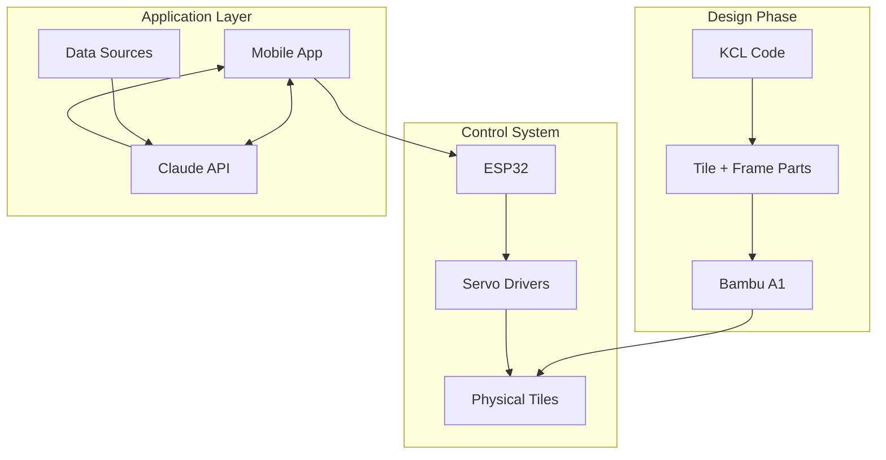

# Part 15: Capstone, The Mechanical Flip-Tile Display

Everything comes together here. You're building a large mechanical display: hundreds of tiles that flip between two colors to render graphs, charts, and visualizations. The hardware is a Bambu A1 for printing, ESP32 for control, and a mobile app connected to Claude for generating visualizations based on what you want to track. This project ties KCL, Rust, embedded systems, and AI into one physical object.

## The Big Picture



## Phase 1: Designing the Tiles in KCL

Each tile needs:
- A body that can flip (hinged)
- Two contrasting faces (white and black, or any two colors)
- A mechanism to connect to the flip actuator
- Tight tolerances for smooth, reliable flipping

### The Tile Design

```kcl
// tile.kcl
@settings(defaultLengthUnit = mm)

// Parameters
tileWidth = 20
tileHeight = 20
tileThickness = 3
hingeRadius = 1.5
hingeTolerance = 0.2
actuatorHoleRadius = 1
actuatorHoleOffset = 5  // Distance from hinge

// Main tile body
tileSketch = startSketchOn(XY)
  |> startProfile(at = [0, 0])
  |> xLine(length = tileWidth)
  |> yLine(length = tileHeight)
  |> xLine(length = -tileWidth)
  |> close()

tileBody = extrude(tileSketch, length = tileThickness)

// Hinge cylinders on top edge
hingeSketch = startSketchOn(XZ)
  |> circle(center = [tileWidth / 4, tileThickness / 2], radius = hingeRadius)

hinge1 = extrude(hingeSketch, length = hingeRadius * 2)
  |> translate(y = tileHeight - hingeRadius)

hingeSketch2 = startSketchOn(XZ)
  |> circle(center = [tileWidth * 3 / 4, tileThickness / 2], radius = hingeRadius)

hinge2 = extrude(hingeSketch2, length = hingeRadius * 2)
  |> translate(y = tileHeight - hingeRadius)

// Actuator connection hole
actuatorSketch = startSketchOn(XY)
  |> circle(center = [tileWidth / 2, actuatorHoleOffset], radius = actuatorHoleRadius)

actuatorHole = extrude(actuatorSketch, length = tileThickness)

// Combine
tile = union(tileBody, hinge1, hinge2)
  |> subtract(actuatorHole)

// Round edges for smooth operation
tile = fillet(tile, radius = 0.5, edges = getBottomEdges(tile))
```

### The Frame Design

The frame holds tiles and their hinges:

```kcl
// frame_cell.kcl
@settings(defaultLengthUnit = mm)

// Must match tile parameters
tileWidth = 20
tileHeight = 20
hingeRadius = 1.5
hingeTolerance = 0.2
wallThickness = 2
cellDepth = 25  // Depth for flip clearance

// Outer dimensions
cellWidth = tileWidth + 2 * wallThickness
cellHeight = tileHeight + wallThickness  // Open at bottom for cable routing

// Outer shell
outerSketch = startSketchOn(XY)
  |> startProfile(at = [0, 0])
  |> xLine(length = cellWidth)
  |> yLine(length = cellHeight)
  |> xLine(length = -cellWidth)
  |> close()

outer = extrude(outerSketch, length = cellDepth)

// Inner cavity
innerWidth = tileWidth + 0.5  // Small clearance
innerHeight = tileHeight + 0.5

innerSketch = startSketchOn(XY)
  |> startProfile(at = [wallThickness, 0])
  |> xLine(length = innerWidth)
  |> yLine(length = innerHeight)
  |> xLine(length = -innerWidth)
  |> close()

inner = extrude(innerSketch, length = cellDepth - wallThickness)
  |> translate(z = wallThickness)

// Hinge slots
hingeSlotRadius = hingeRadius + hingeTolerance
hingeSlotSketch = startSketchOn(XZ)
  |> circle(center = [cellWidth / 4, cellDepth - wallThickness / 2], radius = hingeSlotRadius)

hingeSlot1 = extrude(hingeSlotSketch, length = hingeSlotRadius * 3)
  |> translate(y = cellHeight - hingeSlotRadius)

hingeSlotSketch2 = startSketchOn(XZ)
  |> circle(center = [cellWidth * 3 / 4, cellDepth - wallThickness / 2], radius = hingeSlotRadius)

hingeSlot2 = extrude(hingeSlotSketch2, length = hingeSlotRadius * 3)
  |> translate(y = cellHeight - hingeSlotRadius)

// Assemble frame cell
cell = outer
  |> subtract(inner)
  |> subtract(hingeSlot1)
  |> subtract(hingeSlot2)

// Cable routing channel
cableChannel = startSketchOn(XZ)
  |> circle(center = [cellWidth / 2, wallThickness / 2], radius = 3)
  |> extrude(length = wallThickness + 1)

cell = subtract(cell, cableChannel)
```

### The Grid Assembly

Connect cells into a grid:

```kcl
// grid.kcl
@settings(defaultLengthUnit = mm)

import "frame_cell.kcl" as cell

// Grid dimensions
gridRows = 16
gridCols = 32

cellWidth = cell.cellWidth
cellHeight = cell.cellHeight

// Generate grid
fn cellAt(row, col) {
    return translate(cell.cell,
        x = col * cellWidth,
        y = row * cellHeight
    )
}

// Build rows
// Note: KCL patterns would be more efficient here
// This is illustrative

row0 = union(
    cellAt(0, 0), cellAt(0, 1), cellAt(0, 2), cellAt(0, 3),
    // ... continue for all columns
)

// In practice, use patternLinear:
cellPrototype = cell.cell
row = patternLinear(cellPrototype, count = gridCols, direction = [cellWidth, 0, 0])
grid = patternLinear(row, count = gridRows, direction = [0, cellHeight, 0])
```

## Phase 2: The Flip Mechanism

Each tile needs an actuator. Options:

### Option A: Servo Motors

One small servo per tile. Expensive but precise.

```kcl
// servo_mount.kcl
@settings(defaultLengthUnit = mm)

// SG90 micro servo dimensions
servoWidth = 12.2
servoHeight = 22.7
servoDepth = 22.5
hornLength = 15

// Mount that attaches to frame cell
mountSketch = startSketchOn(XZ)
  |> startProfile(at = [0, 0])
  |> xLine(length = servoWidth + 4)
  |> yLine(length = servoHeight + 4)
  |> xLine(length = -(servoWidth + 4))
  |> close()

mount = extrude(mountSketch, length = servoDepth + 2)

// Cavity for servo
servoSketch = startSketchOn(XZ)
  |> startProfile(at = [2, 2])
  |> xLine(length = servoWidth)
  |> yLine(length = servoHeight)
  |> xLine(length = -servoWidth)
  |> close()

servoCavity = extrude(servoSketch, length = servoDepth)
  |> translate(z = 1)

mount = subtract(mount, servoCavity)
```

### Option B: Electromagnets

Flip tiles magnetically. Cheaper at scale, simpler mechanically.

```kcl
// magnet_mount.kcl
@settings(defaultLengthUnit = mm)

// Small electromagnet dimensions
magnetDiameter = 10
magnetHeight = 8

// Mount in frame cell base
mountSketch = startSketchOn(XY)
  |> circle(center = [0, 0], radius = magnetDiameter / 2 + 2)

mount = extrude(mountSketch, length = magnetHeight + 2)

// Magnet cavity
magnetCavity = startSketchOn(XY)
  |> circle(center = [0, 0], radius = magnetDiameter / 2 + 0.2)
  |> extrude(length = magnetHeight)
  |> translate(z = 1)

mount = subtract(mount, magnetCavity)

// Wire channel
wireChannel = startSketchOn(XZ)
  |> circle(center = [0, 1], radius = 1.5)
  |> extrude(length = magnetDiameter + 4)
  |> translate(y = -magnetDiameter / 2 - 2)

mount = subtract(mount, wireChannel)
```

## Phase 3: The Control System

### ESP32 Firmware (Rust)

Use `esp-idf-hal` or `embassy` for ESP32 in Rust:

```rust
// src/main.rs
#![no_std]
#![no_main]

use esp_hal::prelude::*;
use esp_wifi::wifi::{WifiController, WifiDevice};
use embassy_net::Stack;

#[esp_hal::entry]
fn main() -> ! {
    let peripherals = esp_hal::init();

    // Initialize WiFi
    let wifi = init_wifi(peripherals.WIFI);

    // Initialize GPIO for tile control
    let tile_controller = TileController::new(
        peripherals.GPIO,
        ROWS,
        COLS,
    );

    // Main loop: receive commands over WiFi, update tiles
    loop {
        if let Some(command) = wifi.receive_command() {
            tile_controller.execute(command);
        }
    }
}

struct TileController {
    // GPIO pins or shift registers for tile control
    rows: [OutputPin; 16],
    cols: [OutputPin; 32],
}

impl TileController {
    fn set_tile(&mut self, row: usize, col: usize, state: bool) {
        // For electromagnet: pulse the appropriate pin
        // For servo: set PWM duty cycle
    }

    fn set_frame(&mut self, bitmap: &[u8]) {
        // Update all tiles to match bitmap
        for row in 0..16 {
            for col in 0..32 {
                let byte_index = row * 4 + col / 8;
                let bit_index = col % 8;
                let state = (bitmap[byte_index] >> bit_index) & 1 == 1;
                self.set_tile(row, col, state);
            }
        }
    }
}
```

### Communication Protocol

Simple binary protocol over WiFi:

```rust
#[derive(Debug)]
enum Command {
    SetTile { row: u8, col: u8, state: bool },
    SetFrame { bitmap: [u8; 64] },  // 16 rows x 32 cols / 8 bits
    Clear,
    Fill,
    Invert,
}

impl Command {
    fn parse(data: &[u8]) -> Option<Self> {
        match data.get(0)? {
            0x01 => {
                let row = *data.get(1)?;
                let col = *data.get(2)?;
                let state = *data.get(3)? != 0;
                Some(Command::SetTile { row, col, state })
            }
            0x02 => {
                let mut bitmap = [0u8; 64];
                bitmap.copy_from_slice(data.get(1..65)?);
                Some(Command::SetFrame { bitmap })
            }
            0x03 => Some(Command::Clear),
            0x04 => Some(Command::Fill),
            0x05 => Some(Command::Invert),
            _ => None,
        }
    }
}
```

## Phase 4: The Mapping Layer

Convert abstract data to tile coordinates:

```rust
// display_lib/src/lib.rs

pub struct FlipDisplay {
    width: usize,
    height: usize,
    buffer: Vec<bool>,
}

impl FlipDisplay {
    pub fn new(width: usize, height: usize) -> Self {
        Self {
            width,
            height,
            buffer: vec![false; width * height],
        }
    }

    pub fn clear(&mut self) {
        self.buffer.fill(false);
    }

    pub fn set_pixel(&mut self, x: usize, y: usize, on: bool) {
        if x < self.width && y < self.height {
            self.buffer[y * self.width + x] = on;
        }
    }

    pub fn draw_line(&mut self, x0: usize, y0: usize, x1: usize, y1: usize) {
        // Bresenham's line algorithm
        let dx = (x1 as i32 - x0 as i32).abs();
        let dy = (y1 as i32 - y0 as i32).abs();
        let sx = if x0 < x1 { 1i32 } else { -1 };
        let sy = if y0 < y1 { 1i32 } else { -1 };
        let mut err = dx - dy;
        let mut x = x0 as i32;
        let mut y = y0 as i32;

        loop {
            self.set_pixel(x as usize, y as usize, true);
            if x == x1 as i32 && y == y1 as i32 { break; }
            let e2 = 2 * err;
            if e2 > -dy { err -= dy; x += sx; }
            if e2 < dx { err += dx; y += sy; }
        }
    }

    pub fn draw_bar_chart(&mut self, values: &[f32]) {
        let bar_width = self.width / values.len();
        let max_value = values.iter().cloned().fold(0.0f32, f32::max);

        for (i, &value) in values.iter().enumerate() {
            let bar_height = ((value / max_value) * self.height as f32) as usize;
            let x_start = i * bar_width;

            for x in x_start..(x_start + bar_width - 1) {
                for y in (self.height - bar_height)..self.height {
                    self.set_pixel(x, y, true);
                }
            }
        }
    }

    pub fn to_bitmap(&self) -> Vec<u8> {
        let mut bitmap = vec![0u8; (self.width * self.height + 7) / 8];
        for (i, &pixel) in self.buffer.iter().enumerate() {
            if pixel {
                bitmap[i / 8] |= 1 << (i % 8);
            }
        }
        bitmap
    }
}
```

## Phase 5: The Mobile App

A Flutter or React Native app that:
1. Connects to Claude for visualization generation
2. Sends display commands to ESP32

### React Native with Claude

```typescript
// App.tsx
import React, { useState } from 'react'
import { View, TextInput, Button, StyleSheet } from 'react-native'
import Anthropic from '@anthropic-ai/sdk'

const client = new Anthropic({ apiKey: process.env.ANTHROPIC_API_KEY })

interface DisplayCommand {
  type: 'frame'
  bitmap: number[]
}

export default function App() {
  const [prompt, setPrompt] = useState('')
  const [display, setDisplay] = useState<boolean[][]>(
    Array(16).fill(null).map(() => Array(32).fill(false))
  )

  const generateVisualization = async () => {
    const response = await client.messages.create({
      model: 'claude-sonnet-4-20250514',
      max_tokens: 1024,
      system: `You are a data visualization generator for a 32x16 flip-dot display.
        Given a prompt, generate a bitmap visualization.
        Respond with a JSON array of 16 arrays, each containing 32 booleans.
        true = dot is flipped (visible), false = dot is not flipped.
        Keep visualizations simple and clear at this low resolution.`,
      messages: [{
        role: 'user',
        content: prompt,
      }],
    })

    const bitmap = JSON.parse(response.content[0].text)
    setDisplay(bitmap)
    sendToDisplay(bitmap)
  }

  const sendToDisplay = async (bitmap: boolean[][]) => {
    // Convert to packed bytes
    const packed: number[] = []
    for (const row of bitmap) {
      for (let i = 0; i < row.length; i += 8) {
        let byte = 0
        for (let bit = 0; bit < 8; bit++) {
          if (row[i + bit]) {
            byte |= 1 << bit
          }
        }
        packed.push(byte)
      }
    }

    // Send to ESP32
    await fetch('http://esp32.local/frame', {
      method: 'POST',
      body: new Uint8Array([0x02, ...packed]),
    })
  }

  return (
    <View style={styles.container}>
      <TextInput
        style={styles.input}
        value={prompt}
        onChangeText={setPrompt}
        placeholder="What do you want to see?"
      />
      <Button title="Generate" onPress={generateVisualization} />
      <DisplayPreview bitmap={display} />
    </View>
  )
}

function DisplayPreview({ bitmap }: { bitmap: boolean[][] }) {
  return (
    <View style={styles.preview}>
      {bitmap.map((row, y) => (
        <View key={y} style={styles.row}>
          {row.map((cell, x) => (
            <View
              key={x}
              style={[styles.cell, cell && styles.cellOn]}
            />
          ))}
        </View>
      ))}
    </View>
  )
}
```

## Phase 6: Putting It All Together

### Bill of Materials

| Item | Quantity | Notes |
|------|----------|-------|
| 3D printed tiles | 512 | White/black PLA or dual-color |
| 3D printed frame | 16 | Modular grid sections |
| ESP32 DevKit | 1 | WiFi + GPIO |
| PCA9685 PWM driver | 32 | If using servos |
| SG90 servo | 512 | If using servos |
| OR electromagnets | 512 | If using magnets |
| 5V power supply | 1 | Sized for actuator draw |
| Wiring | Lots | 22 AWG stranded |

### Print Settings for Bambu A1

For tiles:
- Material: PLA (white + black, or use paint)
- Layer height: 0.16mm
- Infill: 20%
- Supports: None (design for supportless)
- Print orientation: Face down

For frame:
- Material: PLA (black)
- Layer height: 0.2mm
- Infill: 30% (structural)
- Supports: Maybe for hinge slots
- Print orientation: Open side up

### Assembly Order

1. Print all tiles (batch of 20-50 per plate)
2. Print frame sections (4 per plate)
3. Assemble frame sections into grid
4. Install actuators in frame
5. Insert tiles into hinges
6. Connect actuator wiring
7. Install ESP32 and power
8. Flash firmware
9. Test individual tiles
10. Calibrate timing
11. Install mobile app
12. Generate first visualization

## Challenges and Solutions

### Challenge: 512 Servos Are Expensive

Solution: Use electromagnets. A small electromagnet per tile costs less than a servo. Pulse to flip, tile stays due to gravity or a small spring.

### Challenge: Wiring Complexity

Solution: Use a matrix wiring scheme. 16 rows x 32 columns = 48 control lines instead of 512. Scan rows while selecting columns.

### Challenge: Power Draw

Solution: Flip tiles in sequence, not all at once. A wave pattern looks good and limits peak current.

### Challenge: Tile Reliability

Solution: Test each tile before installing. Print spares. Design for easy replacement.

## Example Visualizations

Ask Claude to generate:

- "Bar chart showing my daily step count for the past week"
- "Simple analog clock showing current time"
- "Weather icon: sunny, cloudy, rainy"
- "Heart rate graph from today's workout"
- "Today's date in large numbers"
- "Battery level meter at 75%"

## Exercises

1. **Print One Tile**: Export the tile KCL to STL, slice, print. Test the hinge tolerance.

2. **Print One Cell**: Export the frame cell. Test tile fit and clearance.

3. **ESP32 Blink**: Flash a simple LED blink to verify ESP32 setup.

4. **Single Tile Control**: Wire one actuator. Control it from ESP32.

5. **Claude Integration**: Get Claude to generate a simple bitmap. Render it on screen before hardware.

6. **Full Assembly**: Build a 4x4 prototype section. Full 16x32 comes after validation.

## The Full Stack

You've now seen the complete path:

```
Idea (natural language)
    ↓ Claude
Bitmap data
    ↓ Mobile App
WiFi command
    ↓ ESP32
GPIO signals
    ↓ Actuators
Physical tiles flip
    ↓ Human eyes
Visual information received
```

And the design path:

```
CAD requirements
    ↓ KCL
Parametric geometry
    ↓ Export
STL files
    ↓ Slicer
G-code
    ↓ Bambu A1
Physical parts
    ↓ Assembly
Working display
```

## What You've Learned

This series took you from Rust novice to someone who can:

1. Read and understand Rust code (ownership, borrowing, lifetimes)
2. Navigate the KCL codebase (parser, executor, stdlib, engine)
3. Write practical KCL for real parts
4. Understand the geometry engine protocol
5. Handle errors properly in Rust
6. Write meaningful tests
7. Work with WASM bridges
8. Run KCL outside modeling-app
9. Contribute to the project
10. Build a Jupyter kernel
11. Explore native Rust UIs (GPUI)
12. Build Rust web frontends (Leptos)
13. Integrate KCL with other tools (tldraw)
14. Design and build physical objects

## What's Next For You

- **Contribute**: The Jupyter kernel is a real contribution target. The codebase needs it.
- **Build**: Use KCL for your projects. Desk organizers, phone stands, whatever you need.
- **Explore**: Try the GPUI or Leptos paths if native/web interests you.
- **Complete the Capstone**: Build the flip display. Post it on YouTube. Inspire others.

## Final Thoughts

KCL is young. It has rough edges. The codebase has bugs and unpolished corners. That's building in the open. The language has potential beyond its current home in modeling-app. You now have the knowledge to shape that future.

The journey from not knowing Rust to building a mechanical display controlled by AI is long. But every step is learnable. You've taken those steps.

Now make things.
