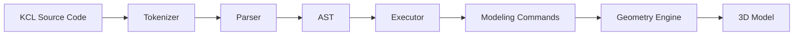

# Part 1: Your First KCL Program (and the Rust You Need to Run It)

You want to understand KCL deeply enough to contribute to it, which means you need to understand Rust. But here's the thing: most Rust tutorials want you to read 200 pages before you write a single line of code. That's backwards. We're starting at the end and working our way back.

By the end of this part, you'll have run KCL code and seen what happens under the hood. You'll know just enough Rust to be dangerous, which is exactly where you want to be.

## The Big Picture

KCL is a domain-specific language for creating CAD models. Think of it like SQL for databases or Terraform for infrastructure, except it's for 3D geometry. The language compiles to operations that get sent to a geometry engine, which does the actual mathematical heavy lifting.

Here's the complete flow:



In Python terms, KCL is like if you took NumPy (specialized operations), SQLAlchemy (DSL with specific syntax), and Flask (client-server architecture) and made them have a baby that produces 3D models instead of web pages.

## Your First KCL Program

Create a file called `box.kcl` anywhere on your system:

```kcl
// A simple box. Revolutionary.
width = 100
height = 50
depth = 25

box = startSketchOn("XY")
  |> startProfile(at = [0, 0])
  |> line(to = [width, 0])
  |> line(to = [width, height])
  |> line(to = [0, height])
  |> close()
  |> extrude(depth)
```

If you've worked with functional programming or method chaining in Python (like pandas), the `|>` operator is your friend. It's the pipe operator. Each line feeds its result into the next function. In Python you'd write:

```python
box = (
    startSketchOn("XY")
    .startProfile(at=[0, 0])
    .line(to=[width, 0])
    .line(to=[width, height])
    .line(to=[0, height])
    .close()
    .extrude(depth)
)
```

Except KCL doesn't use methods. The `|>` operator takes the value on the left and passes it as the first argument to the function on the right. So `x |> f(y)` becomes `f(x, y)`.

## Running KCL Code

Navigate to the modeling-app directory you already have:

```bash
cd modeling-app
```

Run your KCL program:

```bash
cargo run --bin kcl execute /path/to/box.kcl
```

Wait. That's a lie. The `kcl` binary might not be the right entry point. Let's check what actually exists:

```bash
ls rust/kcl-lib/src/bin/
```

You'll find that KCL doesn't have a standalone CLI binary in the traditional sense. It's primarily used as a library. The modeling app itself is the runtime. But we can still execute KCL code programmatically, which we'll do in a moment.

For now, let's look at existing examples:

```bash
ls public/kcl-samples/
```

Open one. Let's say `simple_box.kcl`:

```bash
cat public/kcl-samples/simple_box.kcl
```

You'll see actual production KCL code. Study it. This is what you're building toward.

## The Rust You Can't Avoid

Rust is not Python. Python says "we're all adults here" and lets you shoot yourself in the foot. Rust is the overprotective parent who makes you wear a helmet to check the mail. But that paranoia prevents entire categories of bugs.

### Ownership: The Big Idea

In Python, everything is reference-counted. Objects get cleaned up when nothing points to them. Easy. In Rust, every value has exactly one owner, and when that owner goes out of scope, the value is dropped. No reference counting, no garbage collection, no surprises.

```rust
fn main() {
    let s = String::from("hello");  // s owns the string
    takes_ownership(s);              // ownership moves to the function
    // println!("{}", s);            // ERROR: s no longer owns the string
}

fn takes_ownership(some_string: String) {
    println!("{}", some_string);
}  // some_string is dropped here
```

In Python, you'd write:

```python
def main():
    s = "hello"
    takes_ownership(s)
    print(s)  # This works fine

def takes_ownership(some_string):
    print(some_string)
```

Rust forces you to think about who owns data at any given time. This feels like handcuffs at first. Then you realize you've stopped getting `NoneType has no attribute` errors at 3am.

### Borrowing: Ownership's Gentler Cousin

Sometimes you want to let a function look at data without giving it away:

```rust
fn main() {
    let s = String::from("hello");
    let len = calculate_length(&s);  // Borrow s, don't take ownership
    println!("{} is {} characters", s, len);  // s still valid
}

fn calculate_length(s: &String) -> usize {
    s.len()
}  // s goes out of scope, but since it's borrowed, nothing happens
```

The `&` means "borrow this." The function gets a reference, not ownership. When the function ends, the reference disappears, but the original owner still has the value.

In Python, everything is already a reference (technically), so you don't think about this. In Rust, you think about it constantly.

### Mutability: Explicit by Default

```rust
let x = 5;        // Immutable
// x = 6;         // ERROR: can't assign twice to immutable variable

let mut y = 5;    // Mutable
y = 6;            // Fine
```

Python assumes you want mutability. Rust assumes you want immutability. You have to explicitly ask for mutation with `mut`. This catches bugs where you accidentally change things you meant to keep constant.

### Types: The Compiler Knows Everything

Rust is statically typed. Python type hints are suggestions. Rust types are law.

```rust
fn add(a: i32, b: i32) -> i32 {
    a + b
}
```

Every parameter has a type. Every return value has a type. The compiler checks everything at compile time. No runtime type errors.

The equivalent Python:

```python
def add(a: int, b: int) -> int:
    return a + b

# But this still works (unfortunately):
add("hello", "world")  # Returns "helloworld"
```

In Rust, that would be a compile error. You can't add strings with a function that expects integers.

## Reading KCL's Source

Let's look at how KCL represents a program. Open `rust/kcl-lib/src/parsing/ast/types/mod.rs` (don't worry, you don't need to understand it all yet):

```bash
head -50 rust/kcl-lib/src/parsing/ast/types/mod.rs
```

You'll see structures like this:

```rust
pub struct Program {
    pub body: Vec<BodyItem>,
    pub settings: Vec<Node<Annotation>>,
    // ... more fields
}
```

This is KCL's representation of your entire program. The `body` is a vector (Rust's version of Python's list) of items. Each item is a statement or declaration.

Compare to how Python's AST looks:

```python
import ast

code = """
width = 100
box = startSketchOn('XY')
"""

tree = ast.parse(code)
print(ast.dump(tree, indent=2))
```

Both languages parse source code into tree structures. The difference is Rust makes you handle every possibility explicitly. Python lets you duck-type your way through.

## The Type System You'll Love to Hate

Look at this enum from KCL:

```rust
pub enum BodyItem {
    ImportStatement(Node<ImportStatement>),
    ExpressionStatement(Node<Expr>),
    VariableDeclaration(Node<VariableDeclaration>),
    TypeDeclaration(Node<TypeDeclaration>),
    ReturnStatement(Node<ReturnStatement>),
}
```

This is a sum type (also called tagged union or variant). A `BodyItem` can be one of five things, and you have to handle all five cases. The compiler enforces this.

In Python, you might use inheritance:

```python
class BodyItem:
    pass

class ImportStatement(BodyItem):
    pass

class ExpressionStatement(BodyItem):
    pass

# ... etc
```

But Python won't force you to handle every case. Rust's enums + pattern matching will.

## Your First Rust Program

Create `learning_kcl/experiments/hello_kcl.rs`:

```rust
fn main() {
    // Parse and print a simple KCL program
    let kcl_code = r#"
        width = 100
        height = 50
    "#;

    println!("KCL Code:");
    println!("{}", kcl_code);

    // We'll actually parse this in Part 3
    println!("\nThis code would create a program AST");
    println!("with 2 variable declarations");
}
```

The `r#"..."#` syntax is a raw string literal. It's like Python's `r"..."` but works for multiline strings.

To run this:

```bash
rustc learning_kcl/experiments/hello_kcl.rs -o learning_kcl/experiments/hello_kcl
./learning_kcl/experiments/hello_kcl
```

Congratulations. You've written Rust. It compiled. It ran. You're dangerous now.

## What You Just Learned

1. KCL is a DSL that compiles to geometry operations
2. The pipe operator `|>` chains functions together
3. Rust has ownership (one owner per value)
4. Rust has borrowing (temporary references via `&`)
5. Rust is explicitly mutable (use `mut` to change things)
6. Rust's type system is strict and enforced at compile time
7. Enums in Rust are sum types, not Python's Enum class

## Exercises

1. **Read KCL examples**: Open every file in `public/kcl-samples/` and read the code. You won't understand everything yet. That's fine. Notice patterns.

2. **Compare syntax**: Take a KCL sample and write what you think the equivalent Python code would look like (ignoring the CAD-specific parts). This builds intuition for the language.

3. **Ownership practice**: Write a Rust function that takes ownership of a `String`, prints it, and returns it. Then write one that borrows it instead.

4. **Mutability practice**: Write a Rust function that takes a mutable reference to a vector and adds an element to it.

## Next Up

In Part 2, we'll actually parse KCL code using Rust. You'll build a tool that takes KCL source and prints its AST. Along the way, you'll learn why Rust's ownership model makes parsers both faster and safer than their Python equivalents, and why KCL's AST uses `Box<T>` and `Node<T>` wrappers everywhere.

The training wheels come off next.
