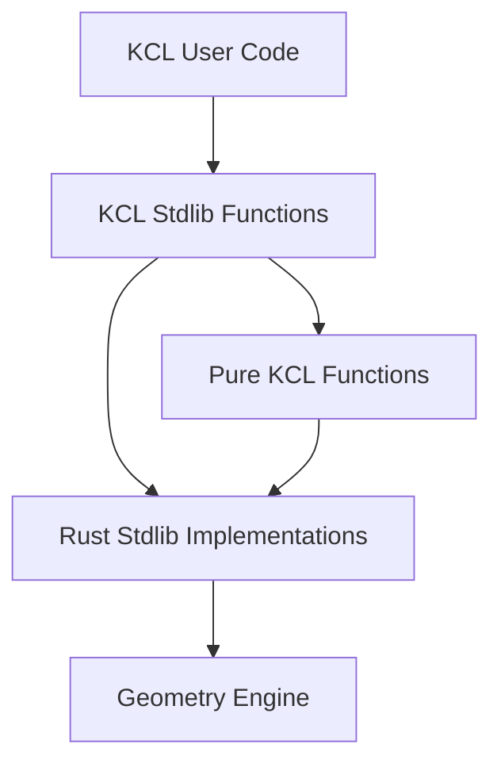

# Part 7: KCL's Standard Library Architecture

You've learned Rust. You've seen how KCL parses and executes. Now you'll understand the standard library, where KCL becomes useful. The stdlib is where `circle()`, `extrude()`, `line()`, and 100+ other functions live.

KCL's stdlib has a unique architecture: some functions are written in KCL itself, some are Rust implementations that call the geometry engine. This dual-layer approach keeps the language flexible while keeping performance critical operations fast.

## The Two-Layer Architecture



**Layer 1: KCL stdlib files** (`rust/kcl-lib/std/*.kcl`)
- High-level functions and constants
- Type definitions
- Convenience wrappers
- Documentation and examples

**Layer 2: Rust implementations** (`rust/kcl-lib/src/std/*.rs`)
- Performance-critical operations
- Engine communication
- Complex computations
- Type conversions

Example from `rust/kcl-lib/std/sketch.kcl`:

```kcl
// High-level KCL function
export fn rectangle(width, height, center = [0, 0]) {
  const [x, y] = center
  return startProfile([x - width/2, y - height/2])
    |> line([width, 0])
    |> line([0, height])
    |> line([-width, 0])
    |> close()
}
```

This calls lower-level functions (`startProfile`, `line`, `close`), which are Rust implementations.

In Python, you'd have:

```python
# Python stdlib
def rectangle(width, height, center=(0, 0)):
    x, y = center
    return (
        start_profile([x - width/2, y - height/2])
        .line([width, 0])
        .line([0, height])
        .line([-width, 0])
        .close()
    )

# C extension (Rust equivalent)
@native
def start_profile(point):
    # Implemented in C for performance
    pass
```

The pattern is familiar, but KCL's version keeps everything type-safe and fast.

## How Functions Are Registered

Open `rust/kcl-lib/src/std/mod.rs` and find the `std_fn` function:

```rust
pub fn std_fn(module: &str, fn_name: &str) -> Option<(StdFn, StdFnProps)> {
    let key = (module, fn_name);

    match key {
        ("sketch", "circle") => Some((
            |args, exec_state| Box::pin(crate::std::shapes::circle(args, exec_state)),
            StdFnProps {
                name: "std::sketch::circle".to_string(),
                summary: "Create a circle".to_string(),
                // ... more metadata
            },
        )),
        ("sketch", "line") => Some((
            |args, exec_state| Box::pin(crate::std::shapes::line(args, exec_state)),
            StdFnProps::default("std::sketch::line"),
        )),
        // ... 100+ more functions
        _ => None,
    }
}
```

This is a giant match statement mapping `(module, function_name)` to implementations. Each entry returns:
1. The function implementation (a closure that returns a pinned future)
2. Metadata (name, summary, documentation)

When KCL code calls `circle(radius = 10)`, the executor:
1. Looks up `("sketch", "circle")` in this registry
2. Gets the function implementation
3. Calls it with the arguments
4. Awaits the result

In Python, you'd use a dict:

```python
STDLIB = {
    ("sketch", "circle"): (circle_impl, {"name": "circle", "doc": "..."}),
    ("sketch", "line"): (line_impl, {"name": "line", "doc": "..."}),
}

def call_stdlib_fn(module, name, args):
    fn, metadata = STDLIB.get((module, name))
    return fn(**args)
```

Rust's version is compile-time checked. If you typo the module name or function name, the compiler catches it.

## Argument Parsing: Named Parameters

KCL functions use named arguments heavily:

```kcl
circle(center = [0, 0], radius = 10)
```

The Rust implementation receives an `Args` struct:

```rust
pub struct Args {
    args: HashMap<String, KclValue>,
}

impl Args {
    pub fn get_number(&self, name: &str) -> Result<f64, KclError> {
        let value = self.args.get(name)
            .ok_or_else(|| KclError::missing_argument(name))?;

        match value {
            KclValue::Number(n, _) => Ok(*n),
            _ => Err(KclError::type_mismatch("number", value.type_name())),
        }
    }

    pub fn get_number_array(&self, name: &str) -> Result<Vec<f64>, KclError> {
        let value = self.args.get(name)
            .ok_or_else(|| KclError::missing_argument(name))?;

        match value {
            KclValue::HomArray(items) => {
                items.iter()
                    .map(|v| match v {
                        KclValue::Number(n, _) => Ok(*n),
                        _ => Err(KclError::type_mismatch("number", v.type_name())),
                    })
                    .collect()
            }
            _ => Err(KclError::type_mismatch("array", value.type_name())),
        }
    }

    pub fn get_optional_number(&self, name: &str, default: f64) -> Result<f64, KclError> {
        match self.args.get(name) {
            Some(value) => match value {
                KclValue::Number(n, _) => Ok(*n),
                _ => Err(KclError::type_mismatch("number", value.type_name())),
            },
            None => Ok(default),
        }
    }
}
```

Functions call these helpers to extract and validate arguments:

```rust
pub async fn circle(args: Args, exec_state: &mut ExecState) -> Result<KclValue, KclError> {
    let center = args.get_number_array("center")?;
    let radius = args.get_number("radius")?;

    // ... create circle
}
```

The `?` operator propagates errors. If the argument is missing or the wrong type, the function returns an error immediately.

In Python, you'd use:

```python
def circle(center, radius):
    if not isinstance(center, list):
        raise TypeError("center must be a list")
    if not isinstance(radius, (int, float)):
        raise TypeError("radius must be a number")
    # ... create circle
```

Or with type hints and runtime validation:

```python
from typing import List
from pydantic import validate_arguments

@validate_arguments
def circle(center: List[float], radius: float):
    # ... create circle
```

Rust does this at the stdlib boundary without external libraries.

## Implementing a Standard Library Function

Let's implement a new function: `polygon(sides, radius, center)` that creates a regular polygon.

Step 1: Define the signature in KCL stdlib (optional, can be Rust-only):

```kcl
// rust/kcl-lib/std/sketch.kcl
export fn polygon(sides, radius, center = [0, 0]) {
  // Delegates to Rust implementation
  return _polygon(sides, radius, center)
}
```

Step 2: Implement in Rust:

```rust
// rust/kcl-lib/src/std/shapes.rs

use std::f64::consts::PI;

pub async fn polygon(
    args: Args,
    exec_state: &mut ExecState,
) -> Result<KclValue, KclError> {
    // Extract arguments
    let sides = args.get_number("sides")? as usize;
    let radius = args.get_number("radius")?;
    let center = args.get_number_array("center")?;

    if sides < 3 {
        return Err(KclError::invalid_argument(
            "sides must be at least 3"
        ));
    }

    let cx = center[0];
    let cy = center[1];

    // Calculate polygon vertices
    let angle_step = 2.0 * PI / sides as f64;
    let mut points = Vec::new();

    for i in 0..sides {
        let angle = i as f64 * angle_step;
        let x = cx + radius * angle.cos();
        let y = cy + radius * angle.sin();
        points.push(vec![x, y]);
    }

    // Build the polygon using line commands
    let mut sketch = exec_state.start_profile(&points[0]).await?;

    for point in &points[1..] {
        sketch = exec_state.line_to(&sketch, point).await?;
    }

    sketch = exec_state.close_path(&sketch).await?;

    Ok(sketch)
}
```

Step 3: Register it:

```rust
// rust/kcl-lib/src/std/mod.rs

pub fn std_fn(module: &str, fn_name: &str) -> Option<(StdFn, StdFnProps)> {
    match (module, fn_name) {
        // ... existing functions

        ("sketch", "polygon") => Some((
            |args, exec_state| Box::pin(crate::std::shapes::polygon(args, exec_state)),
            StdFnProps {
                name: "std::sketch::polygon".to_string(),
                summary: "Create a regular polygon".to_string(),
                description: Some("Creates a regular polygon with the specified number of sides".to_string()),
                // ... more metadata
            },
        )),

        // ... more functions
    }
}
```

Step 4: Test it:

```kcl
// test.kcl
const hex = polygon(sides = 6, radius = 50, center = [0, 0])
const shape = extrude(hex, length = 10)
```

In Python, you'd add it to a module:

```python
# stdlib/sketch.py

def polygon(sides, radius, center=(0, 0)):
    if sides < 3:
        raise ValueError("sides must be at least 3")

    import math
    cx, cy = center
    angle_step = 2 * math.pi / sides

    points = []
    for i in range(sides):
        angle = i * angle_step
        x = cx + radius * math.cos(angle)
        y = cy + radius * math.sin(angle)
        points.append([x, y])

    sketch = start_profile(points[0])
    for point in points[1:]:
        sketch = line_to(sketch, point)
    return close_path(sketch)
```

The logic is similar, but Rust's version is type-checked and integrated with the async engine.

## Units and Tagged Values

KCL supports units:

```kcl
width = 100mm
angle = 45degrees
```

Under the hood, numbers carry optional unit tags:

```rust
pub enum KclValue {
    Number(f64, Option<UnitType>),
    // ... other variants
}

pub enum UnitType {
    Millimeters,
    Centimeters,
    Meters,
    Inches,
    Feet,
    Degrees,
    Radians,
}
```

When a function expects a length in millimeters, it checks the unit:

```rust
pub fn get_length_mm(&self, name: &str) -> Result<f64, KclError> {
    let value = self.get_number_with_unit(name)?;

    match value.1 {
        Some(UnitType::Millimeters) => Ok(value.0),
        Some(UnitType::Centimeters) => Ok(value.0 * 10.0),
        Some(UnitType::Meters) => Ok(value.0 * 1000.0),
        Some(UnitType::Inches) => Ok(value.0 * 25.4),
        None => Ok(value.0),  // Assume mm if no unit
        _ => Err(KclError::invalid_unit("expected length unit")),
    }
}
```

This converts between units automatically and rejects incompatible units (e.g., using degrees where length is expected).

In Python, you'd use a library like `pint`:

```python
from pint import UnitRegistry

ureg = UnitRegistry()

def get_length_mm(value):
    if hasattr(value, 'to'):
        return value.to(ureg.millimeters).magnitude
    return value  # Assume mm
```

Rust does this without external dependencies, integrated into the type system.

## The ExecState: The Executor's Context

Every stdlib function receives `&mut ExecState`. This is the execution context:

```rust
pub struct ExecState {
    pub memory: Memory,
    pub engine_connection: Box<dyn EngineConnection>,
    pub module_id: ModuleId,
    pub settings: Settings,
    // ... more fields
}
```

It provides:
- **Memory**: Variable storage (symbol table)
- **Engine connection**: Send commands to the geometry engine
- **Module ID**: Which file is executing
- **Settings**: User preferences (units, precision, etc.)

Functions use it to:
1. Look up variables
2. Send commands to the engine
3. Store intermediate results
4. Access configuration

Example:

```rust
pub async fn extrude(args: Args, exec_state: &mut ExecState) -> Result<KclValue, KclError> {
    let sketch = args.get_sketch("profile")?;
    let length = exec_state.get_length_mm(args.get_number("length")?)?;

    let response = exec_state
        .engine_connection
        .send_modeling_cmd(ModelingCmd::Extrude {
            profile_id: sketch.id,
            distance: length,
        })
        .await?;

    Ok(KclValue::Solid {
        id: response.id,
        // ... more fields
    })
}
```

The function gets the sketch from arguments, converts the length to millimeters using the execution state's settings, sends a command to the engine, and returns a solid.

## Documentation Generation

KCL generates documentation from rustdoc comments:

```rust
/// Create a circle.
///
/// # Arguments
///
/// * `center` - Center point [x, y]
/// * `radius` - Circle radius
///
/// # Examples
///
/// ```kcl
/// const c = circle(center = [0, 0], radius = 50)
/// ```
pub async fn circle(args: Args, exec_state: &mut ExecState) -> Result<KclValue, KclError> {
    // ...
}
```

The `just redo-kcl-stdlib-docs` command extracts these comments and generates markdown documentation. This keeps docs in sync with code.

In Python, you'd use docstrings:

```python
def circle(center, radius):
    """Create a circle.

    Args:
        center: Center point [x, y]
        radius: Circle radius

    Examples:
        >>> circle(center=[0, 0], radius=50)
    """
    pass
```

And tools like Sphinx to generate docs.

## What You Just Learned

1. KCL's stdlib has two layers: KCL functions and Rust implementations
2. Functions are registered in a giant match statement (`std_fn`)
3. Arguments are extracted and validated with the `Args` helper
4. Functions are async and return `Pin<Box<Future>>`
5. Units are tracked as part of number values
6. `ExecState` provides execution context (memory, engine, settings)
7. Documentation is generated from rustdoc comments

## Exercises

1. **Implement a new function**: Add `star(points, outer_radius, inner_radius, center)` that creates a star shape. Register it and test it.

2. **Add unit conversion**: Implement a function that converts between units: `convert(value, from_unit, to_unit)`. Handle length and angle conversions.

3. **Explore the stdlib**: Read all the `.kcl` files in `rust/kcl-lib/std/` and understand what each module exports. Find examples of KCL functions that call Rust functions.

4. **Trace a function call**: Pick a stdlib function (like `extrude` or `revolve`). Trace its execution from the KCL call to the Rust implementation to the engine command. Understand the full flow.

5. **Add optional parameters**: Extend your `polygon` function to accept optional `rotation` and `center` parameters with default values.

## Next Up

In Part 8, we'll explore KCL's advanced features: sketch blocks, pipe operators, constraints, and how CAD-specific operations work. You'll understand the sketch execution context, how pipes transform values, and how KCL represents geometric constraints.

This is where KCL stops being a general-purpose language and becomes a CAD DSL.
