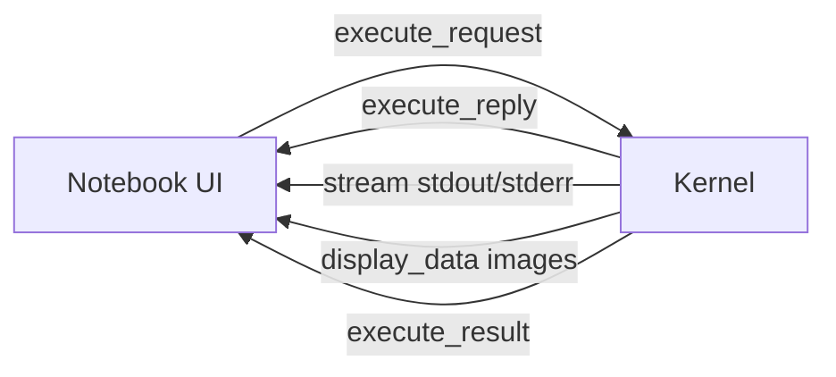
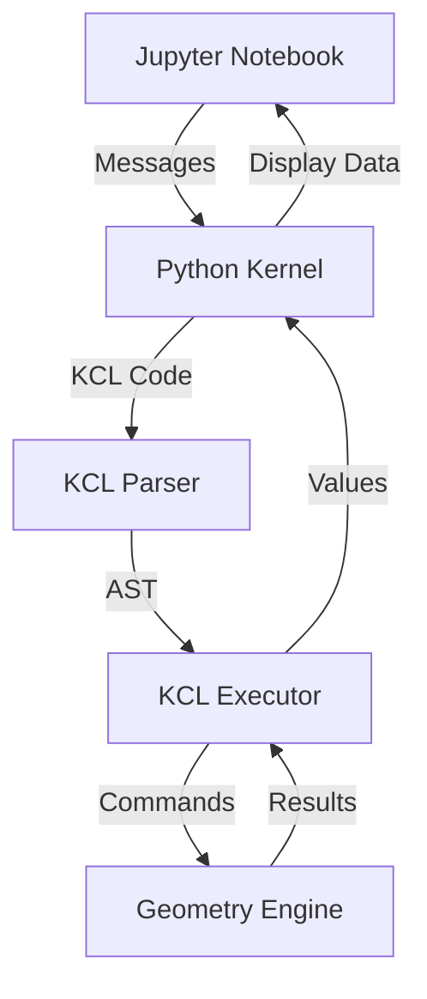

# Part 9: Building a Jupyter Kernel for KCL

You've learned Rust. You've learned KCL. Now you'll combine them to build something useful: a Jupyter kernel that lets you write KCL code in notebooks.

Jupyter kernels are language backends. You've used IPython (the Python kernel). There are kernels for R, Julia, JavaScript, and dozens of other languages. We're building one for KCL.

## The Jupyter Kernel Protocol

Jupyter separates the frontend (notebook UI) from the backend (kernel). They communicate over ZeroMQ sockets using a JSON-based protocol.

The flow:



When you run a cell, the notebook sends an `execute_request` message. The kernel executes the code and sends back results: stdout/stderr streams, display data (images, HTML), and the final result.

## Two Approaches: Rust vs Python

You can build a kernel in any language. The two reasonable choices:

**1. Rust kernel** (using `jupyter_protocol` crate)
- Fast
- Integrated with KCL directly
- More complex (ZeroMQ bindings, async message handling)

**2. Python kernel** (using `ipykernel`)
- Simpler (ipykernel handles the protocol)
- Uses KCL's Python bindings
- Slower (crossing the Python/Rust boundary)

We'll implement the Python version first (faster to build), then discuss the Rust version.

## Architecture



The kernel:
1. Receives code from the notebook
2. Parses it with KCL's parser
3. Executes it with KCL's executor
4. Captures results (variables, geometry, errors)
5. Sends results back to the notebook

## Step 1: Python Wrapper for KCL

KCL has Python bindings in `rust/kcl-python-bindings/`. Let's use them:

```python
# test_kcl.py
import kcl

# Parse KCL code
code = """
width = 100
height = 50
area = width * height
"""

result = kcl.execute(code)
print(result)
```

If the bindings don't exist or don't expose what you need, you'll use PyO3 to create them. PyO3 lets you call Rust from Python.

## Step 2: Minimal Kernel Implementation

Install ipykernel:

```bash
pip install ipykernel
```

Create `kcl_kernel.py`:

```python
from ipykernel.kernelbase import Kernel
import kcl  # KCL Python bindings

class KCLKernel(Kernel):
    implementation = 'KCL'
    implementation_version = '0.1.0'
    language = 'kcl'
    language_version = '0.2.111'
    language_info = {
        'name': 'kcl',
        'mimetype': 'text/x-kcl',
        'file_extension': '.kcl',
    }
    banner = "KCL - Zoo's CAD Programming Language"

    def __init__(self, **kwargs):
        super().__init__(**kwargs)
        self.execution_state = None  # KCL execution context

    def do_execute(self, code, silent, store_history=True,
                   user_expressions=None, allow_stdin=False):
        """Execute KCL code and return results."""

        if not silent:
            try:
                # Execute KCL code
                result = kcl.execute(code, self.execution_state)

                # Send stdout/stderr
                if result.stdout:
                    self.send_response(self.iopub_socket, 'stream', {
                        'name': 'stdout',
                        'text': result.stdout,
                    })

                if result.stderr:
                    self.send_response(self.iopub_socket, 'stream', {
                        'name': 'stderr',
                        'text': result.stderr,
                    })

                # Send result (last expression value)
                if result.value:
                    self.send_response(self.iopub_socket, 'execute_result', {
                        'execution_count': self.execution_count,
                        'data': {
                            'text/plain': str(result.value),
                        },
                        'metadata': {},
                    })

                # Update execution state for next cell
                self.execution_state = result.state

                return {
                    'status': 'ok',
                    'execution_count': self.execution_count,
                    'payload': [],
                    'user_expressions': {},
                }

            except Exception as e:
                # Send error
                self.send_response(self.iopub_socket, 'error', {
                    'ename': type(e).__name__,
                    'evalue': str(e),
                    'traceback': [str(e)],
                })

                return {
                    'status': 'error',
                    'execution_count': self.execution_count,
                    'ename': type(e).__name__,
                    'evalue': str(e),
                    'traceback': [str(e)],
                }

        return {'status': 'ok', 'execution_count': self.execution_count}


if __name__ == '__main__':
    from ipykernel.kernelapp import IPKernelApp
    IPKernelApp.launch_instance(kernel_class=KCLKernel)
```

This is a minimal kernel. It executes code and returns results. No geometry visualization yet, just text output.

## Step 3: Kernel Installation

Create `kernel.json`:

```json
{
  "argv": ["python", "-m", "kcl_kernel", "-f", "{connection_file}"],
  "display_name": "KCL",
  "language": "kcl"
}
```

Install the kernel:

```bash
# Create kernel directory
mkdir -p ~/.local/share/jupyter/kernels/kcl

# Copy files
cp kernel.json ~/.local/share/jupyter/kernels/kcl/
cp kcl_kernel.py ~/.local/share/jupyter/kernels/kcl/

# Or use jupyter kernelspec
jupyter kernelspec install ./kcl_kernel --user
```

Now "KCL" appears in Jupyter's kernel list.

## Step 4: Stateful Execution

Jupyter cells execute sequentially. Variables from one cell should be available in the next:

```kcl
# Cell 1
width = 100
height = 50

# Cell 2
area = width * height  # Should work
```

The kernel needs to maintain state. In the Rust implementation:

```rust
pub struct KernelState {
    memory: Memory,
    engine_connection: Box<dyn EngineConnection>,
    // ... other state
}

impl KernelState {
    pub async fn execute(&mut self, code: &str) -> Result<ExecutionResult, KclError> {
        let program = parse_str(code)?;

        // Execute with existing state
        let mut exec_state = ExecState {
            memory: self.memory.clone(),
            engine_connection: self.engine_connection.clone(),
            // ... more fields
        };

        exec_state.execute_program(&program).await?;

        // Update state for next execution
        self.memory = exec_state.memory;

        Ok(ExecutionResult {
            value: exec_state.last_value,
            stdout: exec_state.stdout,
            stderr: exec_state.stderr,
        })
    }
}
```

Each execution starts with the previous state and updates it.

## Step 5: Displaying Geometry

KCL produces 3D models. You want to see them in the notebook. Options:

**1. Export to STL and display with a viewer:**

```python
# After executing KCL
if result.geometry:
    stl_data = result.geometry.to_stl()

    # Send as display data
    self.send_response(self.iopub_socket, 'display_data', {
        'data': {
            'application/sla': stl_data,  # Custom MIME type
            'text/plain': '<3D Model>',
        },
        'metadata': {},
    })
```

The notebook needs a frontend extension to render the MIME type.

**2. Export to image (PNG screenshot):**

```python
if result.geometry:
    png_data = result.geometry.render_to_png(width=800, height=600)

    import base64
    png_base64 = base64.b64encode(png_data).decode('ascii')

    self.send_response(self.iopub_socket, 'display_data', {
        'data': {
            'image/png': png_base64,
            'text/plain': '<3D Model>',
        },
        'metadata': {},
    })
```

This works immediately in any notebook.

**3. Use an existing 3D viewer library:**

Libraries like `pythreejs` or `k3d` can display 3D geometry in Jupyter. Export KCL geometry to their format.

## Step 6: Rust Implementation (Advanced)

For a pure Rust kernel, use the `jupyter_protocol` crate:

```rust
use jupyter_protocol::{Kernel, ExecuteRequest, ExecuteReply, Stream};
use tokio;

struct KCLKernel {
    state: KernelState,
}

impl Kernel for KCLKernel {
    async fn execute(&mut self, req: ExecuteRequest) -> ExecuteReply {
        let code = req.code;

        match self.state.execute(&code).await {
            Ok(result) => {
                // Send stdout
                if !result.stdout.is_empty() {
                    self.send_stream(Stream::Stdout, &result.stdout).await;
                }

                // Send result
                ExecuteReply::ok(
                    req.execution_count,
                    result.value.map(|v| v.to_string()),
                )
            }
            Err(error) => {
                // Send error
                ExecuteReply::error(
                    req.execution_count,
                    error.to_string(),
                )
            }
        }
    }
}

#[tokio::main]
async fn main() {
    let kernel = KCLKernel {
        state: KernelState::new(),
    };

    jupyter_protocol::run_kernel(kernel).await.unwrap();
}
```

This is more complex but gives you full control and better performance.

## Step 7: Autocomplete and Introspection

Jupyter supports autocomplete and introspection. Implement `do_complete` and `do_inspect`:

```python
class KCLKernel(Kernel):
    # ... previous code

    def do_complete(self, code, cursor_pos):
        """Provide autocomplete suggestions."""

        # Extract the current token at cursor
        token = self.get_token_at_cursor(code, cursor_pos)

        # Get completions from KCL
        matches = kcl.get_completions(token, self.execution_state)

        return {
            'matches': matches,
            'cursor_start': cursor_pos - len(token),
            'cursor_end': cursor_pos,
            'status': 'ok',
        }

    def do_inspect(self, code, cursor_pos, detail_level=0):
        """Provide documentation for symbol at cursor."""

        token = self.get_token_at_cursor(code, cursor_pos)

        # Get documentation from KCL
        docs = kcl.get_documentation(token)

        return {
            'status': 'ok',
            'found': docs is not None,
            'data': {
                'text/plain': docs or 'No documentation found',
            },
            'metadata': {},
        }
```

This gives you Shift+Tab documentation and Tab completion.

## Step 8: Error Handling with Source Context

KCL errors include source positions. Show them nicely:

```python
def format_error(error):
    """Format KCL error with source context."""

    lines = error.source.split('\n')
    line_num = error.line
    col_num = error.column

    # Build error message with context
    context = []
    if line_num > 0:
        context.append(f"{line_num-1:4} | {lines[line_num-2]}")

    context.append(f"{line_num:4} | {lines[line_num-1]}")
    context.append(f"     | {' ' * (col_num-1)}^")

    if line_num < len(lines):
        context.append(f"{line_num+1:4} | {lines[line_num]}")

    return '\n'.join([
        f"Error: {error.message}",
        "",
        *context,
    ])
```

This produces:

```
Error: Undefined variable 'x'

   5 | width = 100
   6 | area = x * height
     |        ^
   7 | volume = area * depth
```

Much nicer than a raw error message.

## Step 9: Testing the Kernel

Create a test notebook:

```python
# test_kernel.ipynb
{
    "cells": [
        {
            "cell_type": "code",
            "source": [
                "# Cell 1: Variables\n",
                "width = 100\n",
                "height = 50\n",
                "print(width)"
            ]
        },
        {
            "cell_type": "code",
            "source": [
                "# Cell 2: Use previous variables\n",
                "area = width * height\n",
                "print(area)"
            ]
        },
        {
            "cell_type": "code",
            "source": [
                "# Cell 3: Create geometry\n",
                "sketch = startSketchOn(\"XY\")\n",
                "  |> startProfile(at = [0, 0])\n",
                "  |> line(to = [width, 0])\n",
                "  |> line(to = [width, height])\n",
                "  |> line(to = [0, height])\n",
                "  |> close()\n",
                "\n",
                "solid = extrude(sketch, length = 25)\n",
                "# Should display the geometry"
            ]
        }
    ]
}
```

Run it and verify:
1. Variables persist between cells
2. Geometry displays correctly
3. Errors show source context

## Step 10: Publishing the Kernel

Once it works, publish it:

```bash
# Create a package
mkdir kcl_jupyter_kernel
cd kcl_jupyter_kernel

# Create setup.py
cat > setup.py << 'EOF'
from setuptools import setup

setup(
    name='kcl_jupyter_kernel',
    version='0.1.0',
    description='Jupyter kernel for KCL',
    author='Your Name',
    py_modules=['kcl_kernel'],
    install_requires=[
        'ipykernel',
        'kcl',  # KCL Python bindings
    ],
    entry_points={
        'console_scripts': [
            'kcl-kernel=kcl_kernel:main',
        ],
    },
)
EOF

# Install
pip install -e .

# Install kernel spec
python -m kcl_kernel install
```

Now anyone can `pip install kcl_jupyter_kernel` and use KCL in Jupyter.

## What You Just Learned

1. Jupyter kernels communicate via ZeroMQ and JSON messages
2. `ipykernel` handles the protocol for Python kernels
3. Kernels maintain execution state between cells
4. Display data supports multiple MIME types (text, images, HTML, custom)
5. Autocomplete and introspection are separate protocol methods
6. Error messages should include source context
7. Rust kernels use `jupyter_protocol` crate for direct implementation
8. Publishing a kernel requires a kernel spec and package metadata

## Exercises

1. **Complete the Python kernel**: Implement the full kernel with geometry display, autocomplete, and introspection. Test it with real KCL code.

2. **Add syntax highlighting**: Create a CodeMirror mode for KCL syntax. Install it so notebooks highlight KCL code correctly.

3. **Geometry viewer**: Build a custom Jupyter widget that displays KCL geometry interactively (rotate, zoom, pan). Use Three.js or Babylon.js.

4. **Rust kernel**: Implement a pure Rust kernel using `jupyter_protocol`. Compare performance with the Python version.

5. **Magic commands**: Add Jupyter magic commands like `%kcl_version`, `%kcl_export filename.stl`, `%kcl_settings units=mm`.

## Next Up

In Part 10, we'll polish your Jupyter kernel and prepare it for contribution to the KCL project. You'll learn about testing, documentation, CI/CD, and the pull request process. This is where your learning becomes a real contribution.

Time to give back to the project.
