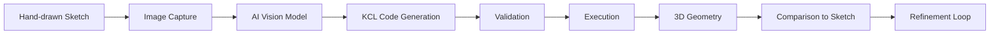

# Part 13: AI-Powered Sketch to KCL (Closing the Loop)

You've built the canvas. You've got code execution. You've got 3D visualization. Now for the final piece: AI that converts hand-drawn sketches to KCL code. This is where low-fidelity meets high-precision, and the infinite canvas becomes a true hybrid workspace.

By the end of this part, you'll draw a rough bracket, click a button, and watch AI generate parametric KCL code that produces a precise 3D model.

## The Vision

Traditional CAD workflow:
```
Idea → Sketch on paper → Manually recreate in CAD → Parametric model
```

Our workflow:
```
Idea → Sketch on canvas → AI generates KCL → Parametric model → Refine
```

The sketch stays on the canvas. The code appears next to it. The 3D model appears next to both. Everything is linked. Change the sketch, AI regenerates code. Change the code, model updates. Mixed fidelity, single surface.

## How makereal Works

tldraw's makereal (https://github.com/tldraw/make-real) takes drawn UI mockups and generates React code. The process:

1. Capture the drawing as an image
2. Send to GPT-4V (vision model)
3. Prompt: "Convert this UI mockup to React code"
4. GPT-4V generates code
5. Display the live component

We'll adapt this for CAD:

1. Capture the sketch as an image
2. Send to GPT-4V (or Claude with vision)
3. Prompt: "Convert this mechanical sketch to KCL code"
4. Model generates parametric KCL
5. Execute the code, display 3D geometry

## The AI Pipeline



The key insight: CAD has intent. A circle isn't just a circle, it's a hole or a shaft. Parallel lines aren't coincidence, they're a constraint. The AI needs to understand geometric intent, not just shapes.

## Setting Up the AI Integration

Install OpenAI SDK (or Anthropic for Claude):

```bash
npm install openai
```

Create `src/ai/sketchToKcl.ts`:

```typescript
import OpenAI from 'openai'

const openai = new OpenAI({
  apiKey: process.env.OPENAI_API_KEY,
  dangerouslyAllowBrowser: true, // For client-side (not recommended for production)
})

export interface SketchConversionResult {
  code: string
  explanation: string
  parameters: Record<string, number>
  confidence: number
}

export async function convertSketchToKCL(
  imageDataUrl: string,
  userPrompt?: string
): Promise<SketchConversionResult> {
  const systemPrompt = `You are an expert CAD programmer specializing in KCL (KittyCAD Language).
Your job is to convert hand-drawn mechanical sketches into precise, parametric KCL code.

Guidelines:
1. Identify geometric primitives (rectangles, circles, lines)
2. Infer constraints (parallel, perpendicular, concentric)
3. Extract dimensions from annotations
4. Make the design parametric (use variables for key dimensions)
5. Include comments explaining your interpretation
6. Default to millimeters for units
7. Generate complete, runnable KCL code

Output format:
{
  "code": "// KCL code here",
  "explanation": "I interpreted this as...",
  "parameters": {"width": 100, "height": 50},
  "confidence": 0.85
}`

  const userMessage = userPrompt ||
    "Convert this mechanical sketch to parametric KCL code. Include all visible features and infer reasonable constraints."

  const response = await openai.chat.completions.create({
    model: 'gpt-4-vision-preview',
    messages: [
      {
        role: 'system',
        content: systemPrompt,
      },
      {
        role: 'user',
        content: [
          {
            type: 'text',
            text: userMessage,
          },
          {
            type: 'image_url',
            image_url: {
              url: imageDataUrl,
              detail: 'high', // High detail for technical drawings
            },
          },
        ],
      },
    ],
    max_tokens: 2000,
    temperature: 0.3, // Lower temperature for more deterministic code
  })

  const content = response.choices[0].message.content

  // Parse the JSON response
  try {
    const result = JSON.parse(content)
    return result
  } catch (e) {
    // If JSON parsing fails, extract code from markdown
    const codeMatch = content.match(/```kcl\n([\s\S]*?)\n```/)
    const code = codeMatch ? codeMatch[1] : content

    return {
      code,
      explanation: 'Generated from sketch',
      parameters: {},
      confidence: 0.5,
    }
  }
}
```

## Capturing Sketches as Images

tldraw drawings need to be converted to images. Create `src/lib/captureSketch.ts`:

```typescript
import { Editor, TLShapeId } from '@tldraw/tldraw'

export async function captureShapeAsImage(
  editor: Editor,
  shapeId: TLShapeId
): Promise<string> {
  const shape = editor.getShape(shapeId)
  if (!shape) throw new Error('Shape not found')

  // Get the shape's bounding box
  const bounds = editor.getShapePageBounds(shapeId)
  if (!bounds) throw new Error('Could not get shape bounds')

  // Add padding
  const padding = 20
  const expandedBounds = {
    x: bounds.x - padding,
    y: bounds.y - padding,
    w: bounds.w + padding * 2,
    h: bounds.h + padding * 2,
  }

  // Export as SVG
  const svg = await editor.getSvg([shapeId], {
    background: true,
    darkMode: false,
    padding,
  })

  if (!svg) throw new Error('Could not generate SVG')

  // Convert SVG to data URL
  const svgString = new XMLSerializer().serializeToString(svg)
  const svgDataUrl = `data:image/svg+xml;base64,${btoa(svgString)}`

  // Convert to PNG (better for AI models)
  return await svgToPng(svgDataUrl, expandedBounds.w, expandedBounds.h)
}

async function svgToPng(
  svgDataUrl: string,
  width: number,
  height: number
): Promise<string> {
  return new Promise((resolve, reject) => {
    const canvas = document.createElement('canvas')
    canvas.width = width
    canvas.height = height

    const ctx = canvas.getContext('2d')
    if (!ctx) {
      reject(new Error('Could not get canvas context'))
      return
    }

    const img = new Image()
    img.onload = () => {
      // Fill white background
      ctx.fillStyle = 'white'
      ctx.fillRect(0, 0, width, height)

      // Draw image
      ctx.drawImage(img, 0, 0, width, height)

      // Convert to PNG data URL
      resolve(canvas.toDataURL('image/png'))
    }
    img.onerror = () => reject(new Error('Failed to load image'))
    img.src = svgDataUrl
  })
}
```

## Creating an AI Conversion Button

Add a "Convert to KCL" button that appears when you select a drawing:

```typescript
// src/components/ConvertToKclButton.tsx
import { useEditor, useValue } from '@tldraw/tldraw'
import { captureShapeAsImage } from '../lib/captureSketch'
import { convertSketchToKCL } from '../ai/sketchToKcl'
import { KclCodeShape } from '../shapes/KclCodeShape'

export function ConvertToKclButton() {
  const editor = useEditor()

  // Get selected shapes
  const selectedShapes = useValue(
    'selected shapes',
    () => editor.getSelectedShapes(),
    [editor]
  )

  const [isConverting, setIsConverting] = useState(false)

  // Only show button if a single shape is selected and it's a draw shape
  const canConvert = selectedShapes.length === 1 &&
    selectedShapes[0].type === 'draw'

  if (!canConvert) return null

  const handleConvert = async () => {
    setIsConverting(true)

    try {
      const shape = selectedShapes[0]

      // Capture as image
      const imageDataUrl = await captureShapeAsImage(editor, shape.id)

      // Send to AI
      const result = await convertSketchToKCL(imageDataUrl)

      // Validate the generated code
      const isValid = await validateKcl(result.code)

      if (!isValid) {
        alert('Generated code has errors. Please try again or edit manually.')
      }

      // Create a KCL code shape next to the sketch
      editor.createShape<KclCodeShape>({
        type: 'kcl-code',
        x: shape.x + shape.props.w + 50,
        y: shape.y,
        props: {
          w: 400,
          h: 400,
          code: result.code,
          linkedViewerId: null,
        },
      })

      // Show explanation
      alert(`AI Interpretation:\n\n${result.explanation}\n\nConfidence: ${(result.confidence * 100).toFixed(0)}%`)

    } catch (error) {
      console.error('Conversion failed:', error)
      alert('Failed to convert sketch. Please try again.')
    } finally {
      setIsConverting(false)
    }
  }

  return (
    <button
      onClick={handleConvert}
      disabled={isConverting}
      style={{
        position: 'fixed',
        bottom: 20,
        right: 20,
        padding: '12px 24px',
        background: isConverting ? '#555' : '#00d084',
        color: 'white',
        border: 'none',
        borderRadius: '8px',
        fontSize: '16px',
        fontWeight: 'bold',
        cursor: isConverting ? 'wait' : 'pointer',
        boxShadow: '0 4px 12px rgba(0, 0, 0, 0.2)',
        zIndex: 10000,
      }}
    >
      {isConverting ? 'Converting...' : '✨ Convert to KCL'}
    </button>
  )
}
```

Add it to your canvas:

```typescript
// src/components/TldrawKclCanvas.tsx
export function TldrawKclCanvas() {
  return (
    <div style={{ position: 'fixed', inset: 0 }}>
      <Tldraw shapeUtils={customShapeUtils} tools={customTools}>
        <ShapeLinks />
        <ConvertToKclButton />
      </Tldraw>
    </div>
  )
}
```

## Improving the AI Prompt

The better your prompt, the better the results. Add domain-specific guidance:

```typescript
const systemPrompt = `You are an expert CAD programmer specializing in KCL.

Key concepts:
- startSketchOn("XY"|"XZ"|"YZ") starts a 2D sketch on a plane
- startProfile(at = [x, y]) begins a sketch profile
- line(to = [x, y]) draws a line (absolute coords)
- line([dx, dy]) draws a line (relative coords)
- circle(center = [x, y], radius = r) draws a circle
- arc(to = [x, y], radius = r) draws an arc
- close() closes the profile
- extrude(profile, length = l) extrudes to 3D
- revolve(profile, axis = "X"|"Y"|"Z", angle = degrees) revolves around axis
- fillet(solid, edges = [...], radius = r) rounds edges
- chamfer(solid, edges = [...], distance = d) bevels edges

Design principles:
1. Use descriptive variable names (plateWidth, holeRadius, etc.)
2. Extract all dimensions as variables (parametric design)
3. Add comments for each major feature
4. Default to mm for lengths, degrees for angles
5. Start simple, build complexity incrementally
6. Use constraints when possible (parallel, perpendicular, etc.)

Common patterns:
- Mounting bracket: base plate + vertical plate + mounting holes
- Shaft: circle + extrude + optional fillet
- Housing: box + hollow shell + mounting features
- Gear: circle + pattern of teeth

When you see:
- Dashed lines → center lines or hidden features
- Dimension arrows → extract those values as parameters
- Multiple views → combine into single 3D model
- Section marks → use those for extrusion depths or cutting planes

Output valid JSON with:
{
  "code": "complete KCL code",
  "explanation": "what you interpreted and why",
  "parameters": {"width": 100, "height": 50},
  "confidence": 0.85,
  "assumptions": ["assumed mounting holes are M4", "assumed material thickness 3mm"]
}`
```

## Adding Few-Shot Examples

Improve accuracy with examples:

```typescript
const fewShotExamples = [
  {
    description: "Simple rectangular bracket",
    sketch: "Rectangle with two circles",
    code: `// Mounting bracket
plateWidth = 100
plateHeight = 50
thickness = 5
holeRadius = 4
holeOffset = 10

plate = startSketchOn("XY")
  |> startProfile(at = [0, 0])
  |> line(to = [plateWidth, 0])
  |> line(to = [plateWidth, plateHeight])
  |> line(to = [0, plateHeight])
  |> close()
  |> extrude(thickness)

// Mounting holes
hole1 = startSketchOn(plate, face = "top")
  |> circle(center = [holeOffset, plateHeight / 2], radius = holeRadius)
  |> extrude(-thickness)

hole2 = startSketchOn(plate, face = "top")
  |> circle(center = [plateWidth - holeOffset, plateHeight / 2], radius = holeRadius)
  |> extrude(-thickness)

bracket = subtract(plate, [hole1, hole2])`
  },
  // Add more examples
]

// Include examples in the prompt
const examplesText = fewShotExamples
  .map(ex => `Example: ${ex.description}\nSketch: ${ex.sketch}\nCode:\n${ex.code}\n`)
  .join('\n---\n\n')
```

## Handling Ambiguity

Sketches are ambiguous. Is that a circle in 2D or a cylinder in 3D? Is that line an edge or a center line? Add clarification prompts:

```typescript
export async function convertSketchWithClarification(
  imageDataUrl: string
): Promise<SketchConversionResult> {
  // First pass: identify ambiguities
  const analysisResponse = await openai.chat.completions.create({
    model: 'gpt-4-vision-preview',
    messages: [
      {
        role: 'user',
        content: [
          {
            type: 'text',
            text: 'Analyze this mechanical sketch and list any ambiguities or assumptions you would need to make to convert it to CAD code.',
          },
          {
            type: 'image_url',
            image_url: { url: imageDataUrl },
          },
        ],
      },
    ],
  })

  const ambiguities = analysisResponse.choices[0].message.content

  // Ask user to clarify
  const clarifications = await askUserForClarifications(ambiguities)

  // Second pass: generate code with clarifications
  const codeResponse = await openai.chat.completions.create({
    model: 'gpt-4-vision-preview',
    messages: [
      {
        role: 'user',
        content: [
          {
            type: 'text',
            text: `Convert this sketch to KCL code. User clarifications: ${clarifications}`,
          },
          {
            type: 'image_url',
            image_url: { url: imageDataUrl },
          },
        ],
      },
    ],
  })

  // Parse and return
  return parseCodeResponse(codeResponse.choices[0].message.content)
}

async function askUserForClarifications(ambiguities: string): Promise<string> {
  // Show a modal or form with the ambiguities
  // User provides clarifications
  // Return as structured text
  return prompt(`Ambiguities found:\n\n${ambiguities}\n\nPlease clarify:`)
}
```

## Refinement Loop

The first generation won't be perfect. Add refinement:

```typescript
export async function refineKclCode(
  originalCode: string,
  feedback: string
): Promise<string> {
  const response = await openai.chat.completions.create({
    model: 'gpt-4',
    messages: [
      {
        role: 'system',
        content: 'You are refining KCL code based on user feedback.',
      },
      {
        role: 'user',
        content: `Original code:\n\`\`\`kcl\n${originalCode}\n\`\`\`\n\nUser feedback: ${feedback}\n\nGenerate improved code addressing the feedback.`,
      },
    ],
  })

  return extractCode(response.choices[0].message.content)
}
```

Add a refinement UI:

```typescript
// In the KCL code shape, add a "Refine" button
const handleRefine = async () => {
  const feedback = prompt('What would you like to change?')
  if (!feedback) return

  const refinedCode = await refineKclCode(code, feedback)
  setCode(refinedCode)
}
```

## Complete Workflow Example

1. **Sketch**: Draw a bracket with your mouse
   - Base rectangle
   - Two circles for mounting holes
   - Dimension annotations (100mm x 50mm)

2. **Convert**: Click "Convert to KCL"
   - AI captures the sketch
   - Identifies rectangle + circles
   - Infers: circles are holes (not features)
   - Extracts dimensions from annotations
   - Generates parametric code

3. **Code appears**: KCL code shape created next to sketch
   ```kcl
   // Mounting bracket (AI-generated)
   width = 100
   height = 50
   thickness = 5
   holeRadius = 4
   holeInset = 10

   // Base plate
   plate = startSketchOn("XY")
     |> startProfile(at = [0, 0])
     |> line(to = [width, 0])
     |> line(to = [width, height])
     |> line(to = [0, height])
     |> close()
     |> extrude(thickness)

   // Mounting holes
   // ... etc
   ```

4. **3D appears**: Geometry viewer shows the bracket in 3D

5. **Refine**: Change `thickness = 5` to `thickness = 10`, model updates

6. **Export**: Download STL for 3D printing

## Handling Multiple Views

Engineering drawings have multiple views (top, front, side). Combine them:

```typescript
export async function convertMultiViewSketch(
  topViewImage: string,
  frontViewImage: string,
  sideViewImage?: string
): Promise<SketchConversionResult> {
  const prompt = `Convert these orthographic views to a single 3D KCL model.

Top view shows the XY plane.
Front view shows the XZ plane.
${sideViewImage ? 'Side view shows the YZ plane.' : ''}

Combine the views to infer the complete 3D geometry.`

  const content: any[] = [{ type: 'text', text: prompt }]
  content.push({ type: 'image_url', image_url: { url: topViewImage } })
  content.push({ type: 'image_url', image_url: { url: frontViewImage } })
  if (sideViewImage) {
    content.push({ type: 'image_url', image_url: { url: sideViewImage } })
  }

  const response = await openai.chat.completions.create({
    model: 'gpt-4-vision-preview',
    messages: [{ role: 'user', content }],
  })

  return parseCodeResponse(response.choices[0].message.content)
}
```

## What You Just Built

The complete pipeline:
- Hand-drawn sketch → AI vision → KCL code → 3D geometry
- Clarification loop for ambiguities
- Refinement loop for improvements
- Multi-view support for engineering drawings
- Mixed-fidelity workspace (sketch, code, 3D side by side)

This is genuinely novel. No other CAD tool does this.

## What You Just Learned

1. Vision AI integration (GPT-4V, Claude)
2. Prompt engineering for code generation
3. Image capture from canvas elements
4. Few-shot learning for better results
5. Clarification loops for ambiguous input
6. Iterative refinement with AI
7. Multi-view geometry reconstruction

## Exercises

1. **Add constraint detection**: Train the AI to recognize and generate constraints (parallel, perpendicular, equal, etc.).

2. **Add dimension reading**: Use OCR to read dimension annotations from the sketch instead of relying on AI to measure visually.

3. **Add material recognition**: Different line styles mean different things (dashed = hidden, thick = section, etc.). Teach the AI to recognize these.

4. **Build a feedback loop**: After generating geometry, compare it to the sketch visually and suggest corrections.

5. **Add style transfer**: User draws in their own style (messy, precise, artistic). AI learns to interpret their style over time.

## The Complete Vision

You now have:
- **Infinite canvas** for exploration (tldraw)
- **Code blocks** for precision (KCL)
- **3D viewers** for visualization (Three.js)
- **AI conversion** for bridging fidelity (GPT-4V)
- **Real-time updates** connecting everything
- **Export** to standard formats (STL, STEP, etc.)

This is a new paradigm for CAD:
- Not sketch-based (too imprecise)
- Not fully parametric (too rigid)
- But a hybrid: mix fidelity as needed, use AI to move between levels

## Production Considerations

Before deploying this:

1. **API costs**: Vision API calls are expensive. Cache results, batch requests, add user limits.

2. **Security**: Don't expose API keys client-side. Route through your backend.

3. **Rate limiting**: Prevent abuse. Limit conversions per user/hour.

4. **Error handling**: AI fails sometimes. Always show the user what was sent and what came back.

5. **Privacy**: User sketches may be proprietary. Ensure API providers don't train on your data.

6. **Validation**: Always validate generated code before execution. Sandbox execution if possible.

## Beyond makereal

This approach generalizes:
- **Sketch → Finite Element Analysis**: Draw load arrows, AI generates FEA simulation
- **Sketch → Assembly**: Draw multiple parts, AI infers fits and constraints
- **Photo → CAD**: Take a photo of a physical part, AI generates CAD model (reverse engineering)
- **Text → CAD**: "Create a bracket to hold a 50mm motor" → AI generates code

The infinite canvas + code + AI pattern works for any domain that mixes exploration and precision.

## You're Done

You've built something remarkable:
1. Learned Rust from scratch
2. Learned KCL deeply
3. Built a Jupyter kernel
4. Integrated KCL with tldraw
5. Added 3D visualization
6. Implemented AI sketch-to-code

You went from zero to creating a genuinely novel CAD interface. This didn't exist before you built it.

Now go show it to the world. Open source it. Write about it. Make a video. Get feedback. Iterate.

And if Zoo.dev wants to integrate this into the modeling app? You're ready to contribute.

Welcome to the future of CAD programming.
